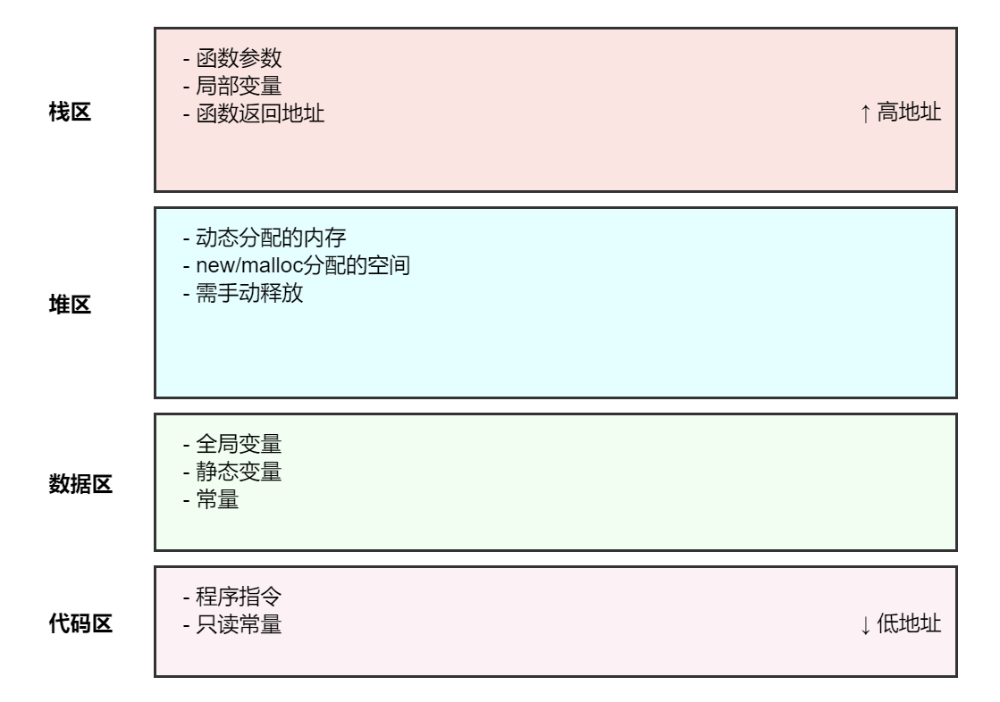
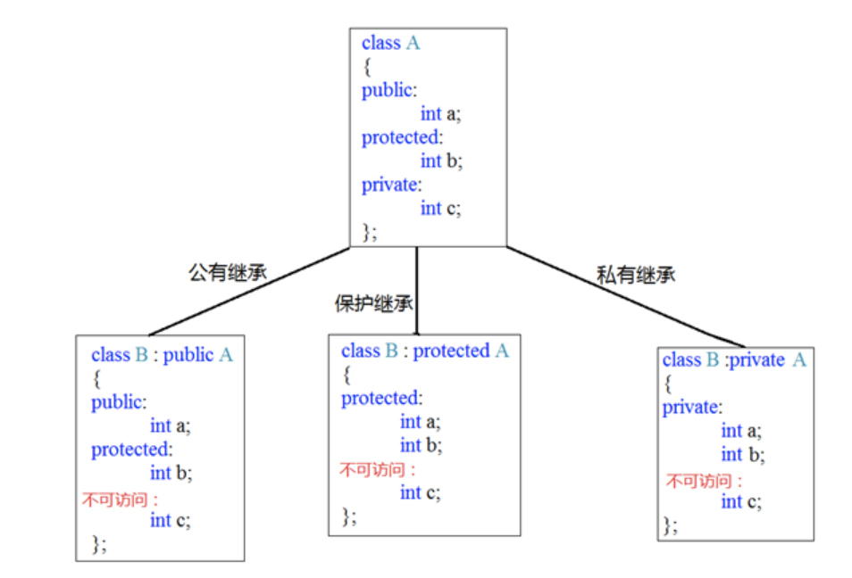
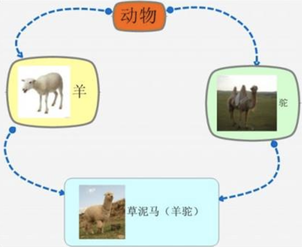

## 1 内存分区模型

C++程序在执行时，将内存大方向划分为**4个区域**

- 代码区：存放函数体的二进制代码，由操作系统进行管理的
- 全局区：存放全局变量和静态变量以及常量
- 栈区：由编译器自动分配释放, 存放函数的参数值,局部变量等
- 堆区：由程序员分配和释放,若程序员不释放,程序结束时由操作系统回收



​					

### 1.1 程序运行前

在程序编译后，生成了exe可执行程序，**未执行该程序前**分为两个区域

**代码区：**

​		存放 CPU 执行的机器指令

​		代码区是**共享**的，共享的目的是对于频繁被执行的程序，只需要在内存中有一份代码即可

​		代码区是**只读**的，使其只读的原因是防止程序意外地修改了它的指令

**全局区：**

​		全局变量和静态变量存放在此.

​		全局区还包含了常量区, 字符串常量和其他常量也存放在此.

​		该区域的数据在程序结束后由操作系统释放.

​	

### 1.2 程序运行后

**栈区：**

​		由编译器自动分配释放, 存放函数的参数值,局部变量等

​		注意事项：不要返回局部变量的地址，栈区开辟的数据由编译器自动释放

**堆区：**

​		由程序员分配释放,若程序员不释放,程序结束时由操作系统回收

​		在C++中主要利用new在堆区开辟内存

​	

### 1.3 new操作符

​	C++中利用`new`操作符在堆区开辟数据

​	堆区开辟的数据，由程序员手动开辟，手动释放，释放利用操作符 `delete`

​	语法：` new 数据类型`

​	利用new创建的数据，会**返回该数据对应的类型的指针**

​		

## 2 引用

### 2.1 引用的基本使用

**作用：** 给变量起别名

**语法：** `数据类型 &别名 = 原名;`

​	

### 2.2 引用注意事项

* 引用必须初始化

* 引用在初始化后，不可以改变

  

### 2.3 引用做函数参数

**作用：**函数传参时，可以利用引用的技术让形参修饰实参

**优点：**可以简化指针修改实参

> 总结：通过引用参数产生的效果同按地址传递是一样的。引用的语法更清楚简单

​	

### 2.4 引用做函数返回值

**作用：**引用是可以作为函数的返回值存在的

**注意：**不要返回局部变量引用

**用法：**函数调用作为左值

​				

## 3. 函数进阶

​	

### 3.1 函数默认参数

在C++中，函数的形参列表中的形参是可以有默认值的。

语法：` 返回值类型  函数名 （参数= 默认值）{}`

```c++
int func(int a, int b = 10, int c = 10) {
	return a + b + c;
}

//1. 如果某个位置参数有默认值，那么从这个位置往后，从左向右，必须都要有默认值
//2. 如果函数声明有默认值，函数实现的时候就不能有默认参数
int func2(int a = 10, int b = 10);
int func2(int a, int b) {
	return a + b;
}

int main() {
	cout << "ret = " << func(20, 20) << endl;
	cout << "ret = " << func(100) << endl;

	return 0;
}
```

​	

### 3.2 函数占位参数

C++中函数的形参列表里可以有占位参数，用来做占位，调用函数时必须填补该位置

**语法：** `返回值类型 函数名 (数据类型){}`

```c++
//函数占位参数 ，占位参数也可以有默认参数
void func(int a, int) {
	cout << "this is func" << endl;
}

int main() {
	func(10,10); //占位参数必须填补

	return 0;
}
```

​	

### 3.3 函数重载

#### 3.3.1 函数重载概述

**作用：**函数名可以相同，提高复用性

**函数重载满足条件：**

* 同一个作用域下
* 函数名称相同
* 函数参数**类型不同**  或者 **个数不同** 或者 **顺序不同**

**注意:**  函数的返回值不可以作为函数重载的条件

```c++
//函数重载需要函数都在同一个作用域下
void func()
{
	cout << "func 的调用！" << endl;
}
void func(int a)
{
	cout << "func (int a) 的调用！" << endl;
}
void func(double a)
{
	cout << "func (double a)的调用！" << endl;
}
void func(int a ,double b)
{
	cout << "func (int a ,double b) 的调用！" << endl;
}
void func(double a ,int b)
{
	cout << "func (double a ,int b)的调用！" << endl;
}
//函数返回值不可以作为函数重载条件
/*
int func(double a, int b)
{
	cout << "func (double a ,int b)的调用！" << endl;
}
*/
int main() {
	func();
	func(10);
	func(3.14);
	func(10,3.14);
	func(3.14 , 10);

	return 0;
}
```

#### 3.3.2 函数重载注意事项

* 引用作为重载条件

* 函数重载碰到函数默认参数

  ​			

## 4.类和对象

> C++面向对象的三大特性为：封装、继承、多态

> C++认为万事万物都皆为对象，对象上有其属性和行为

> 具有相同性质的"对象"，我们可以抽象称为"类"，人属于人类，车属于车类

​	

### 4.1 封装

#### 4.1.1  封装的意义

封装是C++面向对象三大特性之一

封装的意义：

* 将属性和行为作为一个整体，表现生活中的事物
* 将属性和行为加以权限控制

**封装意义一：**

​	在设计类的时候，属性和行为写在一起，表现事物

**语法：** `class 类名{   访问权限： 属性  / 行为  };`

​				

****

**示例1：设计一个圆类，求圆的周长**

```c++
//圆周率
const double PI = 3.14;

//1、封装的意义
//将属性和行为作为一个整体，用来表现生活中的事物

//封装一个圆类，求圆的周长
//class代表设计一个类，后面跟着的是类名

class Circle
{
public:  //访问权限  公共的权限

	//属性
	int m_r;//半径

	//行为
	//获取到圆的周长
	double calculateZC()
	{
		//2 * pi  * r
		//获取圆的周长
		return  2 * PI * m_r;
	}
};

int main() {

	//通过圆类，创建具体的圆（对象）
	// c1就是一个具体的圆
	Circle c1;
	c1.m_r = 10; //给圆对象的半径 进行赋值操作

	//2 * pi * 10 = = 62.8
	cout << "圆的周长为： " << c1.calculateZC() << endl;

	system("pause");

	return 0;
}
```

****

​	

**封装意义二：**

类在设计时，可以把属性和行为放在不同的权限下，加以控制

访问权限有三种：

1. public        公共权限：类内可以访问  类外可以访问
2. protected 保护权限：类内可以访问  类外不可以访问
3. private      私有权限：类内可以访问  类外不可以访问

**示例：**

```c++
class Person
{
	//姓名  公共权限
public:
	string m_Name;
	//汽车  保护权限
protected:
	string m_Car;
	//银行卡密码  私有权限
private:
	int m_Password;
public:
	void func()
	{
		m_Name = "张三";
		m_Car = "拖拉机";
		m_Password = 123456;
	}
};

int main() {
	Person p;
	p.m_Name = "李四";
	//p.m_Car = "奔驰";  //保护权限类外访问不到
	//p.m_Password = 123; //私有权限类外访问不到

	return 0;
}
```

​	

#### 4.1.2 struct和class区别

在C++中 struct和class唯一的**区别**就在于 **默认的访问权限不同**

区别：

* struct 默认权限为公共

* class   默认权限为私有

  

#### 4.1.3 成员属性设置为私有

**优点1：**将所有成员属性设置为私有，可以自己控制读写权限

**优点2：**对于写权限，我们可以检测数据的有效性

**示例：**

```c++
class Person {
public:

	//姓名设置可读可写
	void setName(string name) {
		m_Name = name;
	}
	string getName()
	{
		return m_Name;
	}


	//获取年龄 
	int getAge() {
		return m_Age;
	}
	//设置年龄
	void setAge(int age) {
		if (age < 0 || age > 150) {
			cout << "你个老妖精!" << endl;
			return;
		}
		m_Age = age;
	}

	//情人设置为只写
	void setLover(string lover) {
		m_Lover = lover;
	}

private:
	string m_Name; //可读可写  姓名
	int m_Age; //只读  年龄
	string m_Lover; //只写  情人
};


int main() {

	Person p;
	//姓名设置
	p.setName("张三");
	cout << "姓名： " << p.getName() << endl;

	//年龄设置
	p.setAge(50);
	cout << "年龄： " << p.getAge() << endl;
    
	//情人设置
	p.setLover("苍井");
	//cout << "情人： " << p.m_Lover << endl;  //只写属性，不可以读取

	return 0;
}
```

​				

### 4.2 对象的初始化和清理

> 生活中我们买的电子产品都基本会有出厂设置，在某一天我们不用时候也会删除一些自己信息数据保证安全

> C++中的面向对象来源于生活，每个对象也都会有初始设置以及 对象销毁前的清理数据的设置。

​	

#### 4.2.1 构造函数和析构函数

对象的**初始化和清理**也是两个非常重要的安全问题

​	一个对象或者变量没有初始状态，对其使用后果是未知

​	同样的使用完一个对象或变量，没有及时清理，也会造成一定的安全问题

c++利用了**构造函数**和**析构函数**解决上述问题，这两个函数将会被编译器自动调用，完成对象初始化和清理工作。

对象的初始化和清理工作是编译器强制要我们做的事情，因此如果我们不提供构造和析构，编译器会提供，编译器提供的构造函数和析构函数是空实现。

* **构造函数**：主要作用在于创建对象时为对象的成员属性赋值，构造函数由编译器自动调用，无须手动调用。

* **析构函数：**主要作用在于对象**销毁前**系统自动调用，执行一些清理工作。

  

**构造函数语法：**`类名(){}`

1. 构造函数，没有返回值也不写void
2. 函数名称与类名相同
3. 构造函数可以有参数，因此可以发生重载
4. 程序在调用对象时候会自动调用构造，无须手动调用,而且只会调用一次


**析构函数语法：** `~类名(){}`

1. 析构函数，没有返回值也不写void
2. 函数名称与类名相同,在名称前加上符号  ~
3. 析构函数不可以有参数，因此不可以发生重载
4. 程序在对象销毁前会自动调用析构，无须手动调用,而且只会调用一次

```c++
class Person
{
public:
	//构造函数
	Person()
	{
		cout << "Person的构造函数调用" << endl;
	}
	//析构函数
	~Person()
	{
		cout << "Person的析构函数调用" << endl;
	}

};
```

​	

#### 4.2.2 构造函数的分类及调用

两种分类方式：

​	按参数分为： 有参构造和无参构造

​	按类型分为： 普通构造和拷贝构造

三种调用方式：

​	括号法

​	显示法

​	隐式转换法

```c++
//1、构造函数分类
// 按照参数分类分为 有参和无参构造   无参又称为默认构造函数
// 按照类型分类分为 普通构造和拷贝构造
class Person {
public:
	//无参（默认）构造函数
	Person() {
		cout << "无参构造函数!" << endl;
	}
	//有参构造函数
	Person(int a) {
		age = a;
		cout << "有参构造函数!" << endl;
	}
	//拷贝构造函数
	Person(const Person& p) {
		age = p.age;
		cout << "拷贝构造函数!" << endl;
	}
	//析构函数
	~Person() {
		cout << "析构函数!" << endl;
	}
public:
	int age;
};

//2、构造函数的调用
//调用无参构造函数
void test01() {
	Person p; //调用无参构造函数
}

//调用有参的构造函数
void test02() {

	//2.1  括号法，常用
	Person p1(10);
	//注意1：调用无参构造函数不能加括号，如果加了编译器认为这是一个函数声明
	//Person p2();

	//2.2 显式法
	Person p2 = Person(10); 
	Person p3 = Person(p2);
	//Person(10)单独写就是匿名对象  当前行结束之后，马上析构

	//2.3 隐式转换法
	Person p4 = 10; // Person p4 = Person(10); 
	Person p5 = p4; // Person p5 = Person(p4); 

	//注意2：不能利用 拷贝构造函数 初始化匿名对象 编译器认为是对象声明
	//Person p5(p4);
}

int main() {

	test01();
	//test02();

	system("pause");

	return 0;
}
```

​	

#### 4.2.3 拷贝构造函数调用时机

C++中拷贝构造函数调用时机通常有三种情况

* 使用一个已经创建完毕的对象来初始化一个新对象
* 值传递的方式给函数参数传值
* 以值方式返回局部对象

```c++
class Person {
public:
	Person() {
		cout << "无参构造函数!" << endl;
		mAge = 0;
	}
	Person(int age) {
		cout << "有参构造函数!" << endl;
		mAge = age;
	}
	Person(const Person& p) {
		cout << "拷贝构造函数!" << endl;
		mAge = p.mAge;
	}
	//析构函数在释放内存之前调用
	~Person() {
		cout << "析构函数!" << endl;
	}
public:
	int mAge;
};

//1. 使用一个已经创建完毕的对象来初始化一个新对象
void test01() {

	Person man(100); //p对象已经创建完毕
	Person newman(man); //调用拷贝构造函数
	Person newman2 = man; //拷贝构造

	//Person newman3;
	//newman3 = man; //不是调用拷贝构造函数，赋值操作
}

//2. 值传递的方式给函数参数传值
//相当于Person p1 = p;
void doWork(Person p1) {}
void test02() {
	Person p; //无参构造函数
	doWork(p); 
}

//3. 以值方式返回局部对象
Person doWork2()
{
	Person p1;
	cout << (int *)&p1 << endl;
	return p1;
}

void test03()
{
	Person p = doWork2();
	cout << (int *)&p << endl;
}


int main() {

	//test01();
	//test02();
	test03();

	return 0;
}
```

​		

#### 4.2.4 构造函数调用规则

默认情况下，c++编译器至少给一个类添加3个函数

1．默认构造函数(无参，函数体为空)

2．默认析构函数(无参，函数体为空)

3．默认拷贝构造函数，对属性进行值拷贝

构造函数调用规则如下：

* 如果用户定义有参构造函数，c++不在提供默认无参构造，但是会提供默认拷贝构造


* 如果用户定义拷贝构造函数，c++不会再提供其他构造函数

  

#### 4.2.5 深拷贝与浅拷贝

深浅拷贝是面试经典问题，也是常见的一个坑

- 浅拷贝：简单的赋值拷贝操作，只复制指针值（地址），两个对象指向同一块内存，会导致双重释放问题


- 深拷贝：在堆区重新申请空间，进行拷贝操作，每个对象都有自己的独立内存

```c++
class Person {
public:
	//无参（默认）构造函数
	Person() {
		cout << "无参构造函数!" << endl;
	}
	//有参构造函数
	Person(int age ,int height) {
		
		cout << "有参构造函数!" << endl;

		m_age = age;
		m_height = new int(height);
		
	}
	//拷贝构造函数  
	Person(const Person& p) {
		cout << "拷贝构造函数!" << endl;
		//如果不利用深拷贝在堆区创建新内存，会导致浅拷贝带来的重复释放堆区问题
		m_age = p.m_age;
		m_height = new int(*p.m_height);
	}

	//析构函数
	~Person() {
		cout << "析构函数!" << endl;
		if (m_height != NULL)
		{
			delete m_height;
		}
	}
public:
	int m_age;
	int* m_height;
};

void test01()
{
	Person p1(18, 180);
	Person p2(p1);

	cout << "p1的年龄： " << p1.m_age << " 身高： " << *p1.m_height << endl;
	cout << "p2的年龄： " << p2.m_age << " 身高： " << *p2.m_height << endl;
}

int main() {
	test01();

	return 0;
}
```

#### 4.2.6 初始化列表

**作用：**

C++提供了初始化列表语法，用来初始化属性

**语法：**`构造函数()：属性1(值1),属性2（值2）... {}`

```c++
class Person {
public:

	////传统方式初始化
	//Person(int a, int b, int c) {
	//	m_A = a;
	//	m_B = b;
	//	m_C = c;
	//}

	//初始化列表方式初始化
	Person(int a, int b, int c) :m_A(a), m_B(b), m_C(c) {}
	void PrintPerson() {
		cout << "mA:" << m_A << endl;
		cout << "mB:" << m_B << endl;
		cout << "mC:" << m_C << endl;
	}
private:
	int m_A;
	int m_B;
	int m_C;
};

int main() {
	Person p(1, 2, 3);
	p.PrintPerson();

	return 0;
}
```

#### 4.2.7 类对象作为类成员

C++类中的成员可以是另一个类的对象，我们称该成员为 对象成员

构造的顺序是 ：先调用对象成员的构造，再调用本类构造

例如：

```c++
class A {}
class B
{
    A a；
}
```

#### 4.2.8 静态成员

静态成员就是在成员变量和成员函数前加上关键字static，称为静态成员

静态成员分为：

*  静态成员变量
   *  所有对象共享同一份数据
   *  在编译阶段分配内存
   *  类内声明，类外初始化
*  静态成员函数
   *  所有对象共享同一个函数
   *  静态成员函数只能访问静态成员变量

**静态成员变量：**

```c++
class Person
{
	
public:

	static int m_A; //静态成员变量

	//静态成员变量特点：
	//1 在编译阶段分配内存
	//2 类内声明，类外初始化
	//3 所有对象共享同一份数据

private:
	static int m_B; //静态成员变量也是有访问权限的
};
int Person::m_A = 10;
int Person::m_B = 10;

void test01()
{
	//静态成员变量两种访问方式

	//1、通过对象
	Person p1;
	p1.m_A = 100;
	cout << "p1.m_A = " << p1.m_A << endl;

	Person p2;
	p2.m_A = 200;
	cout << "p1.m_A = " << p1.m_A << endl; //共享同一份数据
	cout << "p2.m_A = " << p2.m_A << endl;

	//2、通过类名
	cout << "m_A = " << Person::m_A << endl;
	//cout << "m_B = " << Person::m_B << endl; //私有权限访问不到
}

int main() {
	test01();

	return 0;
}
```

​	

### 4.3 C++对象模型和this指针

#### 4.3.1 成员变量和成员函数分开存储

在C++中，类内的成员变量和成员函数分开存储

只有非静态成员变量才属于类的对象上

#### 4.3.2 this指针概念

我们知道在C++中成员变量和成员函数是分开存储的

每一个非静态成员函数只会诞生一份函数实例，也就是说多个同类型的对象会共用一块代码

**this指针指向被调用的成员函数所属的对象**

- this指针是隐含每一个非静态成员函数内的一种指针
- this指针不需要定义，直接使用即可

this指针的用途：

*  当形参和成员变量同名时，可用this指针来区分
*  在类的非静态成员函数中返回对象本身，可使用return *this

**区分同名变量：**

```c++
class Person {
public:
    Person(int age) {
        // 用this指针区分成员变量和形参
        this->age = age;
    }
private:
    int age;
};
```

**返回对象本身（实现链式调用）**

```c++
class Calculator {
private:
    int num;
public:
    Calculator(int n) : num(n) {}
    
    Calculator& add(int n) {
        num += n;
        return *this;	//返回自己，给链式调用提供条件
    }
    
    Calculator& subtract(int n) {
        num -= n;
        return *this;
    }
    
    int getResult() {
        return num;
    }
};

// 使用示例
int main() {
    Calculator calc(10);
    // 链式调用
    int result = calc.add(5).subtract(3).add(2).getResult();
    // result = 14
    return 0;
}
```

**防止对象调用自己**

```c++
class Person {
public:
    void compare(Person& p) {
        if (this == &p) {
            cout << "相同对象" << endl;
            return;
        }
        // 其他比较逻辑
    }
};
```

**在const成员函数中使用**

```c++
class MyClass {
public:
    // const成员函数中，this是指向const对象的指针
    void printData() const {
        // this的类型是const MyClass* const
        cout << "Data: " << this->data << endl;
    }
private:
    int data;
};
```

**this指针作用域**

```c++
class MyClass {
public:
    void func1() {
        // 这里可以使用this
    }
    
    static void func2() {
        // 这里不能使用this
    }
    
    void func3() {
        auto lambda = [this]() {
            // 在lambda表达式中捕获this
            this->func1();
        };
    }
};
```

**返回引用和返回值的区别**

```c++
class MyClass {
public:
    // 返回引用，支持链式调用
    MyClass& func1() {
        return *this;
    }
    
    // 返回值，会创建新对象
    MyClass func2() {
        return *this;
    }
};
```

​						

#### 4.3.3 空指针访问成员函数

C++中空指针也是可以调用成员函数的，但是也要注意有没有用到this指针

如果用到this指针，需要加以判断保证代码的健壮性

```c++
//空指针访问成员函数
class Person {
public:

	void ShowClassName() {
		cout << "我是Person类!" << endl;
	}

	void ShowPerson() {
		if (this == NULL) {
			return;
		}	//防止读取这个导致程序崩溃
		cout << mAge << endl;
	}

public:
	int mAge;
};

void test01()
{
	Person * p = NULL;
	p->ShowClassName(); //空指针，可以调用成员函数
	p->ShowPerson();  //但是如果成员函数中用到了this指针，就不可以了
}
```

​	

#### 4.3.4 const修饰成员函数


**常函数：**

* 成员函数后加const后我们称为这个函数为**常函数**
* 常函数内不可以修改成员属性
* 成员属性声明时加关键字mutable后，在常函数中依然可以修改

**常对象：**

* 声明对象前加const称该对象为常对象
* 常对象只能调用常函数

```c++
class Person {
public:
	Person() {
		m_A = 0;
		m_B = 0;
	}

	//this指针的本质是一个指针常量，指针的指向不可修改
	//如果想让指针指向的值也不可以修改，需要声明常函数
	void ShowPerson() const {
		//const Type* const pointer;
		//this = NULL; //不能修改指针的指向 Person* const this;
		//this->mA = 100; //但是this指针指向的对象的数据是可以修改的

		//const修饰成员函数，表示指针指向的内存空间的数据不能修改，除了mutable修饰的变量
		this->m_B = 100;
	}

	void MyFunc() const {
		//mA = 10000;
	}

public:
	int m_A;
	mutable int m_B; //可修改 可变的
};


//const修饰对象  常对象
void test01() {

	const Person person; //常量对象  
	cout << person.m_A << endl;
	//person.mA = 100; //常对象不能修改成员变量的值,但是可以访问
	person.m_B = 100; //但是常对象可以修改mutable修饰成员变量

	//常对象访问成员函数
	person.MyFunc(); //常对象不能调用const的函数

}
```

​	

### 4.4 友元

在程序里，有些私有属性 也想让类外特殊的一些函数或者类进行访问，就需要用到友元的技术

友元的目的就是让一个函数或者类 访问另一个类中私有成员

友元的关键字为  `friend`

友元的三种实现

* 全局函数做友元
* 类做友元
* 成员函数做友元

#### 4.4.1 全局函数做友元

```c++
class Building
{
	//告诉编译器 goodGay全局函数 是 Building类的好朋友，可以访问类中的私有内容
	friend void goodGay(Building * building);

public:

	Building()
	{
		this->m_SittingRoom = "客厅";
		this->m_BedRoom = "卧室";
	}


public:
	string m_SittingRoom; //客厅

private:
	string m_BedRoom; //卧室
};
```

#### 4.4.2 类做友元

```c++
class Building;
class goodGay
{
public:
	goodGay();
	void visit();
private:
	Building *building;
};

class Building
{
	//告诉编译器 goodGay类是Building类的好朋友，可以访问到Building类中私有内容
	friend class goodGay;

public:
	Building();
public:
	string m_SittingRoom; //客厅
private:
	string m_BedRoom;//卧室
};

Building::Building()
{
	this->m_SittingRoom = "客厅";
	this->m_BedRoom = "卧室";
}
goodGay::goodGay()
{
	building = new Building;
}
void goodGay::visit()
{
	cout << "好基友正在访问" << building->m_SittingRoom << endl;
	cout << "好基友正在访问" << building->m_BedRoom << endl;
}
void test01()
{
	goodGay gg;
	gg.visit();
}
```

#### 4.4.3 成员函数做友元

```c++
class Building;
class goodGay
{
public:

	goodGay();
	void visit(); //只让visit函数作为Building的好朋友，可以发访问Building中私有内容
	void visit2(); 

private:
	Building *building;
};


class Building
{
	//告诉编译器  goodGay类中的visit成员函数 是Building好朋友，可以访问私有内容
	friend void goodGay::visit();

public:
	Building();

public:
	string m_SittingRoom; //客厅
private:
	string m_BedRoom;//卧室
};
```

​				

### 4.5 运算符重载

运算符重载概念：对已有的运算符重新进行定义，赋予其另一种功能，以适应不同的数据类型

**重载函数的语法**

- 重载运算符的函数名固定为 `operator符号`，如 `operator+`。

- 它通常作为类的成员函数，但也可以是全局函数。

- 参数：

  - 如果是成员函数，第一个操作数是当前对象（`this`），第二个操作数是参数。
  - 如果是全局函数，则需要两个参数。

- 返回值是运算符处理后的结果。

  

#### 4.5.1 加号运算符重载

作用：实现两个自定义数据类型相加的运算

**示例：**

```c++
// 定义 Point 类
class Point {
private:
    int x; // x 坐标
    int y; // y 坐标

public:
    // 构造函数
    Point(int x = 0, int y = 0) : x(x), y(y) {}

    // 重载 + 运算符
    Point operator+(const Point& other) const {
        // 返回新的 Point 对象，其坐标为两点坐标之和
        return Point(x + other.x, y + other.y);
    }
```

> 总结1：对于内置的数据类型的表达式的的运算符是不可能改变的

> 总结2：不要滥用运算符重载

​	

#### 4.5.2 左移运算符重载

作用：可以输出自定义数据类型

**左移运算符重载的特点**

- **函数形式**：左移运算符必须作为全局函数重载，而不是类的成员函数。
  - 原因：左操作数是 `std::ostream` 类型，不是类的对象，无法直接调用类的成员函数。
- **友元函数**：为了访问类的私有或保护成员，可以将全局函数声明为类的友元函数。

```c++
// 定义 Point 类
class Point {
private:
    int x; // x 坐标
    int y; // y 坐标

public:
    // 构造函数
    Point(int x = 0, int y = 0) : x(x), y(y) {}

    // 友元函数：重载 << 运算符
    friend ostream& operator<<(ostream& os, const Point& point);
};

// 左移运算符重载
ostream& operator<<(ostream& os, const Point& point) {
    // 格式化输出 Point 对象
    os << "(" << point.x << ", " << point.y << ")";
    return os; // 返回流对象以支持链式操作
}
```

​	

#### 4.5.3 递增运算符重载

作用： 通过重载递增运算符，实现自己的整型数据

```c++
// 定义 Counter 类
class Counter {
private:
    int value; // 当前计数值

public:
    // 构造函数
    Counter(int v = 0) : value(v) {}

    // 前置递增 ++
    Counter& operator++() {
        ++value;           // 自增计数值
        return *this;      // 返回当前对象引用
    }

    // 后置递增 ++
    Counter operator++(int) {
        Counter temp = *this; // 保存当前对象状态
        ++value;              // 自增计数值
        return temp;          // 返回旧的对象
    }

};
```

​	

#### 4.5.4 赋值运算符重载

c++编译器至少给一个类添加4个函数

1. 默认构造函数(无参，函数体为空)
2. 默认析构函数(无参，函数体为空)
3. 默认拷贝构造函数，对属性进行值拷贝
4. 赋值运算符 operator=, 对属性进行值拷贝

如果类中有属性指向堆区，做赋值操作时也会出现深浅拷贝问题

**语法：**`ClassName& operator=(const ClassName& other);`

```c++
class Person
{
public:
	Person(int age)
	{
		//将年龄数据开辟到堆区
		m_Age = new int(age);
	}
	//重载赋值运算符 
	Person& operator=(Person &p)
	{
		if (m_Age != NULL)
		{
			delete m_Age;
			m_Age = NULL;
		}
		//提供深拷贝 解决浅拷贝的问题
		m_Age = new int(*p.m_Age);
		//返回自身
		return *this;
	}

	~Person()
	{
		if (m_Age != NULL)
		{
			delete m_Age;
			m_Age = NULL;
		}
	}
	//年龄的指针
	int *m_Age;
};
```

​	

#### 4.5.5 关系运算符重载

**作用：**重载关系运算符，可以让两个自定义类型对象进行对比操作

```c++
class Point {
private:
    int x, y; // 点的坐标
public:
    // 构造函数
    Point(int x = 0, int y = 0) : x(x), y(y) {}
    // 计算平方和
    int magnitudeSquared() const {
        return x * x + y * y;
    }
    // 重载 == 运算符
    bool operator==(const Point& other) const {
        return x == other.x && y == other.y;
    }
    // 重载 != 运算符
    bool operator!=(const Point& other) const {
        return !(*this == other); // 基于 == 的实现
    }
    // 重载 < 运算符
    bool operator<(const Point& other) const {
        return magnitudeSquared() < other.magnitudeSquared();
    }
    // 重载 > 运算符
    bool operator>(const Point& other) const {
        return magnitudeSquared() > other.magnitudeSquared();
    }
};
```

​					

#### 4.5.6 函数调用运算符重载

* 函数调用运算符 ()  也可以重载
* 由于重载后使用的方式非常像函数的调用，因此称为仿函数
* 仿函数没有固定写法，非常灵活

**示例：**

```c++
class MyPrint
{
public:
	void operator()(string text)
	{
		cout << text << endl;
	}
};
void test01()
{
	//重载的（）操作符 也称为仿函数
	MyPrint myFunc;
	myFunc("hello world");
}
```

​				

### 4.6  继承

继承是面向对象三大特性之一，允许我们基于现有的类创建新的类。原有的类称为父类(基类)，新创建的类称为子类(子类)。

#### 4.6.1 继承的基本语法

```c++
class 子类名 : 继承方式 父类名 {
    // 子类的新成员
};
```

​	

#### 4.6.2 继承方式

**继承方式一共有三种：**

* 公共继承 public
* 保护继承 protected
* 私有继承 private



继承方式会影响父类成员在子类中的访问级别

```c++
class Parent {
public:
    int pub = 1;      // 公有成员
protected:
    int prot = 2;     // 保护成员
private:
    int priv = 3;     // 私有成员
};

// 公有继承 (public inheritance)
class PublicChild : public Parent {
    // 父类的public成员 -> 在子类中仍是public
    // 父类的protected成员 -> 在子类中仍是protected
    // 父类的private成员 -> 在子类中不可访问
};

// 保护继承 (protected inheritance)
class ProtectedChild : protected Parent {
    // 父类的public成员 -> 在子类中变成protected
    // 父类的protected成员 -> 在子类中仍是protected
    // 父类的private成员 -> 在子类中不可访问
};

// 私有继承 (private inheritance)
class PrivateChild : private Parent {
    // 父类的public成员 -> 在子类中变成private
    // 父类的protected成员 -> 在子类中变成private
    // 父类的private成员 -> 在子类中不可访问
};
```

​	

#### 4.6.3 继承中构造和析构顺序

子类继承父类后，当创建子类对象，也会调用父类的构造函数

- 构造顺序：先父类，后子类

- 析构顺序：先子类，后父类

  

#### 4.6.4 继承同名成员处理方式

问题：当子类与父类出现同名的成员，如何通过子类对象，访问到子类或父类中同名的数据呢？

* 访问子类同名成员   直接访问即可
* 访问父类同名成员   需要加作用域

```c++
//父类：Base，子类：Son，都有 int m_A;
cout << "Son下的m_A = " << s.m_A << endl;
cout << "Base下的m_A = " << s.Base::m_A << endl;
```

​	

#### 4.6.5 继承同名静态成员处理方式

静态成员和非静态成员出现同名，处理方式一致

- 访问子类同名成员   直接访问即可
- 访问父类同名成员   需要加作用域

```c++
//父类：Base，子类：Son，有同名成员函数func()
//通过对象访问
cout << "通过对象访问： " << endl;
Son s;
s.func();
s.Base::func();
//通过类名访问
cout << "通过类名访问： " << endl;
Son::func();
Son::Base::func();
//出现同名，子类会隐藏掉父类中所有同名成员函数，需要加作作用域访问
Son::Base::func(100);
```

> 总结：同名静态成员处理方式和非静态处理方式一样，只不过有两种访问的方式（通过对象 和 通过类名）

​	

#### 4.6.6 多继承语法

C++允许<mark>一个类继承多个类</mark>

语法：` class 子类 ：继承方式 父类1 ， 继承方式 父类2...`

​	

#### 4.6.7 菱形继承

<font color=purple>**菱形继承概念：**</font>

​	两个子类继承同一个父类，又有某个类同时继承者两个子类，这种继承被称为菱形继承，或者钻石继承

**典型的菱形继承案例：**



菱形继承问题：羊继承了动物的数据，驼同样继承了动物的数据，当草泥马使用数据时，就会产生二义性。

可以用<mark>虚继承</mark>解决：

```
class Animal
{
public:
	int m_Age;
};

//继承前加virtual关键字后，变为虚继承
//此时公共的父类Animal称为虚基类
class Sheep : virtual public Animal {};
class Tuo   : virtual public Animal {};
class SheepTuo : public Sheep, public Tuo {};
```

​		

### 4.7  多态

#### 4.7.1 多态的基本概念

多态就是同一种操作作用于不同的对象，可以有不同的执行结果。是C++面向对象三大特性之一

多态分为两类

* 静态多态: 函数重载 和 运算符重载属于静态多态，复用函数名
* 动态多态: 派生类和虚函数实现运行时多态

静态多态和动态多态区别：

* 静态多态的函数地址早绑定  -  编译阶段确定函数地址
* 动态多态的函数地址晚绑定  -  运行阶段确定函数地址

**示例：**

```c++
class Animal {
public:
    // 虚函数，允许在派生类中重写
    virtual void makeSound() {
        cout << "动物发出声音" << endl;
    }
    // 虚析构函数，确保正确释放内存
    virtual ~Animal() {}
};

// 派生类 Dog
class Dog : public Animal {
public:
    // 重写基类的虚函数
    void makeSound() override {
        cout << "汪汪汪！" << endl;
    }
};

// 派生类 Cat
class Cat : public Animal {
public:
    // 重写基类的虚函数
    void makeSound() override {
        cout << "喵喵喵！" << endl;
    }
};

//或者
void DoSpeak(Animal & animal)
{
	animal.makesound();
}

int main() {
    // 使用基类指针指向不同的派生类对象
    Animal* animal1 = new Dog();
    Animal* animal2 = new Cat();
    
    animal1->makeSound(); // 输出：汪汪汪！
    animal2->makeSound(); // 输出：喵喵喵！
    
    //或者
    DoSpeak(dog);
    
    delete animal1;
    delete animal2;
    return 0;
}
```

多态满足条件

* 有继承关系
* 子类重写父类中的虚函数

多态使用条件

* 父类指针或引用指向子类对象

重写：函数返回值类型  函数名 参数列表 完全一致称为重写

​	

#### 4.7.3 纯虚函数和抽象类

在多态中，通常父类中虚函数的实现是毫无意义的，主要都是调用子类重写的内容

因此可以将虚函数改为**纯虚函数**

纯虚函数语法：`virtual 返回值类型 函数名 （参数列表）= 0 ;`

当类中有了纯虚函数，这个类也称为<mark>抽象类</mark>

**抽象类特点**：

 * 无法实例化对象
 * 子类必须重写抽象类中的纯虚函数，否则也属于抽象类

```c++
class Base
{
public:
	virtual void func() = 0;
};

class Son :public Base
{
public:
	virtual void func() 
	{
		cout << "func调用" << endl;
	};
};

int main() {
	Base * base = NULL;
	//base = new Base; // 错误，抽象类无法实例化对象
	base = new Son;
	base->func();
	delete base;//记得销毁
    
	return 0;
}
```

​	

#### 4.7.5 虚析构和纯虚析构

多态使用时，如果子类中有属性开辟到堆区，那么父类指针在释放时无法调用到子类的析构代码

解决方式：将父类中的析构函数改为**虚析构**或者**纯虚析构**

虚析构和纯虚析构共性：

* 可以解决父类指针释放子类对象
* 都需要有具体的函数实现

虚析构和纯虚析构区别：

* 如果是纯虚析构，该类属于抽象类，无法实例化对象

虚析构语法：

`virtual ~类名(){}`

纯虚析构语法：

` virtual ~类名() = 0;`

`类名::~类名(){}`

**示例：**

```c++
class Animal {
public:
	Animal()
	{
		cout << "Animal 构造函数调用！" << endl;
	}
	virtual void Speak() = 0;
	virtual ~Animal() = 0;
};

Animal::~Animal()
{
	cout << "Animal 纯虚析构函数调用！" << endl;
}

class Cat : public Animal {
public:
	Cat(string name)
	{
		cout << "Cat构造函数调用！" << endl;
		m_Name = new string(name);
	}
	virtual void Speak()
	{
		cout << *m_Name <<  "小猫在说话!" << endl;
	}
	~Cat()
	{
		cout << "Cat析构函数调用!" << endl;
		if (this->m_Name != NULL) {
			delete m_Name;
			m_Name = NULL;
		}
	}
public:
	string *m_Name;
};

int main() {
	Animal *animal = new Cat("Tom");
	animal->Speak();
	delete animal;
	//通过父类指针去释放，会导致子类对象可能清理不干净，造成内存泄漏
	//怎么解决？给基类增加一个虚析构函数
	//虚析构函数就是用来解决通过父类指针释放子类对象
    
	return 0;
}
```

