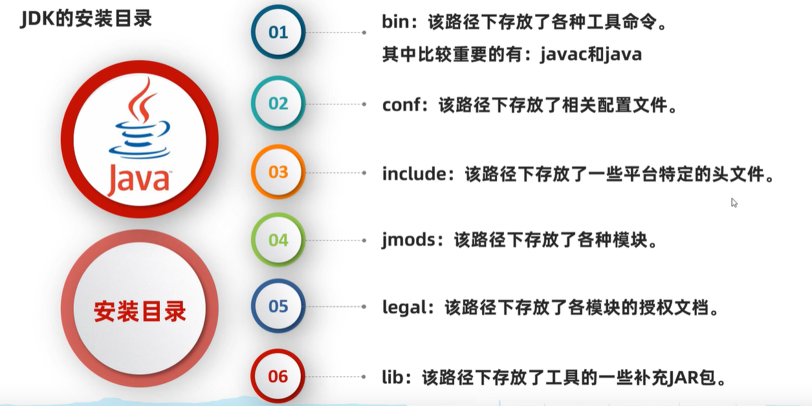
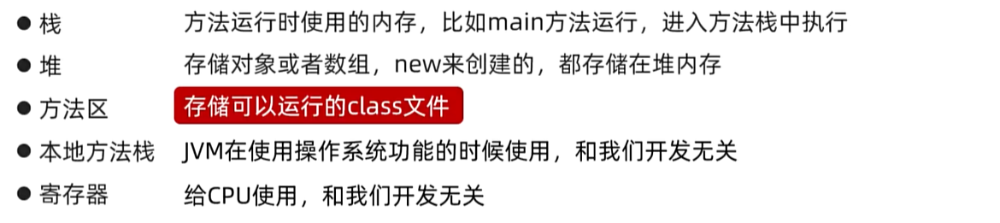
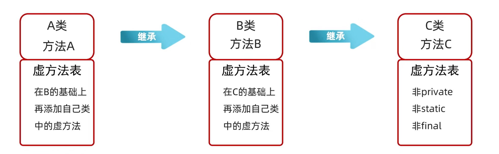
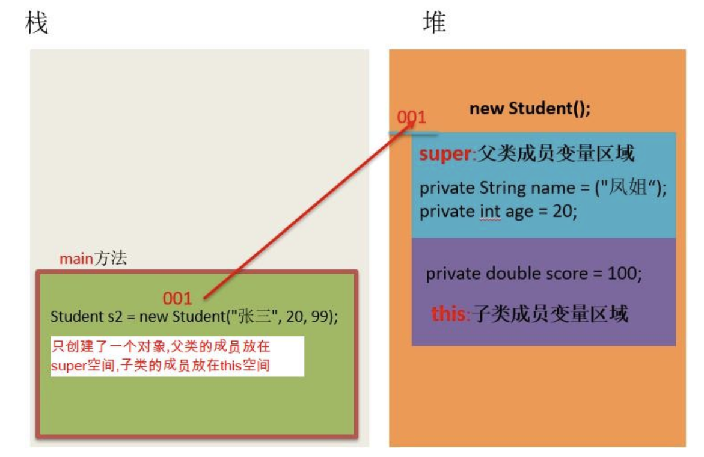
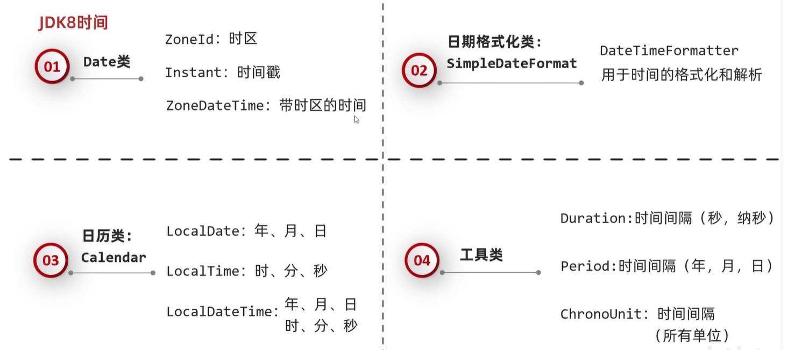
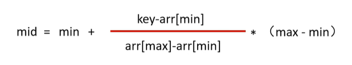
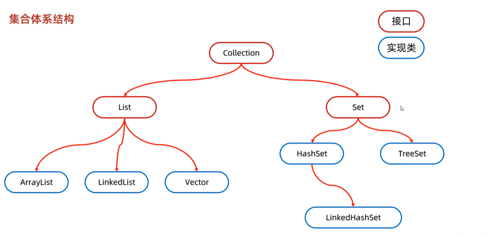
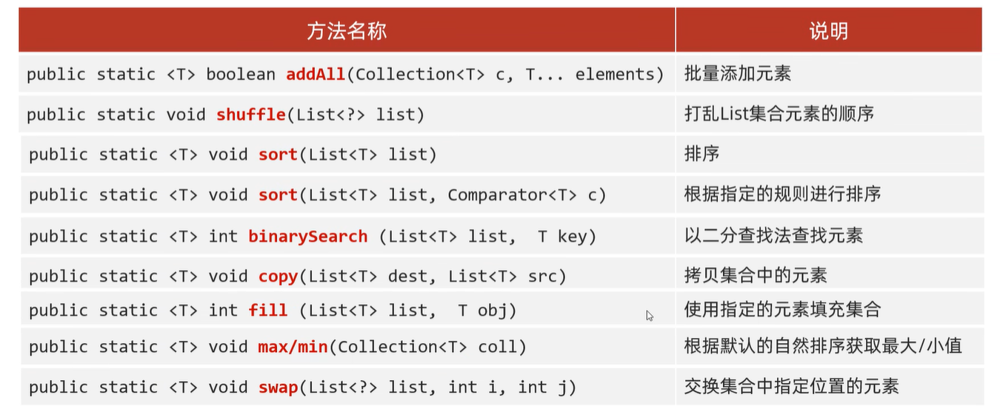

## 1. 基础语法

### 1.1 Java入门

#### 1.1.1 JDK安装目录



- `javac`是JDK提供的编译工具，`java`是用来运行代码的

-  标准配置环境变量，先配置`JAVA_HOME`  (例如E:\develop\jdk) ，再配置Path (%JAVA_HOME%\bin)

#### 1.1.2 JRE和JDK

**JVM：**Java虚拟机，真正运行java程序的地方

**JRE：**Java的运行环境

**JDK：**Java的开发工具包：JVM + 核心类库 + 开发工具

​				

#### 1.1.3 一些IDEA实用快捷键

Shift + F6：选中变量按下后，批量修改该变量的名字

Ctrl + Alt + v：自动补全该行代码前面的内容，例如变量

Ctrl + Alt + T：用一个for或者if或其他包裹一段代码

Ctrl + Alt + M：选中一段代码按这个，将其单独包装成一个新方法

Ctrl + D：向下复制一行


​			

### 1.2  基础概念

####  1.2.1 注释和关键字

Java中的注释分为三种：

* 单行注释：

~~~java
// 这是单行注释文字
~~~

* 多行注释：

~~~java
/*
这是多行注释文字
这是多行注释文字
这是多行注释文字
*/
注意：多行注释不能嵌套使用。
~~~

* 文档注释：

```java
/**
这是多行注释文字
这是多行注释文字
这是多行注释文字
*/
```

关键字就是被Java赋予了特定含义的英文单词。

| **abstract**   | **assert**       | **boolean**   | **break**      | **byte**   |
| -------------- | ---------------- | ------------- | -------------- | ---------- |
| **case**       | **catch**        | **char**      | **class**      | **const**  |
| **continue**   | **default**      | **do**        | **double**     | **else**   |
| **enum**       | **extends**      | **final**     | **finally**    | **float**  |
| **for**        | **goto**         | **if**        | **implements** | **import** |
| **instanceof** | **int**          | **interface** | **long**       | **native** |
| **new**        | **package**      | **private**   | **protected**  | **public** |
| **return**     | **strictfp**     | **short**     | **static**     | **super**  |
| **switch**     | **synchronized** | **this**      | **throw**      | **throws** |
| **transient**  | **try**          | **void**      | **volatile**   | **while**  |

****

**关键字class**

表示定义一个类。创建一个类。

类：Java项目最基本的组成单元，一个完整的Java项目有可能会有成千上万个类来组成的。

class后面跟随的就是这个类的名字，简称：类名。

在类名后面会有一对大括号，表示这个类的内容。

```java
public class HelloWorld{
    
}
```

****

​	

#### 1.2.2 字面量

作用：告诉程序员，数据在程序中的书写格式。

| **字面量类型** | **说明**                                  | **程序中的写法**           |
| -------------- | ----------------------------------------- | -------------------------- |
| 整数           | 不带小数的数字                            | 666，-88                   |
| 小数           | 带小数的数字                              | 13.14，-5.21               |
| 字符           | 必须使用单引号，有且仅能一个字符          | ‘A’，‘0’，   ‘我’          |
| 字符串         | 必须使用双引号，内容可有可无              | “HelloWorld”，“黑马程序员” |
| 布尔值         | 布尔值，表示真假，只有两个值：true，false | true 、false               |
| 空值           | 一个特殊的值，空值                        | 值是：null                 |

> 制表符 \t ：打印的时候把前面字符串的长度补齐到8或者8的整数倍。最少补1个空格，最多补8个
>
> 在打印文字的时候使用，可以达到像表格一样对齐的效果

​			

#### 1.2.3 变量

变量就在程序中临时存储数据的容器。但是这个容器中只能存一个值。

**定义格式：**`数据类型 变量名 = 数据值；`

变量在使用之前必须要赋值。

​	

#### 1.2.4 数据类型

数据类型有两种：基本数据类型、引用数据类型

| 数据类型 | 关键字  | 内存占用 |                 取值范围                  |
| :------: | :-----: | :------: | :---------------------------------------: |
|   整数   |  byte   |    1     |    负的2的7次方 ~ 2的7次方-1(-128~127)    |
|          |  short  |    2     | 负的2的15次方 ~ 2的15次方-1(-32768~32767) |
|          |   int   |    4     |        负的2的31次方 ~ 2的31次方-1        |
|          |  long   |    8     |        负的2的63次方 ~ 2的63次方-1        |
|  浮点数  |  float  |    4     |        1.401298e-45 ~ 3.402823e+38        |
|          | double  |    8     |      4.9000000e-324 ~ 1.797693e+308       |
|   字符   |  char   |    2     |                  0-65535                  |
|   布尔   | boolean |    1     |                true，false                |

- 在java中整数默认是int类型，浮点数默认是double类型。

- byte类型的取值范围：

  ​	-128 ~ 127

  int类型的大概取值范围：

  ​	-21亿多  ~ 21亿多

  整数类型和小数类型的取值范围大小关系：

  ​	double > float > long > int > short > byte

- 如果要定义 一个整数类型的变量，不知道选择哪种数据类型了，默认使用int。

- 如果要定义 一个小数类型的变量，不知道选择哪种数据类型了，默认使用double。

- 如果要定义一个long类型的变量，那么在数据值的后面需要**加上L后缀**。（大小写都可以，建议大写。）

- 如果要定义一个float类型的变量，那么在数据值的后面需要**加上F后缀**。（大小写都可以）

  ​			

#### 1.2.5 标识符

业内大多数程序员都在遵守阿里巴巴的命名规则。

必须要这么做，否则代码会报错。

- 必须由数字、字母、下划线_、美元符号$组成。
- 数字不能开头
- 不能是关键字
- 区分大小写的。

**小驼峰命名法：**适用于变量名和方法名，如果是一个单词，那么全部小写，比如：name；如果是多个单词，那么从第二个单词开始，首字母大写，比如：firstName、maxAge

**大驼峰命名法：**适用于类名，如果是一个单词，那么首字母大写。比如：Demo、Test。如果是多个单词，那么每一个单词首字母都需要大写。比如：HelloWorld

​					

#### 1.2.6 键盘录入 - Scanner类

1. 导包

2. 创建对象

3. 接收数据    

   ​		

### 1.3 运算符和表达式

#### 1.3.1 算术运算符

分类：

`+` 加法

`-` 减法

`*` 乘法

`/` 除法

`%` 取模（取余）

**注意：**

1. 整数相除结果只能得到整除，如果结果想要是小数，必须要有小数参数。

2. 小数直接参与运算，得到的结果有可能是不精确的。

    			

#### 1.3.2 数字类型转换

**隐式转换：**就是把一个取值范围小的数据或者变量，赋值给另一个取值范围大的变量。此时不需要我们额外写代码单独实现，是程序自动帮我们完成的。（取值范围小变大）

两种提升规则：

* 取值范围小的，和取值范围大的进行运算，小的会先提升为大的，再进行运算。
* byte、short、char三种类型的数据在运算的时候，都会直接先提升为int，然后再进行运算。

**强制转换：**如果要把一个取值范围大的数据或者变量赋值给另一个取值范围小的变量。是不允许直接操作。

如果一定要这么干，就需要加入强制转换。（取值范围大变小）

书写格式：

```java
目标数据类型 变量名 = （目标数据类型）被强转的数据；
```

​	

#### 1.3.4 字符串的+操作

* 当+操作中出现字符串时，此时就是字符串的连接符，会将前后的数据进行拼接，并产生一个新的字符串。

* 当连续进行+操作时，从左到右逐个执行的。

  ​		

#### 1.3.5 自增和自减运算符

`++` 自增（前置和后置）：变量的值加1，先用后加

`--` 自减（前置和后置）：变量的值减1，先加后用

​				

#### 1.3.6 赋值运算符

最为常用的：=

拓展赋值运算符 ：+=、-=、*=、/=、%=


#### 1.3.7 关系运算符

| 符号 | 解释                                                         |
| ---- | ------------------------------------------------------------ |
| ==   | 就是判断左边跟右边是否相等，如果成立就是true，如果不成立就是false |
| !=   | 就是判断左边跟右边是否不相等，如果成立就是true，如果不成立就是false |
| >    | 就是判断左边是否大于右边，如果成立就是true，如果不成立就是false |
| >=   | 就是判断左边是否大于等于右边，如果成立就是true，如果不成立就是false |
| <    | 就是判断左边是否小于右边，如果成立就是true，如果不成立就是false |
| <=   | 就是判断左边是否小于等于右边，如果成立就是true，如果不成立就是false |

注意：

* 关系运算符最终的结果一定是布尔类型的。要么是true，要么是false

* 在写==的时候，千万不要写成=

  ​	

#### 1.3.8 逻辑运算符

**&：逻辑与（而且）**

​	两边都为真，结果才是真，只要有一个为假，那么结果就是假。

**|：逻辑或（或者）**

​	两边都为假，结果才是假，只要有一个为真，那么结果就是真。

**^：异或**

​	如果两边相同，结果为false，如果两边不同，结果为true

**!：取反**

​	计算规则：false取反就是true，true取反就是false。注意取反最多只能用一个

**&&：**

​	运算结果跟&是一模一样的，只不过具有短路效果。

**||：**

​	运算结果跟|是一模一样的。只不过具有短路效果。

​				

#### 1.3.9 三元运算符

**格式：**

```java
关系表达式 ？ 表达式1 ：表达式2 ；
```

**计算规则：**

* 计算关系表达式的值。
* 如果关系表达式的值为真，那么执行表达式1。
* 如果关系表达式的值为假，那么执行表达式2。

**注意：**三元运算符的最终结果一定要被使用，要么赋值给一个变量，要么直接打印出来。

​				

### 1.4 判断和循环

#### 1.4.1 判断 —— if语句

```java
格式：
if (关系表达式) {
    语句体;	
}
```

执行流程：

①首先计算关系表达式的值

②如果关系表达式的值为true就执行语句体

③如果关系表达式的值为false就不执行语句体

④继续执行后面的语句内容

```java
格式：
if (关系表达式) {
    语句体1;	
} else {
    语句体2;	
}
```

执行流程：

①首先计算关系表达式的值

②如果关系表达式的值为true就执行语句体1

③如果关系表达式的值为false就执行语句体2

④继续执行后面的语句内容

```java
格式：
if (关系表达式1) {
    语句体1;	
} else if (关系表达式2) {
    语句体2;	
} 
…
else {
    语句体n+1;
}
```

执行流程：

①首先计算关系表达式1的值

②如果值为true就执行语句体1；如果值为false就计算关系表达式2的值

③如果值为true就执行语句体2；如果值为false就计算关系表达式3的值

④…

⑤如果没有任何关系表达式为true，就执行语句体n+1。

​		

#### 1.4.2 判断 —— switch语句

```java
switch (表达式) {
	case 1:
		语句体1;
		break;
	case 2:
		语句体2;
		break;
	...
	default:
		语句体n+1;
		break;
}
```

执行流程：

- 首先计算出表达式的值 
- 其次，和case依次比较，一旦有对应的值，就会执行相应的语句，在执行的过程中，遇到break就会结 束。 
- 最后，如果所有的case都和表达式的值不匹配，就会执行default语句体部分，然后程序结束掉。 

注意：

- default的位置和省略情况

  default可以放在任意位置，也可以省略

- case穿透

  不写break会引发case穿透现象

- switch在JDK12的新特性

  ```java
  int number = 10;
  switch (number) {
      case 1 -> System.out.println("一");
      case 2 -> System.out.println("二");
      case 3 -> System.out.println("三");
      default -> System.out.println("其他");
  }	
  ```

  ​			

#### 1.4.3  循环 —— for

格式：

```java
for (初始化语句;条件判断语句;条件控制语句) {
	循环体语句;
}
```

**格式解释：**

- 初始化语句：  用于表示循环开启时的起始状态，简单说就是循环开始的时候什么样
- 条件判断语句：用于表示循环反复执行的条件，简单说就是判断循环是否能一直执行下去
- 循环体语句：  用于表示循环反复执行的内容，简单说就是循环反复执行的事情
- 条件控制语句：用于表示循环执行中每次变化的内容，简单说就是控制循环是否能执行下去

**执行流程：**

①执行初始化语句

②执行条件判断语句，看其结果是true还是false

​	如果是false，循环结束

​	如果是true，继续执行

③执行循环体语句

④执行条件控制语句

⑤回到②继续		

​				

#### 1.4.4 循环 —— while

**格式：**

```java
初始化语句;
while(条件判断语句){
	循环体;
	条件控制语句;
}
```

**do ... while 循环**

格式：

```java
初始化语句;
do{
    循环体;
    条件控制语句;
}while(条件判断语句);
```

特点：先执行，再判断。

​						

### 1.5 高级循环

#### 1.5.1  无限循环

又叫死循环。循环一直停不下来。

**for格式：**

```java
for(;;){
    System.out.println("循环执行一直在打印内容");
}
```

解释：

初始化语句可以空着不写，表示循环之前不定义任何的控制变量。

条件判断语句可以空着不写，如果不写，默认表示true，循环一直进行。

条件控制语句可以空着不写，表示每次循环体执行完毕后，控制变量不做任何变化。

**while格式：**

```java
while(true){
    System.out.println("循环执行一直在打印内容");
}
```

解释：

​	小括号里面就不能省略了，true一定要写出来，否则代码会报错。

​		

#### 1.5.2 条件控制语句

**break:**  不能单独存在的。可以用在switch和循环中，表示结束，跳出的意思。

**continue: ** 不能单独存在的。只能存在于循环当中。表示跳过本次循环，继续执行下次循环。


#### 1.5.3 Random

Random跟Scanner一样，也是Java提前写好的类，我们不需要关心是如何实现的，只要直接使用就可以了。

**使用步骤：**

1. 导包

```java
import java.util.Random;
导包的动作必须出现在类定义的上边。
```

2. 创建对象

```java
Random r = new Random ();
上面这个格式里面，只有r是变量名，可以变，其他的都不允许变。
```

3. 生成随机数

```java
int number = r.nextInt(随机数的范围);
上面这个格式里面，只有number是变量名，可以变，其他的都不允许变。
随机数范围的特点：从0开始，不包含指定值。比如：参数为10，生成的范围[0,10)
```

​		

#### 1.5.4 break指定循环

```java
遇到嵌套循环想要打破最外层可以这么操作：
loop: while(true){
	......
    while(true){
        break loot;
	}
}
```

​					

### 1.6 数组

#### 1.6.1 数组定义和静态初始化

```java
//格式1
数据类型 [] 数组名
    
//格式2
数据类型 数组名 []
    
//完整格式
数据类型[] 数组名 = new 数据类型[]{元素1，元素2，元素3，元素4...};

//简化格式
数据类型[] 数组名 = {元素1，元素2，元素3，元素4...};
```

**格式详解：**

​	数据类型：限定了数组以后能存什么类型的数据。

​	方括号：表示现在定义的是一个数组。

​	数组名：其实就是名字而已，方便以后使用，在起名字的时候遵循小驼峰命名法。

​		arr   namesArr

​	new：就是给数组在内存中开辟了一个空间。

​	数据类型：限定了数组以后能存什么类型的数据。

​		前面和后面的数据类型一定要保持一致。

​		int[] arr = new double[]{11,22,33};//错误写法

​	方括号：表示现在定义的是一个数组。

​	大括号：表示数组里面的元素。元素也就是存入到数组中的数据。

​		多个元素之间，一定要用逗号隔开。

​			

#### 1.6.2 地址值

打印数组的时候，实际出现的是数组的地址值。

数组的地址值：就表示数组在内存中的位置。

以`[I@6d03e736`为例：

[ ：表示现在打印的是一个数组。

I：表示现在打印的数组是int类型的。

@：仅仅是一个间隔符号而已。

6d03e736：就是数组在内存中真正的地址值。（十六进制的）

但是，我们习惯性会把[I@6d03e736这个整体称之为数组的地址值。

​			

#### 1.6.3 数组元素访问

**格式：**`数组名[索引];`

**索引：**

​	也叫角标、下标，

​	就是数组容器中每一个小格子对应的编号。

* 索引一定是从0开始的。
* 连续不间断。
* 逐个+1增长。

  ​			

#### 1.6.4 数组的动态初始化

**格式：**

```java
数据类型[] 数组名 = new 数据类型[数组的长度];
```

**数组的默认初始化值：**

整数类型：0

小数类型：0.0

布尔类型：false

字符类型：'\u0000'

引用类型：null

​				

#### 1.6.5 内存分配

**java内存分配**




​				

### 1.7 方法

方法（method）是程序中最小的执行单元

注意：

* 方法必须先创建才可以使用，该过程成为方法定义

* 方法创建后并不是直接可以运行的，需要手动使用后，才执行，该过程成为方法调用

  ​		

#### 1.7.1 方法的通用格式

* 格式：

  ```java
  public static 返回值类型 方法名(参数) {
     方法体; 
     return 数据 ;
  }
  ```

* 解释：

  * public static 	修饰符，目前先记住这个格式

    返回值类型	方法操作完毕之后返回的数据的数据类型

    ​			如果方法操作完毕，没有数据返回，这里写void，而且方法体中一般不写return

     方法名		调用方法时候使用的标识

     参数		由数据类型和变量名组成，多个参数之间用逗号隔开

     方法体		完成功能的代码块

     return		如果方法操作完毕，有数据返回，用于把数据返回给调用者

* 定义方法时，要做到两个明确

  * 明确返回值类型：主要是明确方法操作完毕之后是否有数据返回，如果没有，写void；如果有，写对应的数据类型
  * 明确参数：主要是明确参数的类型和数量

* 调用方法时的注意：

  * void类型的方法，直接调用即可
  * 非void类型的方法，推荐用变量接收调用

​		

#### 1.7.3 形参和实参

1. 形参：方法定义中的参数

​          等同于变量定义格式，例如：int number

2. 实参：方法调用中的参数

​          等同于使用变量或常量，例如： 10  number

​			

#### 1.7.4 方法的注意事项

**方法不能嵌套定义**

* 示例代码：

  ```java
  public class MethodDemo {
      public static void main(String[] args) {
  
      }
  
      public static void methodOne() {
  		public static void methodTwo() {
         		// 这里会引发编译错误!!!
      	}
      }
  }
  ```

**void表示无返回值，可以省略return，也可以单独的书写return，后面不加数据**

* 示例代码：

  ```java
  public class MethodDemo {
      public static void main(String[] args) {
  
      }
      public static void methodTwo() {
          //return 100; 编译错误，因为没有具体返回值类型
          return;	
          //System.out.println(100); return语句后面不能跟数据或代码
      }
  }
  ```

  ​			

#### 1.7.5 方法的重载

* 方法重载概念

  方法重载指同一个类中定义的多个方法之间的关系，满足下列条件的多个方法相互构成重载

  * 多个方法在同一个类中
  * 多个方法具有相同的方法名
  * 多个方法的参数不相同，类型不同或者数量不同

* 注意：

  * 重载仅对应方法的定义，与方法的调用无关，调用方式参照标准格式
  * 重载仅针对同一个类中方法的名称与参数进行识别，与返回值无关，换句话说不能通过返回值来判定两个方法是否相互构成重载

**简答来说：同一个类，同一个函数名，不同的形参**

​					 

## 2. 面向对象

### 2.1 类和对象

#### 2.1.1 类和对象的理解

客观存在的事物皆为对象 ，所以我们也常常说万物皆对象。

**类**

* 类的理解
  * 类是对现实生活中一类具有共同属性和行为的事物的抽象
  * 类是对象的数据类型，类是具有相同属性和行为的一组对象的集合
  * 简单理解：类就是对现实事物的一种描述
* 类的组成
  * 属性：指事物的特征，例如：手机事物（品牌，价格，尺寸）
  * 行为：指事物能执行的操作，例如：手机事物（打电话，发短信）

**类和对象的关系**

* 类：类是对现实生活中一类具有共同属性和行为的事物的抽象

* 对象：是能够看得到摸的着的真实存在的实体

* 简单理解：**类是对事物的一种描述，对象则为具体存在的事物**

  ​					

#### 2.1.2 类的定义

类的组成是由属性和行为两部分组成

* 属性：在类中通过成员变量来体现（类中方法外的变量）
* 行为：在类中通过成员方法来体现（和前面的方法相比去掉static关键字即可）

**类的定义步骤：**

①定义类

②编写类的成员变量

③编写类的成员方法

```java
public class 类名 {
	// 成员变量
	变量1的数据类型 变量1；
	变量2的数据类型 变量2;
	…
	// 成员方法
	方法1;
	方法2;	
}
```

**类的分类**

- Javabean类：用来描述一类事物的类，在Javabean类中，是不写main方法的。要有**私有化成员属性**，**get()和set()方法**，**各种参数的构造函数**
- 测试类：编写main方法的类我们可以在测试类中创建javabean类的对象并进行赋值调用。
- 工具类：用来帮助我们做一些事情的，不描述任何事物。**类名见名知意、私有化构造方法、方法定义为静态**

**注意：**

一个代码文件中可以定义多个类，但是只能一个类是public修饰的，且public修饰的类名必须是Java代码的文件名称

​					

#### 2.1.3 对象的使用

创建对象的格式：

* 类名 对象名 = new 类名();

调用成员的格式：

* 对象名.成员变量
* 对象名.成员方法();

示例代码

```java
/*
    创建对象
        格式：类名 对象名 = new 类名();
        范例：Phone p = new Phone();

    使用对象
        1：使用成员变量
            格式：对象名.变量名
            范例：p.brand
        2：使用成员方法
            格式：对象名.方法名()
            范例：p.call()
 */
public class PhoneDemo {
    public static void main(String[] args) {
        //创建对象
        Phone p = new Phone();

        //使用成员变量
        System.out.println(p.brand);
        System.out.println(p.price);

        p.brand = "小米";
        p.price = 2999;

        System.out.println(p.brand);
        System.out.println(p.price);

        //使用成员方法
        p.call();
        p.sendMessage();
    }
}
```


### 2.2 封装    

#### 2.2.1 封装的思想

1. 封装概述
   是面向对象三大特征之一（封装，继承，多态）

   **对象代表什么，就得封装对应的数据，并提供数据对应的行为** 

2. 封装代码实现
   将类的某些信息隐藏在类内部，不允许外部程序直接访问，而是通过该类提供的方法来实现对隐藏信息的操作和访问
   成员变量private，提供对应的getXxx()/setXxx()方法

> 例如人画圆，应当把draw方法封装在圆这个对象中，而非人。人关门，应当把open()和close()封装在门这个对象中 

​			

#### 2.2.2 private关键字

private是一个修饰符，可以用来修饰成员（成员变量，成员方法）

被private修饰的成员，**只能在本类进行访问**，针对private修饰的成员变量，如果需要被其他类使用，提供相应的操作

* 提供“get变量名()”方法，用于获取成员变量的值，方法用public修饰

* 提供“set变量名(参数)”方法，用于设置成员变量的值，方法用public修饰

  ​			

#### 2.2.3 成员变量和局部变量

* 类中位置不同：成员变量（类中方法外）局部变量（方法内部或方法声明上）

* 内存中位置不同：成员变量（堆内存）局部变量（栈内存）

* 生命周期不同：成员变量（随着对象的存在而存在，随着对象的消失而消失）局部变量（随着方法的调用而存在，醉着方法的调用完毕而消失）

* 初始化值不同：成员变量（有默认初始化值）局部变量（没有默认初始化值，必须先定义，赋值才能使用）

  ​			

#### 2.2.4 就近原则和this关键字

this修饰的变量用于指代成员变量，其主要作用是（区分局部变量和成员变量的重名问题）

* 方法的形参如果与成员变量同名，不带this修饰的变量指的是形参，而不是成员变量
* 方法的形参没有与成员变量同名，不带this修饰的变量指的是成员变量

**就近原则：**变量重名时，会优先选择调用离其最近的那一个

```java
public class Student {
    private String name;
    private int age;

    public void setName(String name) {
        this.name = name; //name会首先选择成员方法中的name，this.name才是对象的name
    }
}
```

​				

### 2.3 构造方法

#### 2.3.1 概述

构造方法是一种特殊的方法

* 作用：创建对象   Student stu = **new Student();**

* 格式：

  public class 类名{

  ​        修饰符 类名( 参数 ) {

  ​        }

  }

* 功能：主要是完成对象数据的初始化

* 示例代码：

```java
class Student {
    private String name;
    private int age;
    
    //构造方法
    public Student() {
        System.out.println("无参构造方法");
    }

}
```

​			

#### 2.3.2 一些细节

**构造方法的创建**

如果没有定义构造方法，系统将给出一个默认的无参数构造方法
如果定义了构造方法，系统将不再提供默认的构造方法

**构造方法的重载**

如果自定义了带参构造方法，还要使用无参数构造方法，就必须再写一个无参数构造方法

**推荐的使用方式**

无论是否使用，都手工书写无参数构造方法

**重要功能！**

可以使用带参构造，为成员变量进行初始化

​	

#### 2.3.3 标准类制作

① 类名需要见名知意

② 成员变量使用private修饰

③ 提供至少两个构造方法 

* 无参构造方法
* 带全部参数的构造方法

④ get和set方法 

​	提供每一个成员变量对应的setXxx()/getXxx()

⑤ 如果还有其他行为，也需要写上

​			

### 2.4 static

Java中成员（**变量和方法**）等是存在所属性的，Java是通过static关键字来区分的。**static关键字在Java开发非常的重要，对于理解面向对象非常关键。**

关于 `static` 关键字的使用，它可以用来修饰的成员变量和成员方法，被static修饰的成员是**属于类**的是放在静态区中，没有static修饰的成员变量和方法则是**属于对象**的。我们上面案例中的成员变量都是没有static修饰的，所以属于每个对象。

static是静态的意思。 static可以修饰成员变量或者修饰方法。

​		

#### 2.4.1 静态变量及其访问

有static修饰成员变量，说明这个成员变量是属于类的，这个成员变量称为**类变量**或者**静态成员变量**。 直接用 类名访问即可。因为类只有一个，所以静态成员变量在内存区域中也只存在一份。所有的对象都可以**共享**这个变量。

**如何使用呢**

例如现在我们需要定义传智全部的学生类，那么这些学生类的对象的学校属性应该都是“传智”，这个时候我们可以把这个属性定义成static修饰的静态成员变量。

**定义格式**

```java
修饰符 static 数据类型 变量名 = 初始值；    
```

**举例**

```java
public class Student {
    public static String schoolName = "传智播客"； // 属于类，只有一份。
    // .....
}
```

**静态成员变量的访问:**

格式：`类名.静态变量`

​		

#### 2.4.2 静态方法及其访问

有static修饰成员方法，说明这个成员方法是属于类的，这个成员方法称为**类方法或者**静态方法。 直接用  类名访问即可。因为类只有一个，所以静态方法在内存区域中也只存在一份。所有的对象都可以共享这个方法。

与静态成员变量一样，静态方法也是直接通过**类名.方法名称**即可访问。

**举例**

```java
public class Student{
    public static String schoolName = "传智播客"； // 属于类，只有一份。
    // .....
    public static void study(){
    	System.out.println("我们都在黑马程序员学习");   
    }
}
```

**静态成员变量的访问:**

**格式：类名.静态方法**

```java
public static void  main(String[] args){
    Student.study();
}
```

> 注意：1. 静态方法中没有this关键字
>
> 2. 静态方法中，只能访问静态
> 3. 非静态方法可以访问所有

  

### 2.5 继承

继承描述的是事物之间的所属关系，这种关系是：`is-a` 的关系。例如，兔子属于食草动物，食草动物属于动物。可见，父类更通用，子类更具体。我们通过继承，可以使多种事物之间形成一种关系体系。

**继承**：就是子类继承父类的**属性**和**行为**，使得子类对象可以直接具有与父类相同的属性、相同的行为。子类可以直接访问父类中的**非私有**的属性和行为。

**继承的好处：**

1. 提高**代码的复用性**（减少代码冗余，相同代码重复利用）。

2. 使类与类之间产生了关系。

   ​	

#### 2.5.1 继承的格式

通过 `extends` 关键字，可以声明一个子类继承另外一个父类，定义格式如下：

```java
class 父类 {
	...
}

class 子类 extends 父类 {
	...
}
```

**需要注意：Java是单继承的，一个类只能继承一个直接父类，跟现实世界很像，但是Java中的子类是更加强大的。**

​	

#### 2.5.2 Java继承的特点

1. Java只能单继承，一个类只能继承一个直接父类

2. Java不支持多继承，但支持多层继承

3. Java中所有的类都直接或间接继承于Object类

   ​			

#### 2.5.3 子类能继承的内容

**构造方法：**子类不能继承父类的构造方法。

**成员变量：**

- 非私有可以继承
- private也可以继承：但必须通过getter/setter方法访问父类的private成员变量。

**成员方法：**

- 添加在虚方法表中的可以继承，否则不能

- 

  ​			

#### 2.5.4 继承后的特点——成员变量

子父类中出现了同名的成员变量时，子类会优先访问自己对象中的成员变量（就近原则）。如果此时想访问父类成员变量如何解决呢？我们可以使用super关键字——从父类成员开始往上找 。

**使用格式：**

```java
super.父类成员变量名
```

**示例：**

```java
class Fu {
	// Fu中的成员变量。
	int num = 5;
}

class Zi extends Fu {
	// Zi中的成员变量
	int num = 6;
  
	public void show() {
        int num = 1;
      
        // 访问方法中的num
        System.out.println("method num=" + num);
        // 访问子类中的num
        System.out.println("Zi num=" + this.num);
        // 访问父类中的num
        System.out.println("Fu num=" + super.num);
	}
}
```

​				

#### 2.5.5 方法的重写

**方法重写** ：子类中出现与父类一模一样的方法时（返回值类型，方法名和参数列表都相同），会出现覆盖效果，也称为重写或者复写。**声明不变，重新实现**。

发生在子父类之间的关系。
子类继承了父类的方法，但是子类觉得父类的这方法不足以满足自己的需求，子类重新写了一个与父类同名的方法，以便覆盖父类的该方法。

**@Override重写注解**

* @Override:注解，重写注解校验！

* 这个注解标记的方法，就说明这个方法必须是重写父类的方法，否则编译阶段报错。本质是重写覆盖了虚方法表

* 建议重写都加上这个注解，一方面可以提高代码的可读性，一方面可以防止重写出错！


```java
public class Cat extends Animal {
    // 方法名称与父类全部一样，只是方法体中的功能重写写了！
    @Override
    public void cry(){
        System.out.println("我们一起学猫叫，喵喵喵！喵的非常好听！");
    }
}
```

**重写注意事项：**

1. 方法重写是发生在子父类之间的关系。

2. 子类方法覆盖父类方法，必须要保证权限大于等于父类权限。

3. 子类方法覆盖父类方法，返回值类型、函数名和参数列表都要一模一样。

   ​				

####  2.5.6 继承后的特点——构造方法

构造方法的作用是初始化对象成员变量数据的。所以子类的初始化过程中，必须先执行父类的初始化动作。子类的构造方法中默认有一个`super()` ，表示调用父类的构造方法，父类成员变量初始化后，才可以给子类使用。（

**继承后子类构方法器特点：**子类所有构造方法的第一行都会默认先调用父类的无参构造方法


#### 2.5.7 super()和this()：

super和this完整的用法如下

```java
this.成员变量    	--    本类的
super.成员变量    	--    父类的

this.成员方法名()  	--    本类的    
super.成员方法名()   --    父类的
```

使用调用构造方法格式：

```java
super(...) -- 调用父类的构造方法，根据参数匹配确认
this(...) -- 调用本类的其他构造方法，根据参数匹配确认
```

**注意：**

**子类的每个构造方法中均有默认的super()，调用父类的空参构造。手动调用父类构造会覆盖默认的super()。**

**super() 和 this() 都必须是在构造方法的第一行，所以不能同时出现。**

super(..)是根据参数去确定调用父类哪个构造方法的。

**super()本质：**

**父类空间优先于子类对象产生**

在每次创建子类对象时，先初始化父类空间，再创建其子类对象本身。目的在于子类对象中包含了其对应的父类空间，便可以包含其父类的成员，如果父类成员非private修饰，则子类可以随意使用父类成员。代码体现在子类的构造七调用时，一定先调用父类的构造方法。理解图解如下：



**this()的用法：**

 *    默认是去找本类中的其他构造方法，根据参数来确定具体调用哪一个构造方法。
 *    为了借用其他构造方法的功能。

```java
class Student{
    private String name ;
    private int age ;
    private char sex ;

    public Student() {
        this("徐干",21,'男');
    }

    public Student(String name, int age, char sex) {
        this.name = name ;
        this.age = age   ;
        this.sex = sex   ;
    }

......
}
```

​						

### 2.6 多态

#### 2.6.1 多态的形式和使用场景

多态是继封装、继承之后，面向对象的第三大特性。

多态是出现在继承或者实现关系中的。

**多态体现的格式**：

```java
父类类型 变量名 = new 子类/实现类构造器;
变量名.方法名();
```

**多态的前提**：有继承关系，子类对象是可以赋值给父类类型的变量。例如Animal是一个动物类型，而Cat是一个猫类型。Cat继承了Animal，Cat对象也是Animal类型，自然可以赋值给父类类型的变量。

**使用场景：**

如果没有多态，在下图中register方法只能传递学生对象，其他的Teacher和administrator对象是无法传递给register方法方法的，在这种情况下，只能定义三个不同的register方法分别接收学生，老师和管理员。


有了多态之后，方法的形参就可以定义为共同的父类Person。

**要注意的是：**

* 当一个方法的形参是一个类，我们可以传递这个类所有的子类对象。

* 当一个方法的形参是一个接口，我们可以传递这个接口所有的实现类对象（后面会学）。

* 而且多态还可以根据传递的不同对象来调用不同类中的方法。

  ​			

#### 2.6.2 多态的定义和前提

**多态**： 是指同一行为，具有多个不同表现形式。

从上面案例可以看出，Cat和Dog都是动物，都是吃这一行为，但是出现的效果（表现形式）是不一样的。

 **前提【重点】**

1. 有继承或者实现关系

2. 方法的重写【意义体现：不重写，无意义】

3. 父类引用指向子类对象【格式体现】

   > 父类类型：指子类对象继承的父类类型，或者实现的父接口类型。

**多态的好处：**使用父类型作为参数，可以接收所有子类对象，体现多态的拓展性与便利 ※


#### 2.6.3 多态的运行特点

调用成员变量时：编译看左边，运行看左边

调用成员方法时：编译看左边，运行看右边

```java
Fu f = new Zi()；
//编译看左边的父类中有没有name这个属性，没有就报错
//在实际运行的时候，把父类name属性的值打印出来
System.out.println(f.name);
//编译看左边的父类中有没有show这个方法，没有就报错
//在实际运行的时候，运行的是子类中的show方法
f.show();
```

​					

#### 2.6.4 多态的优势和弊端

**优势：**

1. 在多态形式下，右边的对象可以实现解耦合，便于维护和拓展
2. 定义方法的时候，使用父类型作为参数，可以接收所有子类对象，体现多态的扩展性与便利 ※

**弊端：**

1. 不能调用子类的特有功能（编译看左边，左边父类没有就不行）

   **解决方案：**变回子类类型，用小括号强制转换，转换的时候不能瞎转，不能转换成其他类型

   **instance关键字**

   ```java
   /*....Animal类
   ....Dog类
   ....Cat类 */
       
   Animal a = new Dog();
   Dog b = (Dog) a;  //强制转换
   
   if (a instanceof Dog){		//instanceof 意思是“是不是”，后面跟类名，是就返回true
   	Dog c = (Dog) a;
   }
   
   //新特性：先判断a是否为Dog类型，是的话强转成Dog类型，转换之后变量名为d
   if(a instanceof Dog d){
       ...
   }
   ```
   
   ​						

### 2.7 包

#### 2.7.1 包概述

包在操作系统中其实就是一个文件夹。**包是用来分门别类的管理技术，不同的技术类放在不同的包下**，方便管理和维护。

**包名的命名规范**：

```java
路径名.路径名.xxx.xxx
// 例如：com.itheima.oa
```

- 包名一般是公司域名的倒写。例如：黑马是www.itheima.com,包名就可以定义成com.itheima.技术名称。

- 包名必须用”.“连接。

- 包名的每个路径名必须是一个合法的标识符，而且不能是Java的关键字。

  ​				

#### 2.7.2 导包的条件

什么时候需要导包？

​	情况一：在使用Java中提供的非核心包中的类时

​	情况二：使用自己写的其他包中的类时

**什么时候不需要导包？**

​	情况一：在使用Java核心包（java.lang）中的类时

​	情况二：在使用自己写的同一个包中的类时

**使用不同包下的相同类**

假设demo1和demo2中都有一个Student该如何使用？

代码示例：

```java
//使用全类名的形式即可。
//全类名：包名 + 类名
//拷贝全类名的快捷键：选中类名crtl + shift + alt + c 或者用鼠标点copy，再点击copy Reference
com.itheima.homework.demo1.Student s1 = new com.itheima.homework.demo1.Student();
com.itheima.homework.demo2.Student s2 = new com.itheima.homework.demo2.Student();
```

​					

### 2.8 final

Java提供了`final` 关键字，表示修饰的内容不可变。

**final**：  不可改变，最终的含义。可以用于修饰类、方法和变量。

- 类：被修饰的类，不能被继承。

- 方法：被修饰的方法，不能被重写。

- 变量：被修饰的变量，有且仅能被赋值一次。

  ​		

#### 2.8.1 修饰类、方法和局部变量

final修饰的类，不能被继承。

格式如下：

```java
final class 类名 {
}
```

final修饰的方法，不能被重写。
格式如下：

```java
修饰符 final 返回值类型 方法名(参数列表){
    //方法体
}
```

**局部变量——基本类型**
基本类型的局部变量，被final修饰后，只能赋值一次，不能再更改。代码如下：

基本类型的局部变量，被final修饰后，只能赋值一次，不能再更改。

​			

#### 2.8.2 修饰成员变量

成员变量涉及到初始化的问题，初始化方式有显示初始化和构造方法初始化，只能选择其中一个：

- 显示初始化(在定义成员变量的时候立马赋值)（常用）；

```java
public class Student {
    final int num = 10;
}
```

- 构造方法初始化(在构造方法中赋值一次)（不常用，了解即可）。

  **注意：每个构造方法中都要赋值一次！**

> 被final修饰的常量名称，一般都有书写规范，所有字母都**大写**。

​								

### 2.9 权限修饰符和代码块

在Java中提供了四种访问权限，使用不同的访问权限修饰符修饰时，被修饰的内容会有不同的访问权限，我们之前已经学习过了public 和 private，接下来我们研究一下protected和默认修饰符的作用。

- public：公共的，所有地方都可以访问。

- protected：本类 ，本包，其他包中的子类都可以访问。

- 默认（没有修饰符）：本类 ，本包可以访问。

  注意：默认是空着不写，不是default

- private：私有的，当前类可以访问。
  `public > protected > 默认 > private`

#### 2.9.1 访问范围

|                  | public | protected | 默认 | private |
| ---------------- | ------ | --------- | ---- | ------- |
| 同一类中         | √      | √         | √    | √       |
| 同一包中的类     | √      | √         | √    |         |
| 不同包的子类     | √      | √         |      |         |
| 不同包中的无关类 | √      |           |      |         |

可见，public具有最大权限。private则是最小权限。

编写代码时，如果没有特殊的考虑，建议这样使用权限：

- 成员变量使用`private` ，隐藏细节。
- 构造方法使用` public` ，方便创建对象。
- 成员方法使用`public` ，方便调用方法。

> 小贴士：不加权限修饰符，就是默认权限

​	

#### 2.9.2构造码块

代码块：以{}包裹起来的内容，代码块中定义的变量在代码块结束后会被释放

```java
{
    ......
}

public class Student{
    int age;
    String name;
    
    //构造代码块优先于构造方法
    {	
        System.out.println("构造代码块")
	}
    
}
```

​			

#### 2.9.3 静态代码块

**格式：** static{}

**特点：**需要通过static关键字修饰，随着类的加载而加载，并且自动触发、**只执行一次**

**使用场景：**在类加载的时候，做一些数据初始化的时候使用

​				

### 2.10 抽象类和方法

父类中的方法，被它的子类们重写，子类各自的实现都不尽相同。那么父类的方法声明和方法主体，只有声明还有意义，而方法主体则没有存在的意义了(因为子类对象会调用自己重写的方法)。换句话说，父类可能知道子类应该有哪个功能，但是功能具体怎么实现父类是不清楚的（由子类自己决定），父类只需要提供一个没有方法体的定义即可，具体实现交给子类自己去实现。**我们把没有方法体的方法称为抽象方法。Java语法规定，包含抽象方法的类就是抽象类**。

- **抽象方法** ： 没有方法体的方法。

- **抽象类**：包含抽象方法的类。

  ​				

#### 2.10.1 抽象方法

使用`abstract` 关键字修饰方法，该方法就成了抽象方法，抽象方法只包含一个方法名，而没有方法体。

定义格式：

```java
修饰符 abstract 返回值类型 方法名 (参数列表)；
```

代码举例：

```java
public abstract void run()；
```

​					

#### 2.10.2 抽象类

如果一个类包含抽象方法，那么该类必须是抽象类。**注意：抽象类不一定有抽象方法，但是有抽象方法的类必须定义成抽象类。**

定义格式：

```java
abstract class 类名字 { 
  
}
```

代码举例：

```java
public abstract class Animal {
    public abstract void run()；
}
```

**要求**：继承抽象类的子类**必须重写父类所有的抽象方法**。否则，该子类也必须声明为抽象类。

在开发中能够使得所有开发成员一定要按照规定的格式进行重写。

​				

### 2.11 接口

我们已经学完了抽象类，抽象类中可以用抽象方法，也可以有普通方法，构造方法，成员变量等。那么什么是接口呢？**接口是更加彻底的抽象，JDK7之前，包括JDK7，接口中全部是抽象方法。接口同样是不能创建对象的**。

#### 2.11.1 定义格式

```java
//接口的定义格式：
interface 接口名称{
    // 抽象方法
}

// 接口的声明：interface
// 接口名称：首字母大写，满足“驼峰模式”
```

​				

#### 2.11.2 接口中成员的特点

**成员变量：**在接口中定义的成员变量默认会加上： public static final修饰。也就是说在接口中定义的成员变量实际上是一个常量。这里是使用public static final修饰后，变量值就不可被修改，并且是静态化的变量可以直接用接口名访问，所以也叫常量。常量必须要给初始值。常量命名规范建议字母全部大写，多个单词用下划线连接。

**构造方法：**没有

**成员方法：**只能是抽象方法。接口中的抽象方法默认会自动加上public abstract修饰程序员无需自己手写。
按照规范，以后接口中的抽象方法建议不要写上public abstract。

​			

#### 2.11.3 基本的实现

类与接口的关系为实现关系，即**类实现接口**，该类可以称为接口的实现类，也可以称为接口的子类。实现的动作类似继承，格式相仿，只是关键字不同，实现使用 ` implements`关键字。

**格式：**

```java
/**接口的实现：
    在Java中接口是被实现的，实现接口的类称为实现类。
    实现类的格式:*/
class 类名 implements 接口1,接口2,接口3...{

}
```

从上面格式可以看出，接口是可以被多实现的。

**类实现接口的要求和意义：**

1. 必须重写实现的全部接口中所有抽象方法。

2. 如果一个类实现了接口，但是没有重写完全部接口的全部抽象方法，这个类也必须定义成抽象类。

3. 意义：接口体现的是一种规范，接口对实现类是一种强制性的约束，要么全部完成接口申明的功能，要么自己也定义成抽象类。这正是一种强制性的规范。

   ​				

#### 2.11.4 接口与接口的多继承

Java中，接口与接口之间是可以多继承的：也就是一个接口可以同时继承多个接口。大家一定要注意：

**类与接口是实现关系**

**接口与接口是继承关系**

接口继承接口就是把其他接口的抽象方法与本接口进行了合并。

​			

#### 2.11.5 接口中有代码体的方法 

**默认方法：**

当接口中新增了方法，为了不让没有重写该方法的实现类报错，可以加上default关键字，并在方法中添加方法体

```java
public interface Inter {
	public void method01(){}
    
    public default methodNew(){
		sout("这是新增的方法，不必重写，用到再重写");
    }
}
```

**静态方法：**

```java
//在方法前加上static
public interface Inter {
	public static void show(){
		sout("Inter接口中的静态方法");
	}
}

//在测试类中调用
Inter.show();
```

注意：

1. 静态方法只能通过接口名调用，不能通过实现类名或者对象名调用

2. public可以省略，static不能省略			

   ​				

#### 2.11.6 接口中的私有方法

**格式：**

```java
//格式1，给默认方法服务（不用写default）
private 返回值类型 方法名(参数列表){
    ......
}

//格式2，给静态方法服务
private static 返回值类型 方法名(参数列表){
	......
}
```

​			

#### 2.11.7 接口的应用

1. 接口代表规则，是行为的抽象，想要让哪个类拥有一个行为，就让这个类实现对应的接口就可以了。

2. 当一个方法的参数是接口时，可以传递接口所有实现类的对象，这种方法就是**接口多态**

   ​				

#### 2.11.8 适配器设计模式 ※

当写了一个接口以后，写一个该接口的适配器类XXXXAdapter（最好是抽象类）

在适配器类中对接口中的抽象方法进行空实现

让真正的实现类继承中间类，并重写需要用的方法

为了避免其他类创建适配器类的对象，中间的适配器类用abstract修饰

​				

### 2.12 内部类

将一个类A定义在另一个类B里面，里面的那个类A就称为**内部类**，B则称为**外部类**。可以把内部类理解成寄生，外部类理解成宿主。

当一个事物内部还有一个独立的事物，内部的事物脱离外部的事物无法独立使用，就需要写内部类，例如：汽车的发动机

**访问特点：**

内部类可以访问外部类的全部成员，包括私有

外部类要访问内部类的成员，必须要创建对象

**分类：**

按定义的位置来分

1. **成员内部内**，类定义在了成员位置 (类中方法外称为成员位置，无static修饰的内部类)

2. **静态内部类**，类定义在了成员位置 (类中方法外称为成员位置，有static修饰的内部类)

3. **局部内部类**，类定义在方法内

4. **匿名内部类**，没有名字的内部类，可以在方法中，也可以在类中方法外。

   ​					

#### 2.12.1 成员内部类

**成员内部类特点**：

- 无static修饰的内部类，属于外部类对象的。
- 宿主：外部类对象。

**内部类的使用格式**：

```java
 外部类.内部类。 // 访问内部类的类型都是用 外部类.内部类
```

**获取成员内部类对象的两种方式**：

方式一：外部直接创建成员内部类的对象，被非私有修饰时 

```java
外部类.内部类 变量 = new 外部类（）.new 内部类（）;
```

方式二：在外部类中定义一个方法提供内部类的对象，一般在成员内部类被private修饰时使用

**示例：**

```java
方式一：
public class Test {
    public static void main(String[] args) {
        //  宿主：外部类对象。
       // Outer out = new Outer();
        // 创建内部类对象。
        Outer.Inner oi = new Outer().new Inner();
        oi.method();
    }
}

class Outer {
    // 成员内部类，属于外部类对象的。
    // 拓展：成员内部类不能定义静态成员。JDK16开始才可以
    public class Inner{
        // 这里面的东西与类是完全一样的。
        public void method(){
            System.out.println("内部类中的方法被调用了");
        }
    }
}


方式二：
public class Outer {
    String name;
    private class Inner{
        static int a = 10;
    }
    public Inner getInstance(){
        return new Inner();
    }
}

public class Test {
    public static void main(String[] args) {
        Outer o = new Outer();
        System.out.println(o.getInstance());	
        //多态的思想，也可以用Object接收
        //Object inner = o.getInstance();
    }
}
```

**成员内部类的细节：**

1. 成员内部类可以被一些修饰符所修饰，比如： private，默认，protected，public，static等
2. 在成员内部类里面，JDK16之前不能定义静态变量，JDK16开始才可以定义静态变量。
3. 创建内部类对象时，对象中有一个隐含的`Outer.this`记录外部类对象的地址值。 ※

内部类访问外部类对象的格式是：**外部类名.this**

​				

#### 2.12.2 静态内部类

**静态内部类特点**：

* 静态内部类是一种特殊的成员内部类。

- 有static修饰，属于外部类本身的。
- 总结：静态内部类与其他类的用法完全一样。只是访问的时候需要加上外部类.内部类。
- **拓展1**:静态内部类可以直接访问外部类的静态成员。
- **拓展2**:静态内部类不可以直接访问外部类的非静态成员，如果要访问需要创建外部类的对象。
- **拓展3**:静态内部类中没有银行的Outer.this。

**内部类的使用格式**：

```
外部类.内部类。
```

**静态内部类对象的创建格式**：

```java
外部类.内部类  变量 = new  外部类.内部类构造器;
```

**调用方法的格式：**

* 调用非静态方法的格式：先创建对象，用对象调用

* 调用静态方法的格式：外部类名.内部类名.方法名();

  ​			

#### 2.12.3 局部内部类

**局部内部类** ：定义在**方法中**的类。类似于方法里面的局部变量（意味着不能用权限修饰符修饰 ）

外界无法直接使用，需要在方法内部创建对象并使用

该类可以直接访问外部类的成员，也可以访问方法内的局部变量

**定义格式:**

```java
class 外部类名 {
	数据类型 变量名;
	
	修饰符 返回值类型 方法名(参数列表) {
		// …
		class 内部类 {
			// 成员变量
			// 成员方法
		}
	}
}
```

​					

#### 2.12.4 匿名内部类 ※

**匿名内部类** ：是内部类的简化写法。他是一个隐含了名字的内部类。开发中，最常用到的内部类就是匿名内部类了。

**格式：**

```java
new 父类名或者接口名() {
     重写方法;
};
```

包含了：

* 继承或者实现关系

* 方法重写
* 创建对象

所以从语法上来讲，这个整体其实是匿名内部类对象

**父类或接口名是其要继承的类或要实现的接口，{}才是这个类，new则是创建了一个该类的对象**

**如果我们希望定义一个只要使用一次的类，就可考虑使用匿名内部类。匿名内部类的本质作用是为了简化代码。** 

**使用场景：**

```java
interface Swim {
    public abstract void swimming();
}

public class Demo07 {
    public static void main(String[] args) {
        // 使用匿名内部类
		new Swim() {
			@Override
			public void swimming() {
				System.out.println("自由泳...");
			}
		}.swimming();

        // 接口 变量 = new 实现类(); // 多态,走子类的重写方法
        Swim s2 = new Swim() {
            @Override
            public void swimming() {
                System.out.println("蛙泳...");
            }
        };

        s2.swimming();
    }
}
```

​									

## 3. 字符串

### 3.1 API

**什么是API**

​	API (Application Programming Interface) ：应用程序编程接口

**java中的API**

​	指的就是 JDK 中提供的各种功能的 Java类，这些类将底层的实现封装了起来，我们不需要关心这些类是如何实现的，只需要学习这些类如何使用即可，我们可以通过帮助文档来学习这些API如何使用。

**学会使用API帮助文档**

​	xxxxxx

​			

### 3.2 String 类

​	String 类代表字符串，Java 程序中的所有字符串文字（例如“abc”）都被实现为此类的实例。也就是说，Java 程序中所有的双引号字符串，都是 String 类的对象。String 类在 `java.lang` 包下，所以使用的时候不需要导包！

#### 3.2.1 String类特点

- 字符串不可变，它们的值在创建后不能被更改

- 虽然 String 的值是不可变的，但是它们可以被共享

- 字符串效果上相当于字符数组( char[] )，但是**底层原理是字节数组**( byte[] )

  ​				

#### 3.2.2 String类的构造方法

常用的构造方法

| 方法名                      | 说明                                      |
| --------------------------- | ----------------------------------------- |
| public   String()           | 创建一个空白字符串对象，不含有任何内容    |
| public   String(char[] chs) | 根据字符数组的内容，来创建字符串对象      |
| public   String(byte[] bys) | 根据字节数组的内容，来创建字符串对象      |
| String s =   “abc”;         | 直接赋值的方式创建字符串对象，内容就是abc |

示例代码

```java
public class StringDemo01 {
    public static void main(String[] args) {
        //public String()：创建一个空白字符串对象，不含有任何内容
        String s1 = new String();

        //public String(char[] chs)：根据字符数组的内容，来创建字符串对象
        char[] chs = {'a', 'b', 'c'};
        String s2 = new String(chs);

        //public String(byte[] bys)：根据字节数组的内容，来创建字符串对象
        byte[] bys = {97, 98, 99};
        String s3 = new String(bys);

        //String s = “abc”;	直接赋值的方式创建字符串对象，内容就是abc
        String s4 = "abc";
    }
}
```

**两种方法的区别：**

- 通过构造方法创建

  ​	通过 new 创建的字符串对象，每一次 new 都会申请一个内存空间，虽然内容相同，但是地址值不同

- 直接赋值方式创建

  ​	以“”方式给出的字符串，只要字符序列相同(顺序和大小写)，无论在程序代码中出现几次，JVM 都只会建立一个 String 对象，并在字符串池中维护

  ​			

#### 3.2.3 字符串的比较

**==号的作用：**

- 比较基本数据类型：比较的是具体的值
- 比较引用数据类型：比较的是对象地址值

**字符串比较方法：equals**

```java
public boolean equals(String s)     比较两个字符串内容是否相同、区分大小写
```

> 忽略大小写的比较常用equalsIgnoreCase(String s)

​		 

#### 3.2.x 一些常用方法

##### 1. 根据索引返回字符

public char charAt(int index)

##### 2. 返回此字符串的长度

public int length()

##### 3. 截断字符串

public String substring(int index)

​	

#### 3.2.y 常见操作

1. 字符串反拼  

```java
//对于一个数字2135，将其转换为中文大写，可以采用反拼
......
        while (true) {//2135
            //从右往左获取数据，因为右侧是数据的个位
            int ge = money % 10;
            String capitalNumber = getCapitalNumber(ge);
            //把转换之后的大写拼接到moneyStr当中
            moneyStr = capitalNumber + moneyStr;	//重点学习的方法
            //第一次循环 ： "伍" + "" = "伍"
            //第二次循环 ： "叁" + "伍" = "叁伍"
            //去掉刚刚获取的数据
            money = money / 10;

            //如果数字上的每一位全部获取到了，那么money记录的就是0，此时循环结束
            if (money == 0) {
                break;
            }
        }
```

​				

### 3.3 StringBuilder

StringBuilder 可以看成是一个容器，创建之后里面的内容是可变的。

当我们在拼接字符串和反转字符串的时候会使用到

#### 3.3.1 基本使用

```java
public class StringBuilderDemo3 {
    public static void main(String[] args) {
        //1.创建对象
        StringBuilder sb = new StringBuilder("abc");

        //2.添加元素
        /*sb.append(1);
        sb.append(2.3);
        sb.append(true);*/

        //反转
        sb.reverse();

        //获取长度
        int len = sb.length();
        System.out.println(len);

        //打印
        //普及：
        //因为StringBuilder是Java已经写好的类
        //java在底层对他做了一些特殊处理。
        //打印对象不是地址值而是属性值。
        System.out.println(sb);
    }
}
```

​	

#### 3.3.2 链式编程 ※

**链式编程：**调用一个方法的时候，不需要用变量接收其结果，可以继续调用其他方法。也就是**用前一个方法的结果继续去调用另一个方法**

```java
public class StringBuilderDemo4 {
    public static void main(String[] args) {
        //1.创建对象
        StringBuilder sb = new StringBuilder();

        //2.添加字符串，链式编程
        sb.append("aaa").append("bbb").append("ccc").append("ddd");

        System.out.println(sb);//aaabbbcccddd

        //3.再把StringBuilder变回字符串
        String str = sb.toString();
        System.out.println(str);//aaabbbcccddd

    }
}
```

​		

### 3.4 StringJoiner

* StringJoiner跟StringBuilder一样，也可以看成是一个容器，创建之后里面的内容是可变的。
* 作用：提高字符串的操作效率，而且代码编写特别简洁，但是目前市场上很少有人用。 
* JDK8出现的

**基本使用：**

```java
//1.创建一个对象，并指定中间的间隔符号
StringJoiner sj = new StringJoiner("---");
//2.添加元素
sj.add("aaa").add("bbb").add("ccc");
//3.打印结果
System.out.println(sj);//aaa---bbb---ccc
```

```java
//1.创建对象
StringJoiner sj = new StringJoiner(", ","[","]");
//2.添加元素
sj.add("aaa").add("bbb").add("ccc");
int len = sj.length();
System.out.println(len);//15
//3.打印
System.out.println(sj);//[aaa, bbb, ccc]
String str = sj.toString();
System.out.println(str);//[aaa, bbb, ccc]
```

​										

## 4. 集合 ArrayList

### 4.1 概述

**集合和数组的优势对比：**

1. 长度可变
2. 添加数据的时候不需要考虑索引，默认将数据添加到末尾

什么是集合

​	提供一种存储空间可变的存储模型，存储的数据容量可以发生改变

ArrayList集合的特点

​	长度可以变化，只能存储引用数据类型。

泛型的使用

​	用于约束集合中存储元素的数据类型

​				

### 4.2 ArrayList类常用方法

#### 4.2.1 构造方法

| 方法名             | 说明                 |
| ------------------ | -------------------- |
| public ArrayList() | 创建一个空的集合对象 |

> 泛型：创建集合时应当在ArrayList后加类型名且用<>包裹，例如 ArrayList\<String> list = new ArrayList<>()

​			

#### 4.2.2 成员方法

| 方法名                                | 说明                                   |
| ------------------------------------- | -------------------------------------- |
| public boolean add(要添加的元素)      | 将指定的元素追加到此集合的末尾         |
| public boolean remove(要删除的元素)   | 删除指定元素,返回值表示是否删除成功    |
| public E  remove(int   index)         | 删除指定索引处的元素，返回被删除的元素 |
| public E   set(int index,E   element) | 修改指定索引处的元素，返回被修改的元素 |
| public E   get(int   index)           | 返回指定索引处的元素                   |
| public int   size()                   | 返回集合中的元素的个数                 |

​					

#### 4.2.3 集合存储基本数据类型

集合不可存储基本数据类型，如果要存储应当转换成相应的包装类

| 基本数据类型 | 对应的包装类 |
| :----------: | :----------: |
|     byte     |     Byte     |
|    short     |    Short     |
|     char     |  Character   |
|     int      |   Integer    |
|     long     |     Long     |
|    float     |    Float     |
|    double    |    Double    |
|   boolean    |   Boolean    |

**示例：**

```java
ArrayList<Integer> list = new ArrayList<>(); 
```

​				

## 5. 常用API

### 5.1 Math类

Math类所在包为java.lang包，因此在使用的时候不需要进行导包。并且Math类被final修饰了，因此该类是不能被继承的。

Math类包含执行基本数字运算的方法，我们可以使用Math类完成基本的数学运算。

在API文档中没有体现可用的构造方法，因此我们就不能直接通过new关键字去创建Math类的对象。同时我们发现Math类中的方法都是静态的，因此在使用的时候我们可以直接通过类名去调用。在Math类中

**常见方法：**

```java
public static int abs(int a)					// 返回参数的绝对值
public static double ceil(double a)				// 返回大于或等于参数的最小整数
public static double floor(double a)			// 返回小于或等于参数的最大整数
public static int round(float a)				// 按照四舍五入返回最接近参数的int类型的值
public static int max(int a,int b)				// 获取两个int值中的较大值
public static int min(int a,int b)				// 获取两个int值中的较小值
public static double pow (double a,double b)	// 计算a的b次幂的值
public static double random()					// 返回一个[0.0,1.0)的随机值
public static double sqrt(double a)				// 返回a的平方根
```

​			

### 5.2 System

System类所在包为java.lang包，因此在使用的时候不需要进行导包。并且System类被final修饰了，因此该类是不能被继承的。

System包含了系统操作的一些常用的方法。比如获取当前时间所对应的毫秒值，再比如终止当前JVM等等。

要想使用System类我们就需要先创建该类的对象，那么创建对象就需要借助于构造方法。因此我们就需要首先查看一下API文档，看看API文档中针对System类有没有提供对应的构造方法。通过API文档来

**常见方法：**

```java
public static long currentTimeMillis()			// 获取当前时间所对应的毫秒值（当前时间为0时区所对应的时间即就是英国格林尼治天文台旧址所在位置）
    
public static void exit(int status)				// 终止当前正在运行的Java虚拟机，0表示正常退出，非零表示异常退出
    
public static native void arraycopy(数据源数组, 起始索引, 目的地数组, 起始索引, 拷贝个数); // 进行数组元素copy
```

​						

### 5.3 Runtime

Runtime表示Java中运行时对象，可以获取到程序运行时设计到的一些信息

获取Runtime对象只能用getRuntime()方法，而非new，且不管获取多少个都是同 一个Runtime

```java
public static Runtime getRuntime()		//当前系统的运行环境对象
public void exit(int status)			//停止虚拟机
public int availableProcessors()		//获得CPU的线程数
public long maxMemory()				    //JVM能从系统中获取总内存大小（单位byte）
public long totalMemory()				//JVM已经从系统中获取总内存大小（单位byte）
public long freeMemory()				//JVM剩余内存大小（单位byte）
public Process exec(String command) 	//运行cmd命令
    
Runtime.getRuntime().exit(0);
```

​				

### 5.4 Object类

Object类所在包是java.lang包。Object 是类层次结构的根，每个类都可以将 Object 作为超类。所有类都直接或者间接的继承自该类；换句话说，该类所具备的方法，其他所有类都继承了。

```java
public String toString()				//返回该对象的字符串表示形式(可以看做是对象的内存地址值)
public boolean equals(Object obj)		//比较两个对象地址值是否相等；true表示相同，false表示不相同
protected Object clone()    			//对象克隆
```

其中对象克隆，把A对象的属性值完全拷贝给B对象，也叫对象拷贝,对象复制

对象克隆分为浅克隆和深克隆

**浅克隆：**

​	不管对象内部的属性是基本数据类型还是引用数据类型，都完全拷贝过来 

​	基本数据类型拷贝过来的是具体的数据，**引用数据类型拷贝过来的是地址值**。

​	Object类默认的是浅克隆

**深克隆：**

​	基本数据类型拷贝过来，字符串复用，引用数据类型会重新创建新的

```java
User u2 = (User) u1.clone();
```

​			

### 5.5 Objects

Objects类所在包是在java.util包下，因此在使用的时候需要进行导包。并且Objects类是被final修饰的，因此该类不能被继承。

Objects类提供了一些对象常见操作的方法。比如判断对象是否相等，判断对象是否为null等等。

我们可以发现Objects类中无无参构造方法，因此我们不能使用new关键字去创建Objects的对象。同时我们可以发现Objects类中所提供的方法都是静态的。因此我们可以通过类名直接去调用这些方法。

重点学习的Objects类中的常见方法如下所示：

```java
public static String toString(Object o) 					// 获取对象的字符串表现形式
public static boolean equals(Object a, Object b)			// 比较两个对象是否相等，考虑null
public static boolean isNull(Object obj)					// 判断对象是否为null
public static boolean nonNull(Object obj)					// 判断对象是否不为null
```

​			

### 5.6 BigInteger

平时在存储整数的时候，Java中默认是int类型，int类型有取值范围：-2147483648 ~ 2147483647。如果数字过大，我们可以使用long类型，但是如果long类型也表示不下怎么办呢？

​	就需要用到BigInteger，可以理解为：大的整数。

​	有多大呢？理论上最大到42亿的21亿次方

​	基本上在内存撑爆之前，都无法达到这个上限。

BigInteger所在包是在java.math包下，因此在使用的时候就需要进行导包。我们可以使用BigInteger类进行大整数的计算

<font color="red" size="3">**构造方法**</font>

```java
public BigInteger(int num, Random rnd) 		//获取随机大整数，范围：[0 ~ 2的num次方-1]
public BigInteger(String val) 				//获取指定的大整数
public BigInteger(String val, int radix) 	//获取指定进制的大整数
    
下面这个不是构造，而是一个静态方法获取BigInteger对象
public static BigInteger valueOf(long val) 	//静态方法获取BigInteger的对象，内部有优化
```

**构造方法小结：**

* 如果BigInteger表示的数字没有超出long的范围，可以用静态方法获取。
* 如果BigInteger表示的超出long的范围，可以用构造方法获取。
* 对象一旦创建，BigInteger内部记录的值不能发生改变。
* 只要进行计算都会产生一个新的BigInteger对象

<font color="red" size="3">**常见成员方法**</font>

BigDecimal类中使用最多的还是提供的进行四则运算的方法，如下：

```java
public BigInteger add(BigInteger val)					//加法
public BigInteger subtract(BigInteger val)				//减法
public BigInteger multiply(BigInteger val)				//乘法
public BigInteger divide(BigInteger val)				//除法
public BigInteger[] divideAndRemainder(BigInteger val)	 //除法，获取商和余数
public  boolean equals(Object x) 					    //比较是否相同
public  BigInteger pow(int exponent) 					//次幂、次方
public  BigInteger max/min(BigInteger val) 				//返回较大值/较小值
public  int intValue(BigInteger val) 					//转为int类型整数，超出范围数据有误
```

​	

### 5.7 BigDecimal

用于小数的精确计算，用来表示很大的小数

BigDecimal所在包是在java.math包下，因此在使用的时候就需要进行导包。我们可以使用BigDecimal类进行更加精准的数据计算。

<font color="red" size="3">**构造方法**</font>


尽量使用第二种构造方法

<font color="red" size="3">**常见成员方法**</font>

BigDecimal类中使用最多的还是提供的进行四则运算的方法，如下：

```java
public BigDecimal add(BigDecimal value)				// 加法运算
public BigDecimal subtract(BigDecimal value)		// 减法运算
public BigDecimal multiply(BigDecimal value)		// 乘法运算
public BigDecimal divide(BigDecimal value)			// 触发运算
```

​				

### 5.8 正则表达式

验证一些字符串

用到方法`matches(String regex)`

String regex里面就是正则表达式

正则表达式每个[]是单字符匹配，写的时候对照正确的数据，从左到右依次去写

```java
//用中括号括起来，[abc]就匹配一个字符，[a][b][c]就匹配三个字符，可以直接写成abc
```

​					

#### 5.8.1 字符类

- 语法示例：

1. \[abc\]：代表a或者b，或者c字符中的一个。

2. \[^abc\]：代表除a,b,c以外的任何字符。

3. [a-z]：代表a-z的所有小写字符中的一个。

4. [A-Z]：代表A-Z的所有大写字符中的一个。

5. [0-9]：代表0-9之间的某一个数字字符。

6. [a-zA-Z0-9]：代表a-z或者A-Z或者0-9之间的任意一个字符。

7. [a-dm-p]：a 到 d 或 m 到 p之间的任意一个字符

   ​	

#### 5.8.2 逻辑运算符

语法示例：

1. &&：并且

2. |    ：或者

3. \  ：转义字符

   ​			

#### 5.8.3 预定义字符

语法示例：

1. "." ： 匹配任何字符。

2. "\d"：任何数字[0-9]的简写；

3. "\D"：任何非数字\[^0-9\]的简写；

4. "\s"： 空白字符：[ \t\n\x0B\f\r] 的简写

5. "\S"： 非空白字符：\[^\s\] 的简写

6. "\w"：单词字符：[a-zA-Z_0-9]的简写

7. "\W"：非单词字符：\[^\w\]

   ​		

#### 5.8.4 数量词

语法示例：

1. X? : 0次或1次

2. X* : 0次到多次

3. X+ : 1次或多次

4. X{n} : 恰好n次

5. X{n,} : 至少n次

6. X{n,m}: n到m次(n和m都是包含的)

   ​			

#### 5.8.5 分组

用`()`将部分正则括起来，形成“组”，便于后续引用或重复使用。组号从左到右按**左括号**顺序编号（第1组、第2组等）。

**捕获分组：**

- 捕获数据：如`(abc)`匹配并捕获“abc”。

- 引用组：`\组号`（正则表达式内），`&组号`（正则表达式外）

  示例：

  ```java
  String regex = "(.).+\\1"		//判断字符串首尾是否一致
  ```

**非捕获分组：**

分组但不捕获（不占组号），仅用于括起数据而不需后续引用。

用法：

- `(?:X)`：非捕获形式，如`(?:8|11|17)` – 括起选项但不编号。
- `(?=X)`：正向预查（匹配后必须是X，但不消耗）。
- `(?!X)`：负向预查（匹配后不能是X，但不消耗）。

​				

### 5.9 爬虫

#### 5.9.1 基础爬取

Pattern：表示正则表达式
Matcher：文本匹配器，作用按照正则表达式的规则去读取字符串，从头开始读取。
         	在大串中去找符合匹配规则的子串。

**示例：**

```java
    public static void main(String[] args) {
        /* 有如下文本，请按照要求爬取数据。
                Java自从95年问世以来，经历了很多版本，目前企业中用的最多的是Java8和Java11，
                因为这两个是长期支持版本，下一个长期支持版本是Java17，相信在未来不久Java17也会逐渐登上历史舞台
                要求:找出里面所有的JavaXX
         */

        String str = "Java自从95年问世以来，经历了很多版本，目前企业中用的最多的是Java8和Java11，" +
                "因为这两个是长期支持版本，下一个长期支持版本是Java17，相信在未来不久Java17也会逐渐登上历史舞台";

        //1.获取正则表达式的对象
        Pattern p = Pattern.compile("Java\\d{0,2}");
        
        //2.获取文本匹配器的对象
        //拿着m去读取str，找符合p规则的子串
        Matcher m = p.matcher(str);
        
        //3.利用循环获取
		//m.find()拿着文本匹配器从头开始读取，寻找是否有满足规则的子串
        //如果没有，方法返回false
        //如果有，返回true。在底层记录子串的起始索引和结束索引+1
        // 0,4

        while (m.find()) {
			//方法底层会根据find方法记录的索引进行字符串的截取
        	// substring(起始索引，结束索引);包头不包尾
        	// (0,4)但是不包含4索引
        	// 会把截取的小串进行返回。
            String s = m.group();
            System.out.println(s);
        }
    }
```

​		

#### 5.9.2 按要求爬取

通过正则的预查（lookahead）和分组，精确控制爬取内容，而不改变匹配边界。常用于提取特定模式的文本，如从字符串中爬取“Java”相关版本，但按需求过滤或排除版本号。

**正向预查** `(?=X)`：匹配位置后必须跟随X，但X不计入结果。只提取前半部分。

- 用法：`((?i)Java)(?=8|11|17)` – 匹配“Java”（忽略大小写），后必须跟8/11/17，但结果只取“Java”（不含版本）。

**非捕获分组** `(?:X)`：把X括起来但不占组号，完整提取匹配。

- 用法：`((?i)Java)(?:8|11|17)` – 匹配并提取“Java8”、“Java11”或“Java17”（忽略大小写）。

**负向预查** `(?!X)`：匹配位置后不能跟随X。

- 用法：`((?i)Java)(?!8|11|17)` – 匹配“Java”，但排除后跟8/11/17的（如提取早期Java版本）。

**忽略大小写** `(?i)`：置于分组前，忽略后续字符大小写（如`(?i)Java`匹配java/JAVA等）。

​	

#### 5.9.3 贪婪爬取

正则中的数量词（如`+`、`*`）默认贪婪（尽可能多匹配）；加`?`转为非贪婪（尽可能少匹配）。影响爬取数据的长度，尤其在多个可能匹配时。

- 用法：`X+` 或 `X*` – 如`ab+`匹配“abbbbb”（尽可能多b）。

- 用法：`X+?` 或 `X*?` – 如`ab+?`匹配“ab”（只取一个b）。

  ​		

#### 5.9.4 String类方法中使用正则

`matches(regex)`：全匹配验证。

`split(regex)`：按正则切割字符串

`replaceAll(regex, newStr)`：替换匹配部分

​				

### 5.10 时间相关类

5.10.1 - 5.10.3是JDK7以前的老办法

5.10.4 以后的是JDK8以后的新方法



​			

#### 5.10.1 Date

**概述**：表示特定瞬间（精确到毫秒），基准时间为 1970-01-01 00:00:00 GMT。

**构造方法：**

- `Date()`：当前系统时间。
- `Date(long date)`：从 1970 年起指定毫秒值（中国是东8区，要+8个小时）。

**常用方法：**

- `long getTime()`：获取日期的毫秒值。
- `void setTime(long time)`：设置日期为指定毫秒值。

**用法**：用于获取/设置时间戳，进行时间计算。

​		

#### 5.10.2 SimpleDateFormat

**概述**：日期/字符串转换工具（格式化/解析）。

**构造方法：**

- `SimpleDateFormat()`：默认格式。
- `SimpleDateFormat(String pattern)`：自定义格式（如 "yyyy-MM-dd HH:mm:ss"）。

**格式规则**：y(年)、M(月)、d(日)、H(时)、m(分)、s(秒)。

**常用方法：**

- `String format(Date date)`：Date → 字符串。
- `Date parse(String source)`：字符串 → Date（需匹配格式）。

**用法**：时间格式化/解析，支持自定义模式。

​			

#### 5.10.3 Calendar

**概述**：日期运算工具，支持字段操作。是一个抽象类

**获取实例**：`static Calendar getInstance()`（返回 GregorianCalendar）。

**常用方法：**

- `int get(int field)`：获取字段值（字段常量如 YEAR、MONTH、DAY_OF_MONTH、HOUR、MINUTE、SECOND、DAY_OF_WEEK）。
- `void set(int field, int value)`：设置字段值（注意 MONTH 从 0 开始）。
- `void add(int field, int amount)`：增加/减少字段值。

**用法**：获取/修改/计算日期字段，支持星期查询等。

**注意点：**

1. 获取到的月份从0开始，0~11

2. 星期日是一周中的第一天，1也就是星期日，2是星期一.......

   ​			

#### 5.10.4 时区、时间和格式化

**1. ZoneId（时区）**

- 静态方法：

  - `Set<String> getAvailableZoneIds()`：所有支持时区。
  - `ZoneId systemDefault()`：系统默认时区。
  - `ZoneId of(String zoneId)`：指定时区（如 "Asia/Shanghai"）。

- 用法：处理时区，结合其他类使用。

  ​	

**2. Instant（时间戳，UTC 时区）**

- 静态方法：

  - `Instant now()`：获取当前时间的Instant对象（标准时间）
  - `Instant ofEpochMilli/Second/Nano(long)`：从毫秒/秒/纳秒创建。

- 实例方法：

  - `ZonedDateTime atZone(ZoneId zone)`：转换为带时区时间。
  - `boolean isBefore/isAfter(Instant other)`：时间比较。
  - `Instant minus/plusXxx(long amount)`：减少/增加时间（如 minusSeconds）。

- 用法：表示瞬间时间戳，支持计算和比较。

  ​		

**3. ZonedDateTime（带时区的时间）**

- 静态方法：

  - `ZonedDateTime now()`：当前带时区时间。
  - `ZonedDateTime of(int year, int month, ... , ZoneId zone)`：指定时间。
  - `ZonedDateTime ofInstant(Instant, ZoneId)`：从 Instant 创建。

- 实例方法：

  - `ZonedDateTime withXxx(int value)`：修改字段（如 withYear）。
  - `ZonedDateTime minus/plusXxx(long amount)`：减少/增加时间（如 minusYears）。

- 用法：处理带时区完整日期时间。

  ​	

**4. DateTimeFormatter（格式化和解析）**

- 静态方法：

  - `DateTimeFormatter ofPattern(String pattern)`：自定义格式（如 "yyyy-MM-dd HH:mm:ss"）。

- 实例方法：

  - `String format(TemporalAccessor temporal)`：格式化时间对象为字符串。

- 用法：时间字符串转换，支持自定义模式。

  ​		

#### 5.10.5 日历和工具类

**5. LocalDate（年月日）**

- 静态方法：

  - `LocalDate now()`：当前日期。
  - `LocalDate of(int year, int month, int day)`：指定日期。

- 实例方法：

  - `int getYear/MonthValue/DayOfMonth/DayOfYear()`：获取字段。
  - `DayOfWeek getDayOfWeek()`：星期。
  - `boolean isBefore/After/LeapYear(LocalDate other)`：比较/判断闰年。
  - `LocalDate with/minus/plusXxx(int amount)`：修改/减少/增加（如 withYear、minusDays）。

- 用法：日期操作，无时区/时间。

  ​		

**6. LocalTime（时分秒纳秒）**

- 静态方法：

  - `LocalTime now()`：当前时间。
  - `LocalTime of(int hour, int minute, ...)`：指定时间。

- 实例方法：

  - `int getHour/Minute/Second/Nano()`：获取字段。
  - `boolean isBefore/After(LocalTime other)`：比较。
  - `LocalTime with/minus/plusXxx(int amount)`：修改/减少/增加（如 withHour、plusMinutes）。

- 用法：时间操作，无日期/时区。

  ​			

**7. LocalDateTime（年月日时分秒纳秒）**

- 静态方法：

  - `LocalDateTime now()`：当前日期时间。
  - `LocalDateTime of(int year, int month, ...)`：指定。

- 实例方法：

  - `int getYear/MonthValue/DayOfMonth/Hour/Minute/Second/Nano()`：获取字段。
  - `DayOfWeek getDayOfWeek()`：星期。
  - `LocalDate toLocalDate()`：转换为 LocalDate。
  - `LocalTime toLocalTime()`：转换为 LocalTime。
  - 修改/计算方法同 LocalDate/Time。

- 用法：完整日期时间操作，无时区。

  ​	

**8. Duration（时间间隔：秒/纳秒）**

- 静态方法：
  - `Duration between(Temporal start, Temporal end)`：计算间隔。
- 实例方法：
  - `long toDays/Hours/Minutes/Millis/Nanos()`：转换为天/时/分/毫/纳。
- 用法：计算时间点间隔（精确到纳秒）。


**9. Period（时间间隔：年月日）**

- 静态方法：
  - `Period between(LocalDate start, LocalDate end)`：计算间隔。
- 实例方法：
  - `int getYears/Months/Days()`：获取年/月/日。
  - `int toTotalMonths()`：总月数。
- 用法：计算日期间隔（粗粒度）。


**10. ChronoUnit（时间间隔：所有单位）**

- 枚举方法：
  
  - `long between(Temporal start, Temporal end)`：计算指定单位间隔（如 ChronoUnit.YEARS.between）。
  
- 单位：YEARS、MONTHS、WEEKS、DAYS、HOURS、MINUTES、SECONDS、MILLIS、NANOS 等。

- 用法：灵活计算任意单位间隔。

  ​	

### 5.11 包装类

Java提供了两个类型系统，基本类型与引用类型，使用基本类型在于效率，然而很多情况，会创建对象使用，因为对象可以做更多的功能，如果想要我们的基本类型像对象一样操作，就可以使用基本类型对应的包装类，如下：

| 基本类型 | 对应的包装类（位于java.lang包中） |
| -------- | --------------------------------- |
| byte     | Byte                              |
| short    | Short                             |
| int      | **Integer**                       |
| long     | Long                              |
| float    | Float                             |
| double   | Double                            |
| char     | **Character**                     |
| boolean  | Boolean                           |

#### 5.11.2 Integer类（其他类似）

- **概述**：包装原始 int 值。

- 构造方法

  （过时，不推荐）：

  - `Integer(int value)`：从 int 创建。
  - `Integer(String s)`：从字符串创建（s 须为有效整数，否则抛 NumberFormatException）。

- 静态方法：

  - `Integer valueOf(int i)`：从 int 创建 Integer 实例（推荐）。
  - `Integer valueOf(String s)`：从字符串创建 Integer 实例。
  - `String toBinaryString(int i)`：转换为二进制字符串。
  - `String toOctalString(int i)`：转换为八进制字符串。
  - `String toHexString(int i)`：转换为十六进制字符串。
  - `int parseInt(String s)`：字符串转换为 int（s 须为有效整数，否则抛 NumberFormatException）。

- **其他包装类类似**：除 Character 外，其他包装类有 `parseXxx(String s)` 方法（如 `Long.parseLong`、`Boolean.parseBoolean`）。

  ​	

#### 5.11.3 装箱与拆箱

基本类型与对应的包装类对象之间，来回转换的过程称为”装箱“与”拆箱“：

- **装箱**：从基本类型转换为对应的包装类对象。
- **拆箱**：从包装类对象转换为对应的基本类型。

用Integer与 int为例：

基本数值---->包装对象

```java
Integer i = new Integer(4);//使用构造函数函数
Integer iii = Integer.valueOf(4);//使用包装类中的valueOf方法
```

包装对象---->基本数值

```java
int num = i.intValue();
```

**自动装箱拆箱：**

由于我们经常要做基本类型与包装类之间的转换，从Java 5（JDK 1.5）开始，基本类型与包装类的装箱、拆箱动作可以自动完成。例如：

```java
Integer i = 4;//自动装箱。相当于Integer i = Integer.valueOf(4);
i = i + 5;//等号右边：将i对象转成基本数值(自动拆箱) i.intValue() + 5;
//加法运算完成后，再次装箱，把基本数值转成对象。
```

​			

#### 5.11.4 基本类型与字符串之间的转换

**基本类型转换为String**

- 转换方式
- 方式一：直接在数字后加一个空字符串
- 方式二：通过String类静态方法valueOf()

**String转换成基本类型** 

除了Character类之外，其他所有包装类都具有parseXxx静态方法可以将字符串参数转换为对应的基本类型：

- `public static byte parseByte(String s)`：将字符串参数转换为对应的byte基本类型。

- `public static short parseShort(String s)`：将字符串参数转换为对应的short基本类型。

- **`public static int parseInt(String s)`：将字符串参数转换为对应的int基本类型。**

- **`public static long parseLong(String s)`：将字符串参数转换为对应的long基本类型。**

- `public static float parseFloat(String s)`：将字符串参数转换为对应的float基本类型。

- `public static double parseDouble(String s)`：将字符串参数转换为对应的double基本类型。

- `public static boolean parseBoolean(String s)`：将字符串参数转换为对应的boolean基本类型。

  ​			

## 6. 常见算法

### 6.1 查找

#### 6.1.1 基本查找（顺序查找）

**基本思想**：从数据结构一端开始顺序扫描，逐个比较结点与目标值。

**适用条件**：适合数组或链表，无序数据。

**用法**：用于简单无序查找，效率O(n)。

操作步骤：

1. 从第一个元素开始遍历。

2. 逐个比较，若匹配返回true；遍历结束未匹配返回false。

   ​					

#### 6.1.2 二分查找（折半查找）

**基本思想**：在有序数组中，取中间元素比较，缩小查找范围至一半。

**适用条件**：数据必须有序（从小到大或大到小）；适合静态数据，不适合频繁插入删除。

**用法**：高效有序查找，平均时间O(log n)。

操作步骤：

1. 初始化min=0, max=数组长度-1。

2. 计算mid=(min+max)/2。

3. 比较目标与arr[mid]：若相等返回mid；若小则max=mid-1；若大则min=mid+1。

4. 重复直到min>max（返回-1）或找到。

   ​		

#### 6.1.3 插值查找

**基本思想**：基于二分查找优化mid计算，使其自适应接近目标值：mid=low + (key-arr[low])/(arr[high]-arr[low])*(high-low)。



**适用条件**：有序数组，数据分布均匀，表长较大。

**用法**：改进二分查找，提高均匀分布数据的效率；不均匀时可能不如二分。

操作步骤：

1. 同二分查找初始化范围。

2. 使用自适应mid公式计算中间点。

3. 比较并调整范围，重复直到找到或范围无效。

   ​	

#### 6.1.4 斐波那契查找

**基本思想**：基于黄金分割，使用斐波那契数列分割数组，选择查找点：mid=low + F[k-1] - 1。

**适用条件**：有序数组，数据分布均匀，表长较大。

**用法**：优化二分查找，利用黄金比例提高效率；需预生成斐波那契数组。

操作步骤：

1. 生成斐波那契数组，扩展原数组补齐至斐波那契长度。

2. 初始化low=0, high=长度-1，找到分割下标k。

3. 计算mid，比较目标：小则high=mid-1并k--；大则low=mid+1并k-=2；相等返回。

4. 重复直到找到或low>high。

   ​			

#### 6.1.5 分块查找 

当数据表中的数据元素很多时，可以采用分块查找。

汲取了顺序查找和折半查找各自的优点，既有动态结构，又适于快速查找

分块查找适用于数据较多，但是数据不会发生变化的情况，如果需要一边添加一边查找，建议使用哈希查找

分块查找的过程：

1. 需要把数据分成N多小块，块与块之间不能有数据重复的交集。

2. 给每一块创建对象单独存储到数组当中

3. 查找数据的时候，先在数组查，当前数据属于哪一块

4. 再到这一块中顺序查找

   ​			

### 6.2 排序

#### 6.2.1冒泡排序

冒泡排序（Bubble Sort）也是一种简单直观的排序算法。

它重复的遍历过要排序的数列，一次比较相邻的两个元素，如果他们的顺序错误就把他们交换过来。

这个算法的名字由来是因为越大的元素会经由交换慢慢"浮"到最后面。

当然，大家可以按照从大到小的方式进行排列。

**算法步骤：**

1. 相邻的元素两两比较，大的放右边，小的放左边

2. 第一轮比较完毕之后，最大值就已经确定，第二轮可以少循环一次，后面以此类推

3. 如果数组中有n个数据，总共我们只要执行n-1轮的代码就可以

   ​		

#### 6.2.2 选择排序

**算法步骤：**

1. 从0索引开始，跟后面的元素一一比较

2. 小的放前面，大的放后面

3. 第一次循环结束后，最小的数据已经确定

4. 第二次循环从1索引开始以此类推

5. 第三轮循环从2索引开始以此类推

6. 第四轮循环从3索引开始以此类推。 

   ​		

#### 6.2.3 插入排序

它的工作原理是通过创建有序序列和无序序列，然后再遍历无序序列得到里面每一个数字，把每一个数字插入到有序序列中正确的位置。

插入排序在插入的时候，有优化算法，在遍历有序序列找正确位置时，可以采取二分查找

**算法步骤：**

将0索引的元素到N索引的元素看做是有序的，把N+1索引的元素到最后一个当成是无序的。

遍历无序的数据，将遍历到的元素插入有序序列中适当的位置，如遇到相同数据，插在后面。

N的范围：0~最大索引

​		

#### 6.2.4 快速排序

**算法步骤：**

1. 从数列中挑出一个元素，一般都是左边第一个数字，称为 "基准数";
2. 创建两个指针，一个从前往后走，一个从后往前走。
3. 先执行后面的指针，找出第一个比基准数小的数字
4. 再执行前面的指针，找出第一个比基准数大的数字
5. 交换两个指针指向的数字
6. 直到两个指针相遇
7. 将基准数跟指针指向位置的数字交换位置，称之为：基准数归位。
8. 第一轮结束之后，基准数左边的数字都是比基准数小的，基准数右边的数字都是比基准数大的。
9. 把基准数左边看做一个序列，把基准数右边看做一个序列，按照刚刚的规则递归排序


​		

### 6.3 常见算法API——Arrays

|           方法签名           |                 功能描述                  |                        关键点                        |
| :--------------------------: | :---------------------------------------: | :--------------------------------------------------: |
|         `sort(arr)`          |            对数组进行升序排序             |               原地排序，直接修改原数组               |
|   `binarySearch(arr, key)`   |       在**已排序**的数组中查找元素        |      **必须先排序**！找不到返回 `-(插入点) - 1`      |
|       `toString(arr)`        | 将数组转换为 `[e1, e2, ...]` 格式的字符串 |      调试打印必备，多维数组用 `deepToString()`       |
|     `equals(arr1, arr2)`     |        比较两个数组的内容是否相等         |                  比较内容，而非引用                  |
|      `copyOf(arr, len)`      |          从头复制数组到指定长度           |                 可用于截断或扩展数组                 |
| `copyOfRange(arr, from, to)` |            复制数组的指定范围             |                 `to` 索引不包含在内                  |
|       `fill(arr, val)`       |           用指定值填充整个数组            |                    快速初始化数组                    |
|       `asList(T... a)`       |            将数组转换为 `List`            | **返回的 List 定长**，不能增删；对基本类型数组有陷阱 |
|     `parallelSort(arr)`      |               并行排序数组                |      适用于大数据量数组，利用多核 CPU 提升性能       |

​		

### 6.4 Lambda表达式

**介绍**

- Lambda表达式是JDK8引入的一种新语法形式。
- 它是一种简洁的函数式编程方式，用于简化代码书写，特别是匿名内部类的实现。

**语法形式**

- 基本语法：

  ```java
  (参数列表) -> { 方法体 }
  ```

  - `()`：参数列表（可以为空）。
  - `->`：Lambda操作符。
  - `{}`：方法体（可以是单行表达式或多行代码）。

- 示例（简单形式）：

  ```java
  () -> { }
  ```

- 省略：

  参数类型可以省略不写

  如果只有一个参数，参数类型可以省略，同时()也可以省略。

  如果Lambda表达式的方法体只有一行，大括号、分号、renturn可以省略不写，需要同时省略。

  

**注意：**

- 对匿名内部类的简化：

  - Lambda表达式可以用来简化匿名内部类的书写。

- 函数式接口的实现：

  - Lambda表达式只能用来实现函数式接口（即只有一个抽象方法的接口）。
  - 函数式接口可以用`@FunctionalInterface`注解标记，以确保接口符合要求。

- 注意事项：

  - Lambda表达式本质上是一个函数式接口的实现实例。
  - 它提供了一种更简洁的代码表达方式，尤其在集合操作、排序等场景中。

  

**Lambda表达式的应用示例**

- 对数组排序的示例：

  - 使用`Arrays.sort()`方法，结合`Comparator`接口。

  - 传统方式（匿名内部类）：

    ```java
    Arrays.sort(arr, new Comparator<Integer>() {
        public int compare(Integer o1, Integer o2) {
            return o1 - o2;
        }
    });
    ```

  - Lambda表达式简化形式：

    ```java
    Arrays.sort(arr, (Integer o1, Integer o2) -> {
        return o1 - o2;
    });
    ```

    进一步简化（类型推断）：

    ```java
    Arrays.sort(arr, (o1, o2) -> o1 - o2);
    ```

    ​				

## 7. 集合进阶

### 7.1 单列集合顶层接口Collection

#### 7.1.1 概述和使用



- Collection集合概述

  - 是单例集合的顶层接口,它表示一组对象,这些对象也称为Collection的元素
  - JDK 不提供此接口的任何直接实现.它提供更具体的子接口(如Set和List)实现

- 创建Collection集合的对象

  - 多态的方式
  - 具体的实现类ArrayList

- Collection集合常用方法

  | 方法名                     | 说明                               |
  | :------------------------- | :--------------------------------- |
  | boolean add(E e)           | 添加元素                           |
  | boolean remove(Object o)   | 从集合中移除指定的元素             |
  | boolean removeIf(Object o) | 根据条件进行移除                   |
  | void   clear()             | 清空集合中的元素                   |
  | boolean contains(Object o) | 判断集合中是否存在指定的元素       |
  | boolean isEmpty()          | 判断集合是否为空                   |
  | int   size()               | 集合的长度，也就是集合中元素的个数 |

> add()向List集合添加元素永远返回 true，向Set集合添加数据如果元素已经存在则返回false

​		

#### 7.1.2 Collection的迭代器遍历

迭代器介绍

- 迭代器,集合的专用遍历方式
- Iterator<E> iterator(): 返回此集合中元素的迭代器,通过集合对象的iterator()方法得到

Iterator中的常用方法

​	`boolean hasNext()`： 判断当前位置是否有元素可以被取出
​	`E next()`： 获取当前位置的元素,将迭代器对象移向下一个索引位置

```java
//Iterator<E> iterator()：返回此集合中元素的迭代器，通过集合的iterator方法得到
Iterator<String> it = list.iterator();

//的判断和获取
while (it.hasNext()) {
	String s = it.next();
	System.out.println(s);
}
```

**注意：**

- 迭代器遍历完后不能复位，想再遍历一遍只能重新创建一个迭代器 

- 迭代器遍历时，不能用集合的方法进行增加或删除，用迭代器里的remove方法删除

  ​				

#### 7.1.3 Collection的增强for遍历

介绍：

- 它是JDK5之后出现的,其内部原理是一个Iterator迭代器
- 实现Iterable接口的类才可以使用迭代器和增强for
- 简化数组和Collection集合的遍历

格式：

```java
for(集合/数组中元素的数据类型 变量名 : 集合/数组名) {
	// 已经将当前遍历到的元素封装到第三方变量s中了,直接使用变量即可
}
```

​	

#### 7.1.4 Lambda表达式遍历

利用forEach方法，再结合lambda表达式的方式进行遍历

```java
public class A07_CollectionDemo7 {
    public static void main(String[] args) {
       /* 
        lambda表达式遍历：
                default void forEach(Consumer<? super T> action):
        */

        //1.创建集合并添加元素
        Collection<String> coll = new ArrayList<>();
        coll.add("zhangsan");
        coll.add("lisi");
        coll.add("wangwu");
        //2.利用匿名内部类的形式
        //底层原理：
        //其实也会自己遍历集合，依次得到每一个元素
        //把得到的每一个元素，传递给下面的accept方法
        //s依次表示集合中的每一个数据
       /* coll.forEach(new Consumer<String>() {
            @Override
            public void accept(String s) {
                System.out.println(s);
            }
        });*/

        //lambda表达式
        coll.forEach(s -> System.out.println(s));
    }
}
```

​		

### 7.2 List集合

#### 7.2.1 概述和使用

**List集合的概述**

- 有序集合,这里的有序指的是存取顺序
- 用户可以精确控制列表中每个元素的插入位置,用户可以通过整数索引访问元素,并搜索列表中的元素
- 与Set集合不同,列表通常允许重复的元素

**List集合的特点**

- 存取有序
- 可以重复
- 有索引

**独有方法：**

| 方法名                          | 描述                                                     |
| ------------------------------- | -------------------------------------------------------- |
| void add(int index,E   element) | 在此集合中的指定位置插入指定的元素                       |
| E remove(int   index)           | 删除指定索引处的元素，返回被删除的元素（也可以传入对象） |
| E set(int index,E   element)    | 修改指定索引处的元素，返回被修改的元素                   |
| E get(int   index)              | 返回指定索引处的元素                                     |

>        remove有两个方法重载： 
>
>        第一个 删除指定的元素,返回值表示当前元素是否删除成功
>        第二个 删除指定索引的元素,返回值表示实际删除的元素

​	

#### 7.2.2 五种遍历方式

1. 迭代器
2. 列表迭代器
3. 增强for
4. Lambda表达式
5. 普通for循环

```java
//创建集合并添加元素
List<String> list = new ArrayList<>();
list.add("aaa");
list.add("bbb");
list.add("ccc");

//1.迭代器
/*Iterator<String> it = list.iterator();
     while(it.hasNext()){
        String str = it.next();
        System.out.println(str);
}*/


//2.增强for
//下面的变量s，其实就是一个第三方的变量而已。
//在循环的过程中，依次表示集合中的每一个元素
/* for (String s : list) {
       System.out.println(s);
   }*/

//3.Lambda表达式
//forEach方法的底层其实就是一个循环遍历，依次得到集合中的每一个元素
//并把每一个元素传递给下面的accept方法
//accept方法的形参s，依次表示集合中的每一个元素
//list.forEach(s->System.out.println(s) );

//4.普通for循环
//size方法跟get方法还有循环结合的方式，利用索引获取到集合中的每一个元素
/*for (int i = 0; i < list.size(); i++) {
            //i:依次表示集合中的每一个索引
            String s = list.get(i);
            System.out.println(s);
        }*/

// 5.列表迭代器
//获取一个列表迭代器的对象，里面的指针默认也是指向0索引的

//额外添加了一个方法：在遍历的过程中，可以添加元素
ListIterator<String> it = list.listIterator();
while(it.hasNext()){
    String str = it.next();
    if("bbb".equals(str)){
        //qqq
        it.add("qqq");
    }
}
System.out.println(list);
```

​			

#### 7.2.3 LinkList

特有方法：

| 方法名                    | 说明                             |
| ------------------------- | -------------------------------- |
| public void addFirst(E e) | 在该列表开头插入指定的元素       |
| public void addLast(E e)  | 将指定的元素追加到此列表的末尾   |
| public E getFirst()       | 返回此列表中的第一个元素         |
| public   E getLast()      | 返回此列表中的最后一个元素       |
| public E removeFirst()    | 从此列表中删除并返回第一个元素   |
| public   E removeLast()   | 从此列表中删除并返回最后一个元素 |

源码分析：

底层是双向链表结构

核心步骤如下：

1. 刚开始创建的时候，底层创建了两个变量：一个记录头结点first，一个记录尾结点last，默认为null
2. 添加第一个元素时，底层创建一个结点对象，first和last都记录这个结点的地址值
3. 添加第二个元素时，底层创建一个结点对象，第一个结点会记录第二个结点的地址值，last会记录新结点的地址值

具体分析过程可以参见视频讲解。


​					

#### 7.2.4 ArrayList

**源码分析：**

核心步骤：

1. 创建ArrayList对象的时候，他在底层先创建了一个长度为0的数组。

   数组名字：elementDate，定义变量size。

   size这个变量有两层含义：
   ①：元素的个数，也就是集合的长度
   ②：下一个元素的存入位置

2. 添加元素，添加完毕后，size++

扩容时机一：

​	当存满时候，会创建一个新的数组，新数组的长度，是原来的1.5倍，也就是长度为15.再把所有的元素，全拷贝到新数组中。如果继续添加数据，这个长度为15的数组也满了，那么下次还会继续扩容，还是1.5倍。

扩容时机二：

​	一次性添加多个数据，扩容1.5倍不够，怎么办呀？

​	如果一次添加多个元素，1.5倍放不下，那么新创建数组的长度以实际为准。

**添加一个元素时的扩容：**


**添加多个元素时的扩容：**


​			

### 7.3 泛型

#### 7.3.1 泛型的概述

**泛型的介绍**

​	泛型是JDK5中引入的特性，可以在编译阶段约束操作的数据类型，并进行检查

**泛型的好处**

1. 把运行时期的问题提前到了编译期间，避免了强制类型转换
2. 统一数据类型

**泛型的定义格式**

- 只支持引用数据类型

- <类型>: 指定一种类型的格式.尖括号里面可以任意书写,一般只写一个字母.例如: \<E> \<T>
- <类型1,类型2…>: 指定多种类型的格式,多种类型之间用逗号隔开.例如: <E,T> <K,V>

****

拓展知识：

Java中的泛型是伪泛型，写\<T>后，会检查添加的数据类型是否是T，不是就报错，是的话就加入集合

加入集合后，实际上集合还是将其看成Object类，在调用时会强转成T

Java文件中的泛型编译为class后就没有了，称为**泛型的擦除**

​	

#### 7.3.2 泛型类

**核心思想**

当一个类中，某个成员变量或方法参数的数据类型在编写时无法确定，希望在创建对象时再指定，此时就可以使用泛型。

**格式**

```java
修饰符 class 类名<类型占位符> {
    // ...
}
```

- **类型占位符**：可以理解为一个**类型的变量**，它不是用来记录数据的，而是用来记录数据**类型**的。
- **常用占位符**：`E` (Element), `T` (Type), `K` (Key), `V` (Value)。这些只是约定俗成的规范，可以使用任何合法的大写字

泛型类上定义的类型，在创建该类的对象时才会被确定。

​	

#### 7.3.3 泛型方法

当一个方法需要处理的参数类型不确定时，可以定义为泛型方法。泛型方法可以存在于普通类中，也可以存在于泛型类中。

有两种主要形式：

**方案①：使用类上已定义的泛型**

如果一个方法位于泛型类中，它可以直接使用类上已经声明的泛型。严格来说，这只是一个使用了泛型的方法，而不是一个独立的泛型方法。

```java
public class MyArrayList<E> { // 类上定义了泛型 E

    // 这个 add 方法直接使用了类定义的泛型 E
    public boolean add(E e) {
        // ...
        return true;
    }
}
```

**方案②：在方法上独立定义泛型**

即使类本身不是泛型类，或者方法需要处理的类型与类的泛型无关，也可以在方法上独立声明自己的泛型。

**格式**

```java
修饰符 <类型占位符> 返回值类型 方法名(类型占位符 变量名) {
    // ...
}
```

- **关键特征**：类型占位符（如 `<T>`）声明在返回值类型之前。

  ​				

#### 7.3.4 泛型接口

与泛型类类似，接口也可以定义泛型，以增强其灵活性。

**格式**

```java
修饰符 interface 接口名<类型占位符> {
    // ...
}
```

**方式1：实现类给出具体类型**

在实现接口时，直接指定泛型的具体类型。这样，实现类就变成了一个普通的类。

```java
// 实现接口时，直接指定 E 为 String 类型
public class StringList implements List<String> {
    @Override
    public void add(String s) { // 参数类型固定为 String
        // ...
    }

    @Override
    public String get(int index) { // 返回值类型固定为 String
        // ...
    }
}
```

**方式2：实现类继续使用泛型**

实现类也声明为泛型类，将接口的泛型“延续”下去。具体的类型将在创建实现类对象时再确定。

```java
// 实现类也声明为泛型，继续使用 E
public class MyArrayList<E> implements List<E> {
    @Override
    public void add(E e) { // 参数类型为 E
        // ...
    }

    @Override
    public E get(int index) { // 返回值类型为 E
        // ...
    }
}

// 创建对象时确定类型
```

​			

#### 7.3.5 通配符

 泛型方法（如 `public <T> void method(T t)`）虽然灵活，但它的弊端在于可以接受**任意**数据类型。

假设我们有以下继承关系：`Ye` -> `Fu` -> `Zi`，还有一个完全无关的 `Student` 类。
我们希望编写一个方法，它可以接收 `Ye`, `Fu`, `Zi` 这三个在同一继承体系中的类型，但不能接收 `Student` 类型。

**解决方案：通配符 `?`**

为了解决上述问题，Java 提供了泛型通配符 `?`。

- `?` 本身代表一个**不确定的类型**，类似于 `<T>`。
- 但它的核心优势在于可以**对类型范围进行限定**。

**通配符的限定**

1. 上限限定 (Upper Bounded Wildcard)

   - **格式**: `? extends E`
   - **含义**: 表示可以传递 `E` 类型或者 `E` 的**所有子类类型**。

2. 下限限定 (Lower Bounded Wildcard)

   - **格式**: `? super E`

   - **含义**: 表示可以传递 `E` 类型或者 `E` 的**所有父类类型**。

     ​			
     
     ​				

### 7.4 Set集合

#### 7.4.1 概述

不可以存储重复元素

没有索引,不能使用普通for循环遍历

​	

#### 7.4.2 HashSet

- **哈希值简介**

  ​	是JDK根据对象的地址或者字符串或者数字算出来的int类型的数值

  **如何获取哈希值**

  ​	Object类中的public int hashCode()：返回对象的哈希码值

  **哈希值的特点**

  - 同一个对象多次调用hashCode()方法返回的哈希值是相同的
  - 默认情况下，不同对象的哈希值是不同的。而重写hashCode()方法，可以实现让不同对象的哈希值相同


- **哈希表的结构：**

  节点个数少于等于8个

  ​	数组 + 链表

  节点个数多于8个

  ​	数组 + 红黑树

  

  ​			

#### 7.4.3 LinkedHashSet

与HashSet不同的是，LinkedHashSet集合是有序的

底层基于哈希表，使用双链表记录添加顺序

​				

#### 7.4.4 TreeSet

**特点：**

不可以存储重复元素

没有索引

**TreeSet集合默认的规则：**

对于数值类型，默认按照从小到大的顺序进行排序

对于字符、字符串类型：按照字符在ASCII码表中的数字升序进行排序

可以将元素按照规则进行排序

+ TreeSet()：根据其元素的自然排序进行排序
+ TreeSet(Comparator comparator) ：根据指定的比较器进行排序

****

**Comparable默认排序**

案例需求

- 存储学生对象并遍历，创建TreeSet集合使用无参构造方法
- 要求：按照年龄从小到大排序，年龄相同时，按照姓名的字母顺序排序

实现步骤

1. 使用空参构造创建TreeSet集合
   + 用TreeSet集合存储自定义对象，无参构造方法使用的是自然排序对元素进行排序的
2. 自定义的Student类实现Comparable接口
   + 自然排序，就是让元素所属的类实现Comparable接口，重写compareTo(T o)方法
3. 重写接口中的compareTo方法
   + 重写方法时，一定要注意排序规则必须按照要求的主要条件和次要条件来写

代码实现：

学生类

```java
public class Student implements Comparable<Student>{
    private String name;
    private int age;

......

    @Override
    public int compareTo(Student o) {
        //按照对象的年龄进行排序
        //主要判断条件: 按照年龄从小到大排序
        int result = this.getAge() - o.getAge();
        //次要判断条件: 年龄相同时，按照姓名的字母顺序排序
        result = result == 0 ? this.name.compareTo(o.getName()) : result;
        return result;
    }
}
```

​	

**Comparable比较器排序**

案例需求

- 存储老师对象并遍历，创建TreeSet集合使用带参构造方法
- 要求：按照年龄从小到大排序，年龄相同时，按照姓名的字母顺序排序

实现步骤

- 用TreeSet集合存储自定义对象，带参构造方法使用的是比较器排序对元素进行排序的
- 比较器排序，就是让集合构造方法接收Comparator的实现类对象，重写compare(T o1,T o2)方法
- 重写方法时，一定要注意排序规则必须按照要求的主要条件和次要条件来写

- 测试类

  ```java
  public class MyTreeSet4 {
      public static void main(String[] args) {
        	//创建集合对象
          TreeSet<Teacher> ts = new TreeSet<>(new Comparator<Teacher>() {
              @Override
              public int compare(Teacher o1, Teacher o2) {
                  //o1表示现在要存入的那个元素
                  //o2表示已经存入到集合中的元素
                
                  //主要条件
                  int result = o1.getAge() - o2.getAge();
                  //次要条件
                  result = result == 0 ? o1.getName().compareTo(o2.getName()) : result;
                  return result;
              }
          });
  		//创建老师对象
          Teacher t1 = new Teacher("zhangsan",23);
          Teacher t2 = new Teacher("lisi",22);
          Teacher t3 = new Teacher("wangwu",24);
          Teacher t4 = new Teacher("zhaoliu",24);
  		//把老师添加到集合
          ts.add(t1);
          ts.add(t2);
          ts.add(t3);
          ts.add(t4);
  		//遍历集合
          for (Teacher teacher : ts) {
              System.out.println(teacher);
          }
      }
  }
  ```

  ​		

### 7.5 双列集合


#### 7.5.1 Map集合

- Map集合概述

  ```java
  interface Map<K,V>  K：键的类型；V：值的类型
  ```

- Map集合的特点

  - 双列集合,一个键对应一个值
  - 键不可以重复,值可以重复

- Map集合的基本使用

  ```java
  public class MapDemo01 {
      public static void main(String[] args) {
          //创建集合对象
          Map<String,String> map = new HashMap<String,String>();
  
          //V put(K key, V value) 将指定的值与该映射中的指定键相关联
          map.put("itheima001","林青霞");
          map.put("itheima002","张曼玉");
  
          //输出集合对象
          System.out.println(map);
      }
  }
  ```

- 方法介绍

  | 方法名                              | 说明                                 |
  | ----------------------------------- | ------------------------------------ |
  | V   put(K key,V   value)            | 添加元素                             |
  | V   remove(Object key)              | 根据键删除键值对元素                 |
  | void   clear()                      | 移除所有的键值对元素                 |
  | boolean containsKey(Object key)     | 判断集合是否包含指定的键             |
  | boolean containsValue(Object value) | 判断集合是否包含指定的值             |
  | boolean isEmpty()                   | 判断集合是否为空                     |
  | int size()                          | 集合的长度，也就是集合中键值对的个数 |

  在添加数据的时候，如果键不存在，那么直接把键值对对象添加到map集合当中


  在添加数据的时候，如果键是存在的，那么会把原有的键值对对象覆盖，会把被覆盖的值进行返回。

- 获取功能

  | 方法名                           | 说明                     |
  | -------------------------------- | ------------------------ |
  | V   get(Object key)              | 根据键获取值             |
  | Set<K>   keySet()                | 获取所有键的集合         |
  | Collection<V>   values()         | 获取所有值的集合         |
  | Set<Map.Entry<K,V>>   entrySet() | 获取所有键值对对象的集合 |

- 遍历1

  ```java
  public class MapDemo01 {
      public static void main(String[] args) {
          //创建集合对象
          Map<String, String> map = new HashMap<String, String>();
  
          //添加元素
          map.put("张无忌", "赵敏");
          map.put("郭靖", "黄蓉");
          map.put("杨过", "小龙女");
  
          //获取所有键的集合。用keySet()方法实现
          Set<String> keySet = map.keySet();
          //遍历键的集合，获取到每一个键。用增强for实现（或迭代器或Lambda）
          for (String key : keySet) {
              //根据键去找值。用get(Object key)方法实现
              String value = map.get(key);
              System.out.println(key + "," + value);
          }
      }
  }
  ```

- 遍历2

```java
public class MapDemo02 {
    public static void main(String[] args) {
        //创建集合对象
        Map<String, String> map = new HashMap<String, String>();

        //添加元素
        map.put("张无忌", "赵敏");
        map.put("郭靖", "黄蓉");
        map.put("杨过", "小龙女");

        //获取所有键值对对象的集合
        Set<Map.Entry<String, String>> entrySet = map.entrySet();
        //遍历键值对对象的集合，得到每一个键值对对象
        for (Map.Entry<String, String> me : entrySet) {
            //根据键值对对象获取键和值
            String key = me.getKey();
            String value = me.getValue();
            System.out.println(key + "," + value);
        }
    }
}
```


#### 7.5.2 HashMap集合

+ HashMap底层是哈希表结构的

+ 依赖hashCode方法和equals方法保证键的唯一

+ 如果键要存储的是自定义对象，需要重写hashCode和equals方法

  ​			

#### 7.5.3 LinkedHashMap

- 由键决定：有序、不重复、无索引

- 这里的有序指的是保证存储和取出的元素顺序一致


- 原理：底层数据结构是依然哈希表，只是每个键值对元素又额外的多了一个双链表的机制记录存储的顺序。

  ​		

#### 7.5.4 TreeMap

TreeMap
TreeMap跟TreeSet底层原理一样，都是红黑树结构的。


由键决定特性：不重复、无索引、可排序


可排序：对键进行排序。


注意：默认按照键的从小到大进行排序，也可以自己规定键的排序规则


**代码书写两种排序规则：**


实现comparable接口，指定比较规则。


创建集合时传递Comparator比较器对象，指定比较规则。

​	

### 7.6 可变参数

方法形参的个数是可以发生变化的（n个数据求和）

格式：`属性类型...名字`

```java
//例如
public static int getSum(int...args){
	int sum - 0;
    for (int i :args){
	}
    
    return sum;
}
```

细节：

1. 方法的形参最多写一个可变参数

2. 可变参数的底层原理是数组

3. 可变参数必须放在形参列表的最后面

   ​			

### 7.7 集合工具类Collections



​			

### 7.8 不可变集合

如果某个数据不能被修改，把它防御性地拷贝到不可变集合中是个很好的实践。

当集合对象被不可信的库调用时，不可变形式是安全的。

**为什么使用不可变集合？（核心优势）**

在程序中优先使用不可变集合是一个非常好的实践，因为它能带来诸多好处：

1. 线程安全 
2. 可预测性和可靠性
3. 可作为常量使用 
4. 可以用作 Map 的 Key 或 Set 的元素
5. 节省内存 

**获取不可变集合的方法：**

`List.of()`, `Set.of()`, `Map.of()` (Java 9+，推荐)

从 Java 9 开始，`List`, `Set`, `Map` 接口中直接加入了静态工厂方法 `of()`，用于创建**真正的、彻底的不可变集合**。

**特点**：

- **真正的不可变**：返回的集合是全新创建的，与任何原始数据源无关，无法以任何方式修改。
- **不允许 `null`**：尝试用 `null` 元素、`null` 键或 `null` 值创建集合会抛出 `NullPointerException`。
- **高效紧凑**：内部实现经过优化，通常比 `ArrayList` 等占用更少的内存。
- **对重复元素的限制**：`Set.of()` 不允许重复元素，`Map.of()` 不允许重复的键，否则会抛出 `IllegalArgumentException`。
- Map：键值对数量最多是10个，超过10个要用ofEntries方法