## 1. Stream流

### 1.1 常见生成方式

- Stream流的思想

  

- Stream流的三类方法

  - 获取Stream流
    - 创建一条流水线,并把数据放到流水线上准备进行操作
  - 中间方法
    - 流水线上的操作
    - 一次操作完毕之后,还可以继续进行其他操作
  - 终结方法
    - 一个Stream流只能有一个终结方法
    - 是流水线上的最后一个操作

- 生成Stream流的方式

  - Collection体系集合

    使用默认方法stream()生成流， default Stream<E> stream()

  - Map体系集合

    把Map转成Set集合，间接的生成流

  - 数组

    通过Arrays中的静态方法stream生成流

  - 同种数据类型的多个数据

    通过Stream接口的静态方法of(T... values)生成流

- 代码演示

  ```java
  public class StreamDemo {
      public static void main(String[] args) {
          //Collection体系的集合可以使用默认方法stream()生成流
          List<String> list = new ArrayList<String>();
          Stream<String> listStream = list.stream();
  
          Set<String> set = new HashSet<String>();
          Stream<String> setStream = set.stream();
  
          //Map体系的集合间接的生成流
          Map<String,Integer> map = new HashMap<String, Integer>();
          Stream<String> keyStream = map.keySet().stream();
          Stream<Integer> valueStream = map.values().stream();
          Stream<Map.Entry<String, Integer>> entryStream = map.entrySet().stream();
  
          //数组可以通过Arrays中的静态方法stream生成流
          String[] strArray = {"hello","world","java"};
          Stream<String> strArrayStream = Arrays.stream(strArray);
        
        	//同种数据类型的多个数据可以通过Stream接口的静态方法of(T... values)生成流
          Stream<String> strArrayStream2 = Stream.of("hello", "world", "java");
          Stream<Integer> intStream = Stream.of(10, 20, 30);
      }
  }
  ```

  ​				

### 1.2 中间操作方法

| 方法名                                            | 说明                                                       |
| ------------------------------------------------- | ---------------------------------------------------------- |
| Stream\<T> filter(Predicate predicate)            | 用于对流中的数据进行过滤                                   |
| Stream\<T> limit(long maxSize)                    | 返回此流中的元素组成的流，截取前指定参数个数的数据         |
| Stream\<T> skip(long n)                           | 跳过指定参数个数的数据，返回由该流的剩余元素组成的流       |
| static \<T> Stream\<T> concat(Stream a, Stream b) | 合并a和b两个流为一个流                                     |
| Stream\<T> distinct()                             | 返回由该流的不同元素（根据Object.equals(Object) ）组成的流 |
| Stream\<T> map(Function)                          | 转换流中的数据类型                                         |

代码示例：

```java
        //filter方法获取流中的 每一个数据.
        //而test方法中的s,就依次表示流中的每一个数据.
        //我们只要在test方法中对s进行判断就可以了.
        //如果判断的结果为true,则当前的数据留下
        //如果判断的结果为false,则当前数据就不要.
        list.stream().filter(
                new Predicate<String>() {
                   @Override
                   public boolean test(String s) {
                        boolean result = s.startsWith("张");
                        return result;
                   }
                }
        ).forEach(s-> System.out.println(s));

		list.stream().filter(s ->s.startsWith("张")).forEach(s-> System.out.println(s));
```

​		

### 1.3 终结操作方法

| 方法名                        | 说明                           |
| ----------------------------- | ------------------------------ |
| void forEach(Consumer action) | 遍历，对此流的每个元素执行操作 |
| long count()                  | 返回此流中的元素数             |

| 方法名                         | 说明               |
| ------------------------------ | ------------------ |
| R collect(Collector collector) | 把结果收集到集合中 |

| 方法名                                                       | 说明                   |
| ------------------------------------------------------------ | ---------------------- |
| public static <T> Collector toList()                         | 把元素收集到List集合中 |
| public static <T> Collector toSet()                          | 把元素收集到Set集合中  |
| public static  Collector toMap(Function keyMapper,Function valueMapper) | 把元素收集到Map集合中  |

​			

## 2. 方法引用

方法引用就是把已经存在的方法拿过来用，当做函数式接口中抽象方法的方法体

**方法引用符**

​	::  该符号为引用运算符，而它所在的表达式被称为方法引用

**方法引用时要注意什么？**


​	需要有函数式接口


​	被引用方法必须已经存在


​	被引用方法的形参和返回值需要跟抽象方法保持一致

​	
被引用方法的功能要满足当前的需求

​		

### 2.1 引用静态方法

引用类方法，其实就是引用类的静态方法

- 格式：`类名::静态方法`

- 范例

  Integer::parseInt

  Integer类的方法：public static int parseInt(String s) 将此String转换为int类型数据

  ​		

### 2.2 引用对象的实例方法

引用对象的实例方法，其实就引用类中的成员方法

- 格式：`对象::成员方法`

  ​			`this::成员方法`

  ​			`super::成员方法`

- 范例

  "HelloWorld"::toUpperCase

    String类中的方法：public String toUpperCase() 将此String所有字符转换为大写

  ​	

### 2.3 引用类的实例方法

引用类的实例方法，其实就是引用类中的成员方法

- 格式：`类名::成员方法`

- 范例

  String::substring

  public String substring(int beginIndex,int endIndex) 

  从beginIndex开始到endIndex结束，截取字符串。返回一个子串，子串的长度为endIndex-beginIndex

- 注意：该引用不能引用所有类中的成员方法，如果抽象方法的第一个参数是A类型的，只能引用A类中的方法

  ​				

### 2.4 引用构造器

引用构造器，其实就是引用构造方法

- 格式：`类名::new`

  引用数组的构造方法：`数据类型[]::new`

- 范例

  Student::new

  ​					

## 3. 异常

### 3.1 异常体系

* **异常** ：指的是程序在执行过程中，出现的非正常的情况，最终会导致JVM的非正常停止。

在Java等面向对象的编程语言中，异常本身是一个类，产生异常就是创建异常对象并抛出了一个异常对象。Java处理异常的方式是中断处理。

异常机制其实是帮助我们**找到**程序中的问题，异常的根类是`java.lang.Throwable`，其下有两个子类：`java.lang.Error`与`java.lang.Exception`，平常所说的异常指`java.lang.Exception`。

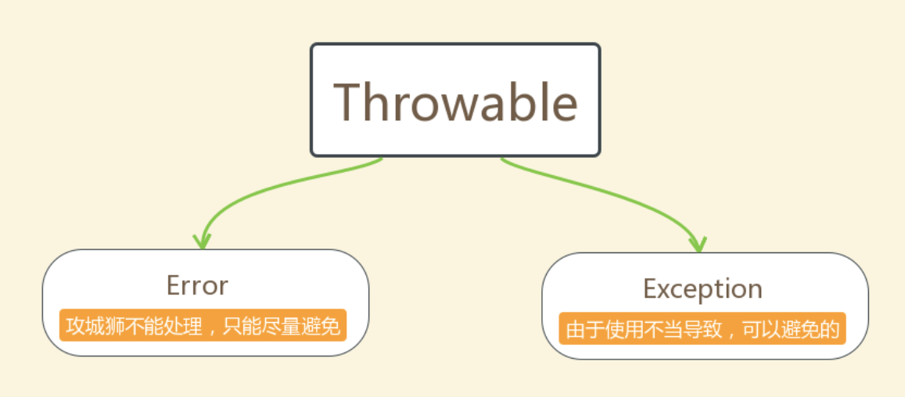

* **Throwable体系：**

  * **Error**:严重错误Error，无法通过处理的错误，只能事先避免，好比绝症。
  * **Exception**:表示异常，异常产生后程序员可以通过代码的方式纠正，使程序继续运行，是必须要处理的。好比感冒、阑尾炎。

  **Throwable中的常用方法：**

  * `public void printStackTrace()`:打印异常的详细信息。

    *包含了异常的类型,异常的原因,还包括异常出现的位置,在开发和调试阶段,都得使用printStackTrace。*

  * `public String getMessage()`:获取发生异常的原因。

    *提示给用户的时候,就提示错误原因。*

  * `public String toString()`:获取异常的类型和异常描述信息(不用)。


- **异常的分类：**

  我们平常说的异常就是指Exception，因为这类异常一旦出现，我们就要对代码进行更正，修复程序。

  **异常(Exception)的分类**:根据在编译时期还是运行时期去检查异常?

  * **编译时期异常**:checked异常。在编译时期,就会检查,如果没有处理异常,则编译失败。(如日期格式化异常)
  * **运行时期异常**:runtime异常。在运行时期,检查异常.在编译时期,运行异常不会编译器检测(不报错)。(如数学异常)

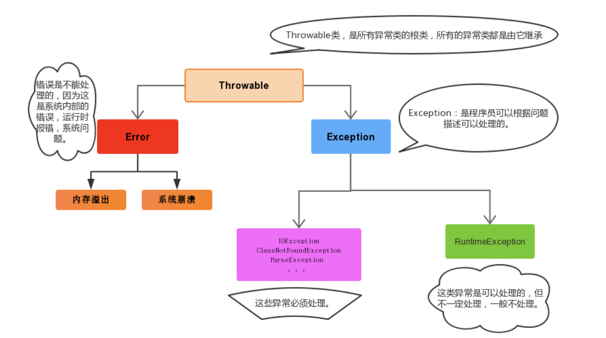

​		

### 3.2 抛出异常 throw

在编写程序时，我们必须要考虑程序出现问题的情况。比如，在定义方法时，方法需要接受参数。那么，当调用方法使用接受到的参数时，首先需要先对参数数据进行合法的判断，数据若不合法，就应该告诉调用者，传递合法的数据进来。这时需要使用抛出异常的方式来告诉调用者。

在java中，提供了一个**throw**关键字，它用来抛出一个指定的异常对象。那么，抛出一个异常具体如何操作呢？

1. 创建一个异常对象。封装一些提示信息(信息可以自己编写)。

2. 需要将这个异常对象告知给调用者。怎么告知呢？怎么将这个异常对象传递到调用者处呢？通过关键字throw就可以完成。throw 异常对象。

   throw**用在方法内**，用来抛出一个异常对象，将这个异常对象传递到调用者处，并结束当前方法的执行。

**使用格式：**

```
throw new 异常类名(参数);
```

​		

### 3.3声明异常 throws

**声明异常**：将问题标识出来，报告给调用者。如果方法内通过throw抛出了编译时异常，而没有捕获处理（稍后讲解该方式），那么必须通过throws进行声明，让调用者去处理。

关键字**throws**运用于方法声明之上,用于表示当前方法不处理异常,而是提醒该方法的调用者来处理异常(抛出异常).

**声明异常格式：**

```
修饰符 返回值类型 方法名(参数) throws 异常类名1,异常类名2…{   }	
```

​	

### 3.4 捕获异常 try…catch

如果异常出现的话,会立刻终止程序,所以我们得处理异常:

1. 该方法不处理,而是声明抛出,由该方法的调用者来处理(throws)。
2. 在方法中使用try-catch的语句块来处理异常。

**try-catch**的方式就是捕获异常。

* **捕获异常**：Java中对异常有针对性的语句进行捕获，可以对出现的异常进行指定方式的处理。

捕获异常语法如下：

```java
try{
     编写可能会出现异常的代码
}catch(异常类型  e){
     处理异常的代码
     //记录日志/打印异常信息/继续抛出异常
}
```

**try：**该代码块中编写可能产生异常的代码。

**catch：**用来进行某种异常的捕获，实现对捕获到的异常进行处理。

> 注意:try和catch都不能单独使用,必须连用。

如何获取异常信息：

Throwable类中定义了一些查看方法:

* `public String getMessage()`:获取异常的描述信息,原因(提示给用户的时候,就提示错误原因。


* `public String toString()`:获取异常的类型和异常描述信息(不用)。
* `public void printStackTrace()`:打印异常的跟踪栈信息并输出到控制台。

多个异常使用捕获又该如何处理呢？

1. 多个异常分别处理。
2. 多个异常一次捕获，多次处理。
3. 多个异常一次捕获一次处理。

一般我们是使用一次捕获多次处理方式，格式如下：

```java
try{
     编写可能会出现异常的代码
}catch(异常类型A  e){  当try中出现A类型异常,就用该catch来捕获.
     处理异常的代码
     //记录日志/打印异常信息/继续抛出异常
}catch(异常类型B  e){  当try中出现B类型异常,就用该catch来捕获.
     处理异常的代码
     //记录日志/打印异常信息/继续抛出异常
}
```

> 注意:这种异常处理方式，要求多个catch中的异常不能相同，并且若catch中的多个异常之间有子父类异常的关系，那么子类异常要求在上面的catch处理，父类异常在下面的catch处理。

​		

### 3.5 finally 代码块

**finally**：有一些特定的代码无论异常是否发生，都需要执行。另外，因为异常会引发程序跳转，导致有些语句执行不到。而finally就是解决这个问题的，在finally代码块中存放的代码都是一定会被执行的。

什么时候的代码必须最终执行？

当我们在try语句块中打开了一些物理资源(磁盘文件/网络连接/数据库连接等),我们都得在使用完之后,最终关闭打开的资源。

finally的语法:

 try...catch....finally:自身需要处理异常,最终还得关闭资源。

> 注意:finally不能单独使用。

比如在我们之后学习的IO流中，当打开了一个关联文件的资源，最后程序不管结果如何，都需要把这个资源关闭掉。

> 当只有在try或者catch中调用退出JVM的相关方法,此时finally才不会执行,否则finally永远会执行。

​		

### 3.6 自定义异常

在 Java 中，除了 JDK 提供的标准异常类（如 `NullPointerException`, `IOException` 等），我们还可以根据自己应用程序的特定需求创建自定义异常。这是一种非常强大的机制，能让我们的代码更具可读性、可维护性和健壮性。

**定义步骤：**

1. 只需创建一个类并继承 `Exception` 或者 `RuntimeException`
2. 空参构造+带参构造

示例：

```java
// 示例：定义一个“用户名已存在”的受检异常
public class UserAlreadyExistsException extends Exception {

    // 1. 无参构造方法
    public UserAlreadyExistsException() {
        super(); // 调用父类构造
    }

    // 2. 接收错误信息的构造方法（最常用）
    public UserAlreadyExistsException(String message) {
        super(message); // 调用父类构造，将信息传递进去
    }

    // 3. 接收错误信息和原始“原因”异常的构造方法（用于异常链）
    public UserAlreadyExistsException(String message, Throwable cause) {
        super(message, cause); // 将原始异常包装起来，避免信息丢失
    }
}

// 示例：定义一个“无效API密钥”的非受检异常
public class InvalidApiKeyException extends RuntimeException {
    public InvalidApiKeyException(String message) {
        super(message);
    }
}

```

​			

## 4. File

`java.io.File` 类是文件和目录路径名的抽象表示，主要用于文件和目录的创建、查找和删除等操作。

​	

### 4.1 常用方法

#### 4.1.1 构造方法

- `public File(String pathname) ` ：通过将给定的**路径名字符串**转换为抽象路径名来创建新的 File实例。  
- `public File(String parent, String child) ` ：从**父路径名字符串和子路径名字符串**创建新的 File实例。
- `public File(File parent, String child)` ：从**父抽象路径名和子路径名字符串**创建新的 File实例。  

> 小贴士：
>
> 1. 一个File对象代表硬盘中实际存在的一个文件或者目录。
> 2. 无论该路径下是否存在文件或者目录，都不影响File对象的创建。

​	

#### 4.1.2 获取功能

- `public String getAbsolutePath() ` ：返回此File的绝对路径名字符串。

- ` public String getPath() ` ：将此File转换为路径名字符串。 

- `public String getName()`  ：返回由此File表示的文件或目录的名称。  

- `public long length()`  ：返回由此File表示的文件的长度。 


#### 4.1.3 判断功能

- `public boolean exists()` ：此File表示的文件或目录是否实际存在。

- `public boolean isDirectory()` ：此File表示的是否为目录。

- `public boolean isFile()` ：此File表示的是否为文件。

  ​		

#### 4.1.4 创建删除

- `public boolean createNewFile()` ：当且仅当具有该名称的文件尚不存在时，创建一个新的空文件。 

- `public boolean delete()` ：删除由此File表示的文件或目录。  

- `public boolean mkdir()` ：创建由此File表示的目录。

- `public boolean mkdirs()` ：创建由此File表示的目录，包括任何必需但不存在的父目录。

  ​			

#### 4.1.5 目录遍历

- `public String[] list()` ：返回一个String数组，表示该File目录中的所有子文件或目录。

- `public File[] listFiles()` ：返回一个File数组，表示该File目录中的所有的子文件或目录。  

  ​		

## 5. IO流

我们把数据的传输，可以看做是一种数据的流动，按照流动的方向，以内存为基准，分为`输入input` 和`输出output` ，即流向内存是输入流，流出内存的输出流。

Java中I/O操作主要是指使用`java.io`包下的内容，进行输入、输出操作。**输入**也叫做**读取**数据，**输出**也叫做作**写出**数据。

### 5.1 IO流的分类

根据数据的流向分为：**输入流**和**输出流**。

* **输入流** ：把数据从`其他设备`上读取到`内存`中的流。 
* **输出流** ：把数据从`内存` 中写出到`其他设备`上的流。

根据数据的类型分为：**字节流**和**字符流**。

* **字节流** ：以字节为单位，读写数据的流。
* **字符流** ：以字符为单位，读写数据的流。

|            |           **输入流**            |              输出流              |
| :--------: | :-----------------------------: | :------------------------------: |
| **字节流** | 字节输入流<br />**InputStream** | 字节输出流<br />**OutputStream** |
| **字符流** |   字符输入流<br />**Reader**    |    字符输出流<br />**Writer**    |

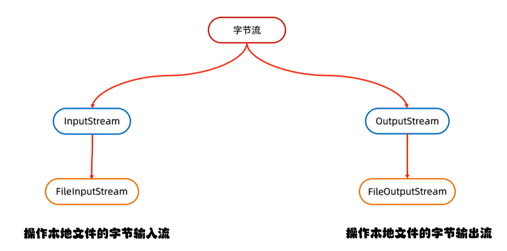

​			

### 5.2 字节流

一切文件数据(文本、图片、视频等)在存储时，都是以二进制数字的形式保存，都一个一个的字节，那么传输时一样如此。所以，**字节流可以传输任意文件数据**。在操作流的时候，我们要时刻明确，无论使用什么样的流对象，底层传输的始终为二进制数据。

#### 5.2.1 字节输出流【OutputStream】

`java.io.OutputStream `抽象类是表示字节输出流的所有类的超类，将指定的字节信息写出到目的地。它定义了字节输出流的基本共性功能方法。

* `public void close()` ：关闭此输出流并释放与此流相关联的任何系统资源。  
* `public void flush() ` ：刷新此输出流并强制任何缓冲的输出字节被写出。  
* `public void write(byte[] b)`：将 b.length字节从指定的字节数组写入此输出流。  
* `public void write(byte[] b, int off, int len)` ：从指定的字节数组写入 len字节，从偏移量 off开始输出到此输出流。  
* `public abstract void write(int b)` ：将指定的字节输出流。

> 小贴士：
>
> close方法，当完成流的操作时，必须调用此方法，释放系统资源。


#### 5.2.2 FileOutputStream类

`OutputStream`有很多子类，我们从最简单的一个子类开始。

`java.io.FileOutputStream `类是文件输出流，用于将数据写出到文件。

**构造方法：**

* `public FileOutputStream(File file)`：创建文件输出流以写入由指定的 File对象表示的文件。 
* `public FileOutputStream(String name)`： 创建文件输出流以指定的名称写入文件。  

当你创建一个流对象时，必须传入一个文件路径。该路径下，如果没有这个文件，会创建该文件。如果有这个文件，会清空这个文件的数据。

​	

**写出字节数据**

1. 写出字节：`write(int b)` 方法，每次可以写出一个字节数据

> 小贴士：
>
> 1. 虽然参数为int类型四个字节，但是只会保留一个字节的信息写出。
> 2. 流操作完毕后，必须释放系统资源，调用close方法，千万记得。

2. 写出字节数组：`write(byte[] b)`，每次可以写出数组中的数据

3. 写出指定长度字节数组：`write(byte[] b, int off, int len)` ,每次写出从off索引开始，len个字节

4. 可以和字符串里的`byte[] getBytes()`方法联合使用 ※

   

**数据追加续写：**

每次程序运行，创建输出流对象，都会清空目标文件中的数据。如何保留目标文件中数据，还能继续添加新数据呢？

- `public FileOutputStream(File file, boolean append)`： 创建文件输出流以写入由指定的 File对象表示的文件。  
- `public FileOutputStream(String name, boolean append)`： 创建文件输出流以指定的名称写入文件。  

这两个构造方法，参数中都需要传入一个boolean类型的值，`true` 表示追加数据，`false` 表示清空原有数据。这样创建的输出流对象，就可以指定是否追加续写了

​	

**写出换行**

Windows系统里，换行符号是`\r\n` 。

> * 回车符`\r`和换行符`\n` ：
>   * 回车符：回到一行的开头（return）。
>   * 换行符：下一行（newline）。
> * 系统中的换行：
>   * Windows系统里，每行结尾是 `回车+换行` ，即`\r\n`；
>   * Unix系统里，每行结尾只有 `换行` ，即`\n`；
>   * Mac系统里，每行结尾是 `回车` ，即`\r`。从 Mac OS X开始与Linux统一。

```java
fos.write("\r\n".getBytes());
```

​	

**注意：**

1. 创建字节输出流对象：

   ​	细节1：参数是字符串表示的路径或者File对象都是可以的


   ​	细节2：如果文件不存在会创建一个新的文件，但是要保证父级路径是存在的。


   ​	细节3：如果文件已经存在，则会清空文件

2. 写数据：write方法的参数是整数，但是实际上写到本地文件中的是整数在ASCII上对应的字符

   

#### 5.2.3 字节输入流【InputStream】

`java.io.InputStream `抽象类是表示字节输入流的所有类的超类，可以读取字节信息到内存中。它定义了字节输入流的基本共性功能方法。

- `public void close()` ：关闭此输入流并释放与此流相关联的任何系统资源。    
- `public abstract int read()`： 从输入流读取数据的下一个字节。 
- `public int read(byte[] b)`： 从输入流中读取一些字节数，并将它们存储到字节数组 b中 。

> 小贴士：
>
> close方法，当完成流的操作时，必须调用此方法，释放系统资源。

​	

#### 5.2.4 FileInputStream 

`java.io.FileInputStream `类是文件输入流，从文件中读取字节。

**构造方法**

* `FileInputStream(File file)`： 通过打开与实际文件的连接来创建一个 FileInputStream ，该文件由文件系统中的 File对象 file命名。 
* `FileInputStream(String name)`： 通过打开与实际文件的连接来创建一个 FileInputStream ，该文件由文件系统中的路径名 name命名。  

当你创建一个流对象时，必须传入一个文件路径。该路径下，如果没有该文件,会抛出`FileNotFoundException` 

​	

**读取字节数据**

1. 读取字节：`read`方法，每次可以读取一个字节的数据，提升为int类型，读取到文件末尾，返回`-1`

> 小贴士：
>
> 1. 虽然读取了一个字节，但是会自动提升为int类型。
> 2. 流操作完毕后，必须释放系统资源，调用close方法，千万记得。

2. 使用字节数组读取：`read(byte[] b)`，每次读取b的长度个字节到数组中，返回读取到的有效字节个数，读取到末尾时，返回`-1`

> 小贴士：
>
> 使用数组读取，每次读取多个字节，减少了系统间的IO操作次数，从而提高了读写的效率，建议开发中使用。

​			

#### 5.2.5 文件拷贝思想

 

复制图片文件，代码使用演示：

```java
public class Copy {
    public static void main(String[] args) throws IOException {
        // 1.创建流对象
        // 1.1 指定数据源
        FileInputStream fis = new FileInputStream("D:\\test.jpg");
        // 1.2 指定目的地
        FileOutputStream fos = new FileOutputStream("test_copy.jpg");

        // 2.读写数据
        // 2.1 定义数组
        byte[] b = new byte[1024];
        // 2.2 定义长度
        int len;
        // 2.3 循环读取
        while ((len = fis.read(b))!=-1) {
            // 2.4 写出数据
            fos.write(b, 0 , len);
        }

        // 3.关闭资源
        fos.close();
        fis.close();
    }
}
```

> 小贴士：
>
> 流的关闭原则：先开后关，后开先关。

​			

### 5.3 IO异常处理

**JDK9的改进(扩展知识点了解内容)**

JDK9中`try-with-resource` 的改进，对于**引入对象**的方式，支持的更加简洁。被引入的对象，同样可以自动关闭，无需手动close，我们来了解一下格式。

改进前格式：

```java
// 被final修饰的对象
final Resource resource1 = new Resource("resource1");
// 普通对象
Resource resource2 = new Resource("resource2");
// 引入方式：创建新的变量保存
try (Resource r1 = resource1;
     Resource r2 = resource2) {
     // 使用对象
}
```

改进后格式：

```java
// 被final修饰的对象
final Resource resource1 = new Resource("resource1");
// 普通对象
Resource resource2 = new Resource("resource2");

// 引入方式：直接引入
try (resource1; resource2) {
     // 使用对象
}
```

改进后，代码使用演示：

```java
public class TryDemo {
    public static void main(String[] args) throws IOException {
       	// 创建流对象
        final  FileReader fr  = new FileReader("in.txt");
        FileWriter fw = new FileWriter("out.txt");
       	// 引入到try中
        try (fr; fw) {
          	// 定义变量
            int b;
          	// 读取数据
          	while ((b = fr.read())!=-1) {
            	// 写出数据
            	fw.write(b);
          	}
        } catch (IOException e) {
            e.printStackTrace();
        }
    }
}
```

​		

### 5.4 Java中编码与解码

乱码产生的两个原因：

1. 读取数据时未读完整个汉字
2. 编码和解码的方式不统一

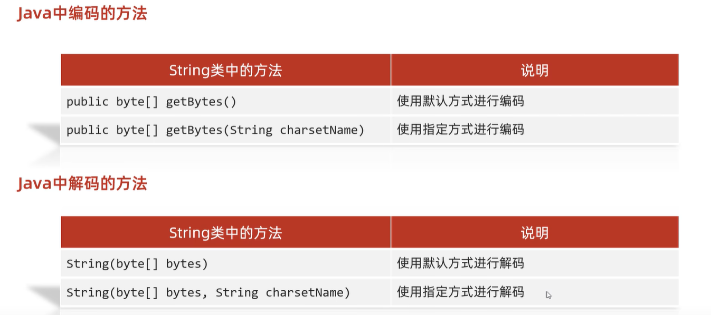

​	

### 5.5 字符流

字符流的底层就是字节流：字符流 = 字节流 + 字符集

特点


​	输入流：一次读一个字节，遇到中文时，一次读多个字节


​	输出流：底层会把数据按照指定的编码方式进行编码，变成字节再写到文件中

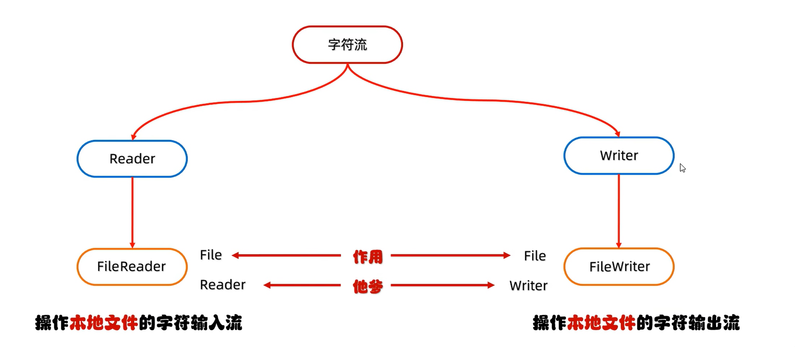

​	

#### 5.5.1 字符输入流【Reader】

`java.io.Reader`抽象类是表示用于读取字符流的所有类的超类，可以读取字符信息到内存中。它定义了字符输入流的基本共性功能方法。

- `public void close()` ：关闭此流并释放与此流相关联的任何系统资源。    

- `public int read()`： 从输入流读取一个字符。 

- `public int read(char[] cbuf)`： 从输入流中读取一些字符，并将它们存储到字符数组 cbuf中 。

  

#### 5.5.2 FileReader类  

`java.io.FileReader `类是读取字符文件的便利类。构造时使用系统默认的字符编码和默认字节缓冲区。

> 小贴士：
>
> 1. 字符编码：字节与字符的对应规则。Windows系统的中文编码默认是GBK编码表。
>
>    idea中UTF-8
>
> 2. 字节缓冲区：一个字节数组，用来临时存储字节数据。

**构造方法**

- `FileReader(File file)`： 创建一个新的 FileReader ，给定要读取的File对象。   
- `FileReader(String fileName)`： 创建一个新的 FileReader ，给定要读取的文件的名称。  

当你创建一个流对象时，必须传入一个文件路径。类似于FileInputStream 。

​	

**读取字符数据**

1. 读取字符：`read`方法，每次可以读取一个字符的数据，提升为int类型，读取到文件末尾，返回`-1`，循环读取

> 小贴士：虽然读取了一个字符，但是会自动提升为int类型。

2. 使用字符数组读取：`read(char[] cbuf)`，每次读取b的长度个字符到数组中，返回读取到的有效字符个数，读取到末尾时，返回`-1` ，代码使用演示：

```java
public class FISRead {
    public static void main(String[] args) throws IOException {
      	// 使用文件名称创建流对象
       	FileReader fr = new FileReader("read.txt");
      	// 定义变量，保存有效字符个数
        int len；
        // 定义字符数组，作为装字符数据的容器
        char[] cbuf = new char[2];
        // 循环读取
        while ((len = fr.read(cbuf))!=-1) {
            System.out.println(new String(cbuf,0,len));
        }
    	// 关闭资源
        fr.close();
    }
}
```

​	

#### 5.5.3 字符输出流【Writer】

`java.io.Writer `抽象类是表示用于写出字符流的所有类的超类，将指定的字符信息写出到目的地。它定义了字节输出流的基本共性功能方法。

- `void write(int c)` 写入单个字符。

- `void write(char[] cbuf) `写入字符数组。 

- `abstract  void write(char[] cbuf, int off, int len) `写入字符数组的某一部分,off数组的开始索引,len写的字符个数。 

- `void write(String str) `写入字符串。 

- `void write(String str, int off, int len)` 写入字符串的某一部分,off字符串的开始索引,len写的字符个数。

- `void flush() `刷新该流的缓冲。  

- `void close()` 关闭此流，但要先刷新它。 

  

#### 5.5.4 FileWriter类

`java.io.FileWriter `类是写出字符到文件的便利类。构造时使用系统默认的字符编码和默认字节缓冲区。

**构造方法**

- `FileWriter(File file)`： 创建一个新的 FileWriter，给定要读取的File对象。   
- `FileWriter(String fileName)`： 创建一个新的 FileWriter，给定要读取的文件的名称。  
- `FileWriter(String fileName, boolean append)`： 第二个参数指是否续写
- `FileWriter(File file, boolean append)`： 第二个参数指是否续写

当你创建一个流对象时，必须传入一个文件路径，类似于FileOutputStream。

​	

**基本写出数据**

1. 写出字符：`write(int b)` 方法，每次可以写出一个字符数据，代码使用演示：

> 小贴士：
>
> 1. 虽然参数为int类型四个字节，但是只会保留一个字符的信息写出。
> 2. 未调用close方法，数据只是保存到了缓冲区，并未写出到文件中。

​	

**关闭和刷新**

因为内置缓冲区的原因，如果不关闭输出流，无法写出字符到文件中。但是关闭的流对象，是无法继续写出数据的。如果我们既想写出数据，又想继续使用流，就需要`flush` 方法了。

* `flush` ：刷新缓冲区，流对象可以继续使用。

* `close `:先刷新缓冲区，然后通知系统释放资源。流对象不可以再被使用了。

  

**写出其他数据**

1. 写出字符数组 ：`write(char[] cbuf)` 和 `write(char[] cbuf, int off, int len)` ，每次可以写出字符数组中的数据，用法类似FileOutputStream

2. 写出字符串：`write(String str)` 和 `write(String str, int off, int len)` ，每次可以写出字符串中的数据，更为方便

3. 续写和换行：操作类似于FileOutputStream。

> 小贴士：字符流，只能操作文本文件，不能操作图片，视频等非文本文件。
>
> 当我们单纯读或者写文本文件时  使用字符流 其他情况使用字节流

​		

### 5.6 缓冲流

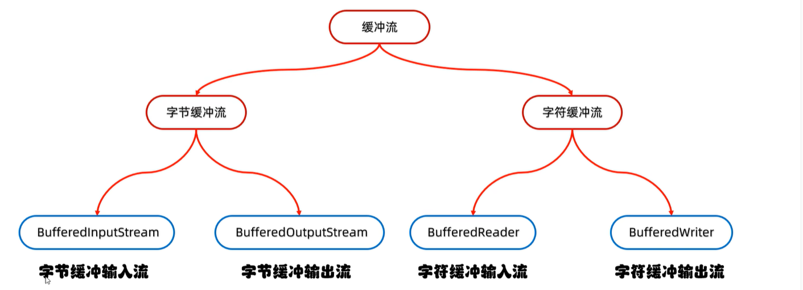

缓冲流,也叫高效流，是对4个基本的`FileXxx` 流的增强，所以也是4个流，按照数据类型分类：

* **字节缓冲流**：`BufferedInputStream`，`BufferedOutputStream` 
* **字符缓冲流**：`BufferedReader`，`BufferedWriter`

缓冲流的基本原理，是在创建流对象时，会创建一个内置的默认大小的缓冲区数组，通过缓冲区读写，减少系统IO次数，从而提高读写的效率。（内存的操作速度很快，减少和硬盘的交互）

​	

#### 5.6.1 字节缓冲流

**构造方法**

* `public BufferedInputStream(InputStream in)` ：创建一个 新的缓冲输入流。 
* `public BufferedOutputStream(OutputStream out)`： 创建一个新的缓冲输出流。

```java
// 创建字节缓冲输入流
BufferedInputStream bis = new BufferedInputStream(new FileInputStream("bis.txt"));
// 创建字节缓冲输出流
BufferedOutputStream bos = new BufferedOutputStream(new FileOutputStream("bos.txt"));
```

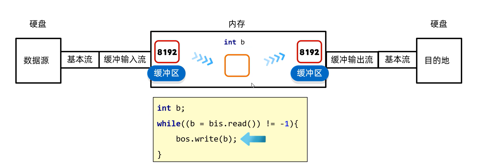

​	

#### 5.6.2 字符缓冲流

**构造方法**

* `public BufferedReader(Reader in)` ：创建一个 新的缓冲输入流。 
* `public BufferedWriter(Writer out)`： 创建一个新的缓冲输出流。

**特有方法 ※**

字符缓冲流的基本方法与普通字符流调用方式一致，不再阐述，我们来看它们具备的特有方法。

* BufferedReader：`public String readLine()`: 读一行文字。 到末尾返回null而非-1
* BufferedWriter：`public void newLine()`: 写一行行分隔符,由系统属性定义符号。 

`readLine`方法演示，代码如下：

```java
public class BufferedReaderDemo {
    public static void main(String[] args) throws IOException {
      	 // 创建流对象
        BufferedReader br = new BufferedReader(new FileReader("in.txt"));
		// 定义字符串,保存读取的一行文字
        String line  = null;
      	// 循环读取,读取到最后返回null
        while ((line = br.readLine())!=null) {
            System.out.print(line);
            System.out.println("------");
        }
		// 释放资源
        br.close();
    }
}
```

​				

### 5.7 转换流

#### 5.7.1 字符编码与字符集

**字符编码**

计算机中储存的信息都是用二进制数表示的，而我们在屏幕上看到的数字、英文、标点符号、汉字等字符是二进制数转换之后的结果。按照某种规则，将字符存储到计算机中，称为**编码** 。反之，将存储在计算机中的二进制数按照某种规则解析显示出来，称为**解码** 。比如说，按照A规则存储，同样按照A规则解析，那么就能显示正确的文本符号。反之，按照A规则存储，再按照B规则解析，就会导致乱码现象。

编码:字符(能看懂的)--字节(看不懂的)

解码:字节(看不懂的)-->字符(能看懂的)

* **字符编码`Character Encoding`** : 就是一套自然语言的字符与二进制数之间的对应规则。

  编码表:生活中文字和计算机中二进制的对应规则

  

**字符集**

* **字符集 `Charset`**：也叫编码表。是一个系统支持的所有字符的集合，包括各国家文字、标点符号、图形符号、数字等。

计算机要准确的存储和识别各种字符集符号，需要进行字符编码，一套字符集必然至少有一套字符编码。常见字符集有ASCII字符集、GBK字符集、Unicode字符集等。

可见，当指定了**编码**，它所对应的**字符集**自然就指定了，所以**编码**才是我们最终要关心的。

* **ASCII字符集** ：
  * ASCII（American Standard Code for Information Interchange，美国信息交换标准代码）是基于拉丁字母的一套电脑编码系统，用于显示现代英语，主要包括控制字符（回车键、退格、换行键等）和可显示字符（英文大小写字符、阿拉伯数字和西文符号）。
  * 基本的ASCII字符集，使用7位（bits）表示一个字符，共128字符。ASCII的扩展字符集使用8位（bits）表示一个字符，共256字符，方便支持欧洲常用字符。
* **ISO-8859-1字符集**：
  * 拉丁码表，别名Latin-1，用于显示欧洲使用的语言，包括荷兰、丹麦、德语、意大利语、西班牙语等。
  * ISO-8859-1使用单字节编码，兼容ASCII编码。
* **GBxxx字符集**：
  * GB就是国标的意思，是为了显示中文而设计的一套字符集。
  * **GB2312**：简体中文码表。一个小于127的字符的意义与原来相同。但两个大于127的字符连在一起时，就表示一个汉字，这样大约可以组合了包含7000多个简体汉字，此外数学符号、罗马希腊的字母、日文的假名们都编进去了，连在ASCII里本来就有的数字、标点、字母都统统重新编了两个字节长的编码，这就是常说的"全角"字符，而原来在127号以下的那些就叫"半角"字符了。
  * **GBK**：最常用的中文码表。是在GB2312标准基础上的扩展规范，使用了双字节编码方案，共收录了21003个汉字，完全兼容GB2312标准，同时支持繁体汉字以及日韩汉字等。
  * **GB18030**：最新的中文码表。收录汉字70244个，采用多字节编码，每个字可以由1个、2个或4个字节组成。支持中国国内少数民族的文字，同时支持繁体汉字以及日韩汉字等。
* **Unicode字符集** ：
  * Unicode编码系统为表达任意语言的任意字符而设计，是业界的一种标准，也称为统一码、标准万国码。
  * 它最多使用4个字节的数字来表达每个字母、符号，或者文字。有三种编码方案，UTF-8、UTF-16和UTF-32。最为常用的UTF-8编码。
  * UTF-8编码，可以用来表示Unicode标准中任何字符，它是电子邮件、网页及其他存储或传送文字的应用中，优先采用的编码。互联网工程工作小组（IETF）要求所有互联网协议都必须支持UTF-8编码。所以，我们开发Web应用，也要使用UTF-8编码。它使用一至四个字节为每个字符编码，编码规则：
    1. 128个US-ASCII字符，只需一个字节编码。
    2. 拉丁文等字符，需要二个字节编码。 
    3. 大部分常用字（含中文），使用三个字节编码。
    4. 其他极少使用的Unicode辅助字符，使用四字节编码。


#### 5.7.2 InputStreamReader类  

转换流`java.io.InputStreamReader`，是Reader的子类，是从字节流到字符流的桥梁。它读取字节，并使用指定的字符集将其解码为字符。它的字符集可以由名称指定，也可以接受平台的默认字符集。 

**构造方法**

* `InputStreamReader(InputStream in)`: 创建一个使用默认字符集的字符流。 
* `InputStreamReader(InputStream in, String charsetName)`: 创建一个指定字符集的字符流。

**指定编码读取：**

```java
public class ConvertStreamDemo1 {
    public static void main(String[] args) throws IOException {
        /*
        利用转换流按照指定字符编码读取(了解)
        因为JDK11: 这种方式被淘汰了。替代方案(掌握)
        */

        /*
        //1.创建对象并指定字符编码
        InputStreamReader isr = new InputStreamReader(new FileInputStream("myio\\gbkfile.txt"), "GBK");
        //2.读取数据
        int ch;
        while ((ch = isr.read()) != -1){
            System.out.print((char) ch);
        }
        //3.释放资源
        isr.close();
        */

        FileReader fr = new FileReader("myio\\gbkfile.txt", Charset.forName("GBK"));
        //2.读取数据
        int ch;
        while ((ch = fr.read()) != -1){
            System.out.print((char) ch);
        }
    }
}
```

​	

#### 5.7.3 OutputStreamWriter类

转换流`java.io.OutputStreamWriter` ，是Writer的子类，是从字符流到字节流的桥梁。使用指定的字符集将字符编码为字节。它的字符集可以由名称指定，也可以接受平台的默认字符集。 

**构造方法**

- `OutputStreamWriter(OutputStream in)`: 创建一个使用默认字符集的字符流。 
- `OutputStreamWriter(OutputStream in, String charsetName)`: 创建一个指定字符集的字符流。

**指定编码写出**

```java
public class ConvertStreamDemo2 {
    public static void main(String[] args) throws IOException {

        /*
        利用转换流按指定字符编码写出
        */

        /*//1.创建转换流的对象
        OutputStreamWriter osw = new OutputStreamWriter(new FileOutputStream("myio\\b.txt"),"GBK");
        //2.写出数据
        osw.write("你好你好");
        //3.释放资源
        osw.close();*/

        FileWriter fw = new FileWriter("myio\\c.txt", Charset.forName("GBK"));
        fw.write("你好你好");
        fw.close();
    }
}

```

​			

### 5.8 序列化流

Java 提供了一种对象**序列化**的机制。用一个字节序列可以表示一个对象，该字节序列包含该`对象的数据`、`对象的类型`和`对象中存储的属性`等信息。字节序列写出到文件之后，相当于文件中**持久保存**了一个对象的信息。 

反之，该字节序列还可以从文件中读取回来，重构对象，对它进行**反序列化**。`对象的数据`、`对象的类型`和`对象中存储的数据`信息，都可以用来在内存中创建对象。看图理解序列化： 

​			

#### 5.8.1 ObjectOutputStream类

`java.io.ObjectOutputStream ` 类，将Java对象的原始数据类型写出到文件,实现对象的持久存储。

**构造方法**

* `public ObjectOutputStream(OutputStream out) `： 创建一个指定OutputStream的ObjectOutputStream。

**序列化操作**

1. 一个对象要想序列化，必须满足两个条件:

* 该类必须实现`java.io.Serializable ` 接口，`Serializable` 是一个标记接口，不实现此接口的类将不会使任何状态序列化或反序列化，会抛出`NotSerializableException` 。
* 该类的所有属性必须是可序列化的。如果有一个属性不需要可序列化的，则该属性必须注明是瞬态的，使用`transient` 关键字修饰。

* 

```java
public class Employee implements java.io.Serializable {
    public String name;
    public String address;
    public transient int age; // transient瞬态修饰成员,不会被序列化
    public void addressCheck() {
      	System.out.println("Address  check : " + name + " -- " + address);
    }
}
```

2.写出对象方法

* `public final void writeObject (Object obj)` : 将指定的对象写出。

  

#### 5.8.2 ObjectInputStream类

ObjectInputStream反序列化流，将之前使用ObjectOutputStream序列化的原始数据恢复为对象。 

**构造方法**

* `public ObjectInputStream(InputStream in) `： 创建一个指定InputStream的ObjectInputStream。

**反序列化操作1**

如果能找到一个对象的class文件，我们可以进行反序列化操作，调用`ObjectInputStream`读取对象的方法：

- `public final Object readObject ()` : 读取一个对象。

对于JVM可以反序列化对象，它必须是能够找到class文件的类。如果找不到该类的class文件，则抛出一个 `ClassNotFoundException` 异常。  

**反序列化操作2**

另外，当JVM反序列化对象时，能找到class文件，但是class文件在序列化对象之后发生了修改，那么反序列化操作也会失败，抛出一个`InvalidClassException`异常。发生这个异常的原因如下：

* 该类的序列版本号与从流中读取的类描述符的版本号不匹配 
* 该类包含未知数据类型 
* 该类没有可访问的无参数构造方法 

`Serializable` 接口给需要序列化的类，提供了一个序列版本号。`serialVersionUID` 该版本号的目的在于验证序列化的对象和对应类是否版本匹配。

```java
public class Employee implements java.io.Serializable {
     // 加入序列版本号
     private static final long serialVersionUID = 1L;
     public String name;
     public String address;
     // 添加新的属性 ,重新编译, 可以反序列化,该属性赋为默认值.
     public int eid; 

     public void addressCheck() {
         System.out.println("Address  check : " + name + " -- " + address);
     }
}
```

​				

### 5.9 打印流

平时我们在控制台打印输出，是调用`print`方法和`println`方法完成的，这两个方法都来自于`java.io.PrintStream`类，该类能够方便地打印各种数据类型的值，是一种便捷的输出方式。

#### 5.9.1 字节打印流（PrintStream）

**构造方法**

- `PrintStream(OutputStream/File/String)`
  关联字节输出流 / 文件 / 文件路径
- `PrintStream(String fileName, Charset charset)`
  指定字符编码
- `PrintStream(OutputStream out, boolean autoFlush)`
  自动刷新
- `PrintStream(OutputStream out, boolean autoFlush, String encoding)`
  指定字符编码且自动刷新

> **注意**：字节流底层没有缓冲区，开不开自动刷新都一样。

**常用方法**

- `write(int b)`
  常规方法：将指定的字节写出

- `println(Xxx xx)`
  特有方法：打印任意数据，自动刷新，自动换行

- `print(Xxx xx)`
  特有方法：打印任意数据，不换行

- `printf(String format, Object... args)`
  特有方法：带有占位符的打印语句，不换行

  ​		

#### 5.9.2 字符打印流（PrintWriter）

**构造方法**

- `PrintWriter(Writer/File/String)`
  关联字符输出流 / 文件 / 文件路径
- `PrintWriter(String fileName, Charset charset)`
  指定字符编码
- `PrintWriter(Writer w, boolean autoFlush)`
  自动刷新
- `PrintWriter(OutputStream out, boolean autoFlush, Charset charset)`
  指定字符编码且自动刷新

> **注意**：字符流底层有缓冲区，想要自动刷新需要开启。

**常用方法**

- `write(...)`
  常规方法：写出字符或字符串
- `println(Xxx xx)`
  **特有方法**：打印任意类型的数据并换行
- `print(Xxx xx)`
  **特有方法**：打印任意类型的数据，不换行
- `printf(String format, Object... args)`
  **特有方法**：带有占位符的打印语句


```java
public class PrintStreamDemo4 {
    public static void main(String[] args) {
        // 获取打印流对象，默认指向控制台
        PrintStream ps = System.out;

        // 写出数据，自动换行，自动刷新
        ps.println("123");

        // ps.close(); // 不建议关闭 System.out

        ps.println("你好你好");

        System.out.println("456");
    }
}

```

​		

#### 5.9.3 占位符速查表

🎨 Java `printf` 占位符速查表

|  **类型**  | **占位符** |           **说明**            |  **示例输出**  |
| :--------: | :--------: | :---------------------------: | :------------: |
|  **整数**  |    `%d`    |          十进制整数           |     `123`      |
|            |    `%o`    |          八进制整数           |      `10`      |
|            |    `%x`    |       十六进制（小写）        |      `ff`      |
|            |    `%X`    |       十六进制（大写）        |      `FF`      |
|  **浮点**  |    `%f`    |  十进制浮点（默认 6 位小数）  |   `3.141590`   |
|            |   `%.2f`   |         保留 2 位小数         |     `3.14`     |
|            |    `%e`    |     科学计数法（小写 e）      | `3.140000e+00` |
|            |    `%E`    |     科学计数法（大写 E）      | `3.140000E+00` |
|            |    `%g`    | 自动选择 `%f` 或 `%e`（小写） |     `3.14`     |
|            |    `%G`    | 自动选择 `%f` 或 `%E`（大写） |     `3.14`     |
|  **字符**  |    `%c`    |           单个字符            |      `A`       |
| **字符串** |    `%s`    |            字符串             |    `Hello`     |
|  **其他**  |    `%%`    |          输出百分号           |      `%`       |
|            |    `%n`    |        换行（跨平台）         |    换行效果    |

🛠 常用格式修饰符

| **修饰符** |      **作用**      |         **示例**         |  **输出**   |
| :--------: | :----------------: | :----------------------: | :---------: |
|   `%5d`    |  宽度为 5，右对齐  |   `printf("%5d", 12)`    |    `12`     |
|   `%-5d`   |  宽度为 5，左对齐  |   `printf("%-5d", 12)`   |    `12`     |
|   `%05d`   | 宽度为 5，前面补 0 |   `printf("%05d", 12)`   |   `00012`   |
|   `%,d`    |     千位分隔符     | `printf("%,d", 1234567)` | `1,234,567` |

​		

### 5.10 压缩和解压缩流

压缩流：

​	负责压缩文件或者文件夹

解压缩流：

​	负责把压缩包中的文件和文件夹解压出来

```java
/*
*   解压缩流
*
* */
public class ZipStreamDemo1 {
    public static void main(String[] args) throws IOException {

        //1.创建一个File表示要解压的压缩包
        File src = new File("D:\\aaa.zip");
        //2.创建一个File表示解压的目的地
        File dest = new File("D:\\");

        //调用方法
        unzip(src,dest);

    }

    //定义一个方法用来解压
    public static void unzip(File src,File dest) throws IOException {
        //解压的本质：把压缩包里面的每一个文件或者文件夹读取出来，按照层级拷贝到目的地当中
        //创建一个解压缩流用来读取压缩包中的数据
        ZipInputStream zip = new ZipInputStream(new FileInputStream(src));
        //要先获取到压缩包里面的每一个zipentry对象
        //表示当前在压缩包中获取到的文件或者文件夹
        ZipEntry entry;
        while((entry = zip.getNextEntry()) != null){
            System.out.println(entry);
            if(entry.isDirectory()){
                //文件夹：需要在目的地dest处创建一个同样的文件夹
                File file = new File(dest,entry.toString());
                file.mkdirs();
            }else{
                //文件：需要读取到压缩包中的文件，并把他存放到目的地dest文件夹中（按照层级目录进行存放）
                FileOutputStream fos = new FileOutputStream(new File(dest,entry.toString()));
                int b;
                while((b = zip.read()) != -1){
                    //写到目的地
                    fos.write(b);
                }
                fos.close();
                //表示在压缩包中的一个文件处理完毕了。
                zip.closeEntry();
            }
        }
        zip.close();
    }
}
```

```java
public class ZipStreamDemo3 {
    public static void main(String[] args) throws IOException {
        /*
         *   压缩流
         *      需求：
         *          把D:\\aaa文件夹压缩成一个压缩包
         * */
        //1.创建File对象表示要压缩的文件夹
        File src = new File("D:\\aaa");
        //2.创建File对象表示压缩包放在哪里（压缩包的父级路径）
        File destParent = src.getParentFile();//D:\\
        //3.创建File对象表示压缩包的路径
        File dest = new File(destParent,src.getName() + ".zip");
        //4.创建压缩流关联压缩包
        ZipOutputStream zos = new ZipOutputStream(new FileOutputStream(dest));
        //5.获取src里面的每一个文件，变成ZipEntry对象，放入到压缩包当中
        toZip(src,zos,src.getName());//aaa
        //6.释放资源
        zos.close();
    }

    /*
    *   作用：获取src里面的每一个文件，变成ZipEntry对象，放入到压缩包当中
    *   参数一：数据源
    *   参数二：压缩流
    *   参数三：压缩包内部的路径
    * */
    public static void toZip(File src,ZipOutputStream zos,String name) throws IOException {
        //1.进入src文件夹
        File[] files = src.listFiles();
        //2.遍历数组
        for (File file : files) {
            if(file.isFile()){
                //3.判断-文件，变成ZipEntry对象，放入到压缩包当中
                ZipEntry entry = new ZipEntry(name + "\\" + file.getName());//aaa\\no1\\a.txt
                zos.putNextEntry(entry);
                //读取文件中的数据，写到压缩包
                FileInputStream fis = new FileInputStream(file);
                int b;
                while((b = fis.read()) != -1){
                    zos.write(b);
                }
                fis.close();
                zos.closeEntry();
            }else{
                //4.判断-文件夹，递归
                toZip(file,zos,name + "\\" + file.getName());
                //     no1            aaa   \\   no1
            }
        }
    }
}
```

`ZipEntry` 决定了压缩包内部的路径

`zos.putNextEntry(entry)` 决定写入目标：会把接下来写入的所有数据（`zos.write(...)`）都写到这个 `ZipEntry` 对应的文件里。
直到你调用 `zos.closeEntry()`，才算结束这个文件的写入。

​		

### 5.11 常用工具包 Commons-io

介绍：

​	Commons是apache开源基金组织提供的工具包，里面有很多帮助我们提高开发效率的API

比如：

​	StringUtils   字符串工具类

​	NumberUtils   数字工具类 

​	ArrayUtils   数组工具类  

​	RandomUtils   随机数工具类

​	DateUtils   日期工具类 

​	StopWatch   秒表工具类 

​	ClassUtils   反射工具类  

​	SystemUtils   系统工具类  

​	MapUtils   集合工具类

​	Beanutils   bean工具类

​	Commons-io io的工具类

​	等等.....

其中：Commons-io是apache开源基金组织提供的一组有关IO操作的开源工具包。

作用：提高IO流的开发效率。

使用方式：

1，新建lib文件夹

2，把第三方jar包粘贴到文件夹中

3，右键点击add as a library

```java
        /*
          FileUtils类
                static void copyFile(File srcFile, File destFile)                   复制文件
                static void copyDirectory(File srcDir, File destDir)                复制文件夹
                static void copyDirectoryToDirectory(File srcDir, File destDir)     复制文件夹
                static void deleteDirectory(File directory)                         删除文件夹
                static void cleanDirectory(File directory)                          清空文件夹
                static String readFileToString(File file, Charset encoding)         读取文件中的数据变成成字符串
                static void write(File file, CharSequence data, String encoding)    写出数据

            IOUtils类
                public static int copy(InputStream input, OutputStream output)      复制文件
                public static int copyLarge(Reader input, Writer output)            复制大文件
                public static String readLines(Reader input)                        读取数据
                public static void write(String data, OutputStream output)          写出数据
         */
```

​	

### 5.12 工具包（hutool）

介绍：

​	Hutool是国人开发的开源工具包，里面有很多帮助我们提高开发效率的API

​	网址：hutool.cn

比如：

​	DateUtil  日期时间工具类 

​	TimeInterval  计时器工具类 

​	StrUtil  字符串工具类

​	HexUtil   16进制工具类

​	HashUtil   Hash算法类

​	ObjectUtil  对象工具类

​	ReflectUtil   反射工具类

​	TypeUtil  泛型类型工具类

​	PageUtil  分页工具类

​	NumberUtil  数字工具类

使用方式：

1，新建lib文件夹

2，把第三方jar包粘贴到文件夹中

3，右键点击add as a library

```java
    /*
        FileUtil类:
                file：根据参数创建一个file对象
                touch：根据参数创建文件

                writeLines：把集合中的数据写出到文件中，覆盖模式。
                appendLines：把集合中的数据写出到文件中，续写模式。
                readLines：指定字符编码，把文件中的数据，读到集合中。
                readUtf8Lines：按照UTF-8的形式，把文件中的数据，读到集合中

                copy：拷贝文件或者文件夹
    */
```

​	

## 6. 多线程

### 6.1 概述

是指从软件或者硬件上实现多个线程并发执行的技术。
具有多线程能力的计算机因有硬件支持而能够在同一时间执行多个线程，提升性能。

**并发和并行【理解】**

+ 并行：在同一时刻，有多个指令在多个CPU上同时执行。

- 并发：在同一时刻，有多个指令在单个CPU上交替执行。

**进程和线程【理解】**

- 进程：是正在运行的程序

  独立性：进程是一个能独立运行的基本单位，同时也是系统分配资源和调度的独立单位
  动态性：进程的实质是程序的一次执行过程，进程是动态产生，动态消亡的
  并发性：任何进程都可以同其他进程一起并发执行

- 线程：是进程中的单个顺序控制流，是一条执行路径

  ​	单线程：一个进程如果只有一条执行路径，则称为单线程程序

  ​	多线程：一个进程如果有多条执行路径，则称为多线程程序

  

### 6.2 实现多线程的方式

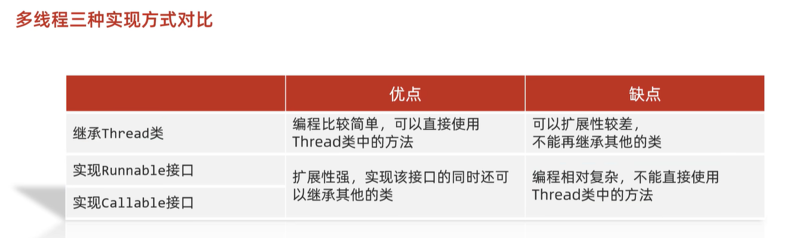

#### 6.2.1 方式一：继承Thread类

- 方法介绍

  | 方法名       | 说明                                        |
  | ------------ | ------------------------------------------- |
  | void run()   | 在线程开启后，此方法将被调用执行            |
  | void start() | 使此线程开始执行，Java虚拟机会调用run方法() |

- 实现步骤

  - 定义一个类MyThread继承Thread类
  - 在MyThread类中重写run()方法
  - 创建MyThread类的对象
  - 启动线程

- 代码演示

  ```java
  public class MyThread extends Thread {
      @Override
      public void run() {
          for(int i=0; i<100; i++) {
              System.out.println(i);
          }
      }
  }
  public class MyThreadDemo {
      public static void main(String[] args) {
          MyThread my1 = new MyThread();
          MyThread my2 = new MyThread();
  
  //        my1.run();
  //        my2.run();
  
          //void start() 导致此线程开始执行; Java虚拟机调用此线程的run方法
          my1.start();
          my2.start();
      }
  }
  ```

- 两个小问题

  - 为什么要重写run()方法？

    因为run()是用来封装被线程执行的代码

  - run()方法和start()方法的区别？

    run()：封装线程执行的代码，直接调用，相当于普通方法的调用

    start()：启动线程；然后由JVM调用此线程的run()方法

    ​	

#### 6.2.2 式二：实现Runnable接口

- Thread构造方法

  | 方法名                               | 说明                   |
  | ------------------------------------ | ---------------------- |
  | Thread(Runnable target)              | 分配一个新的Thread对象 |
  | Thread(Runnable target, String name) | 分配一个新的Thread对象 |

- 实现步骤

  - 定义一个类MyRunnable实现Runnable接口
  - 在MyRunnable类中重写run()方法
  - 创建MyRunnable类的对象
  - 创建Thread类的对象，把MyRunnable对象作为构造方法的参数
  - 启动线程

- 代码演示

  ```java
  public class MyRunnable implements Runnable {
      @Override
      public void run() {
          for(int i=0; i<100; i++) {
              System.out.println(Thread.currentThread().getName()+":"+i);
          }
      }
  }
  public class MyRunnableDemo {
      public static void main(String[] args) {
          //创建MyRunnable类的对象
          MyRunnable my = new MyRunnable();
  
          //创建Thread类的对象，把MyRunnable对象作为构造方法的参数
          //Thread(Runnable target)
  //        Thread t1 = new Thread(my);
  //        Thread t2 = new Thread(my);
          //Thread(Runnable target, String name)
          Thread t1 = new Thread(my,"坦克");
          Thread t2 = new Thread(my,"飞机");
  
          //启动线程
          t1.start();
          t2.start();
      }
  }
  ```

  ​		

#### 6.2.3 方式三: 实现Callable接口

+ 方法介绍

  | 方法名                           | 说明                                               |
  | -------------------------------- | -------------------------------------------------- |
  | V call()                         | 计算结果，如果无法计算结果，则抛出一个异常         |
  | FutureTask(Callable<V> callable) | 创建一个 FutureTask，一旦运行就执行给定的 Callable |
  | V get()                          | 如有必要，等待计算完成，然后获取其结果             |

+ 实现步骤

  + 定义一个类MyCallable实现Callable接口
  + 在MyCallable类中重写call()方法
  + 创建MyCallable类的对象
  + 创建Future的实现类FutureTask对象，把MyCallable对象作为构造方法的参数
  + 创建Thread类的对象，把FutureTask对象作为构造方法的参数
  + 启动线程
  + 再调用get方法，就可以获取线程结束之后的结果。

+ 代码演示

  ```java
  public class MyCallable implements Callable<String> {
      @Override
      public String call() throws Exception {
          for (int i = 0; i < 100; i++) {
              System.out.println("跟女孩表白" + i);
          }
          //返回值就表示线程运行完毕之后的结果
          return "答应";
      }
  }
  public class Demo {
      public static void main(String[] args) throws ExecutionException, InterruptedException {
          //线程开启之后需要执行里面的call方法
          MyCallable mc = new MyCallable();
  
          //Thread t1 = new Thread(mc);
  
          //可以获取线程执行完毕之后的结果.也可以作为参数传递给Thread对象
          FutureTask<String> ft = new FutureTask<>(mc);
  
          //创建线程对象
          Thread t1 = new Thread(ft);
  
          String s = ft.get();
          //开启线程
          t1.start();
  
          //String s = ft.get();
          System.out.println(s);
      }
  }
  ```

  ​			

### 6.3 常用成员方法

| 方法名称                         | 说明                                     |
| -------------------------------- | ---------------------------------------- |
| String getName()                 | 返回此线程的名称                         |
| void setName(String name)        | 设置线程的名字（构造方法也可以设置名字） |
| static Thread currentThread()    | 获取当前线程的对象                       |
| static void sleep(long time)     | 让线程休眠指定的时间，单位为毫秒         |
| setPriority(int newPriority)     | 设置线程的优先级                         |
| final int getPriority()          | 获取线程的优先级                         |
| final void setDaemon(boolean on) | 设置为守护线程                           |
| public static void yield()       | 出让线程/礼让线程                        |
| public static void join()        | 插入线程/插队线程                        |

**`String getName()` / `void setName(String name)`**

- 细节
  1. 如果没有给线程设置名称，线程会有默认的名称，格式为：`Thread-X`（X 从 0 开始）
  2. 可以通过 `set` 方法设置名称，也可以在构造方法中设置

**`static Thread currentThread()`**

- 细节
  - 当 JVM 启动后，会自动启动多条线程，其中有一条叫 **main 线程**
  - main 线程的作用是调用 `main` 方法并执行其中的代码
  - 之前写的所有代码，实际上都是运行在 main 线程中

**`static void sleep(long time)`**

- 细节
  1. 哪条线程执行到该方法，哪条线程就会在这里暂停对应的时间
  2. 参数表示休眠的时间，单位为毫秒（1 秒 = 1000 毫秒）
  3. 时间到达后，线程会自动醒来并继续执行后续代码

**`final void setDaemon(boolean on)`**

- 细节

  - 当其他非守护线程执行完毕后，守护线程会自动结束

  - 通俗理解：当“女神线程”结束了，“备胎线程”也没有存在的必要了

    ​			

### 6.4 线程的生命周期和状态

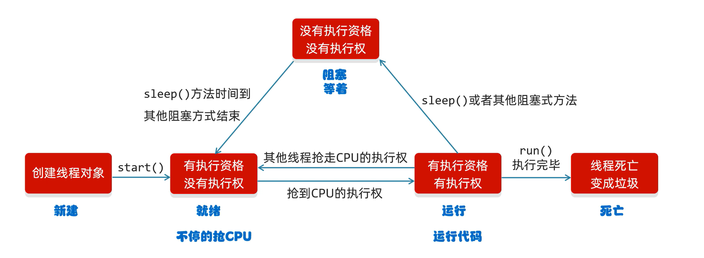

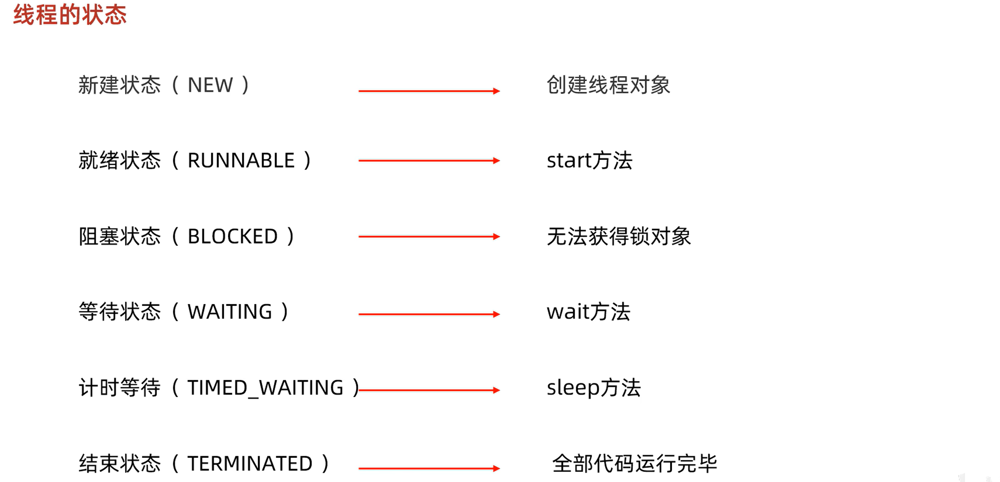

当线程被创建并启动以后，它既不是一启动就进入了执行状态，也不是一直处于执行状态。线程对象在不同的时期有不同的状态。那么Java中的线程存在哪几种状态呢？Java中的线程

状态被定义在了java.lang.Thread.State枚举类中，State枚举类的源码如下：

```java
public class Thread {
    
    public enum State {
    
        /* 新建 */
        NEW , 

        /* 可运行状态 */
        RUNNABLE , 

        /* 阻塞状态 */
        BLOCKED , 

        /* 无限等待状态 */
        WAITING , 

        /* 计时等待 */
        TIMED_WAITING , 

        /* 终止 */
        TERMINATED;
    
	}
    
    // 获取当前线程的状态
    public State getState() {
        return jdk.internal.misc.VM.toThreadState(threadStatus);
    }
    
}
```

通过源码我们可以看到Java中的线程存在6种状态，每种线程状态的含义如下

| 线程状态      | 具体含义                                                     |
| ------------- | ------------------------------------------------------------ |
| NEW           | 一个尚未启动的线程的状态。也称之为初始状态、开始状态。线程刚被创建，但是并未启动。还没调用start方法。MyThread t = new MyThread()只有线程象，没有线程特征。 |
| RUNNABLE      | 当我们调用线程对象的start方法，那么此时线程对象进入了RUNNABLE状态。那么此时才是真正的在JVM进程中创建了一个线程，线程一经启动并不是立即得到执行，线程的运行与否要听令与CPU的调度，那么我们把这个中间状态称之为可执行状态(RUNNABLE)也就是说它具备执行的资格，但是并没有真正的执行起来而是在等待CPU的度。 |
| BLOCKED       | 当一个线程试图获取一个对象锁，而该对象锁被其他的线程持有，则该线程进入Blocked状态；当该线程持有锁时，该线程将变成Runnable状态。 |
| WAITING       | 一个正在等待的线程的状态。也称之为等待状态。造成线程等待的原因有两种，分别是调用Object.wait()、join()方法。处于等待状态的线程，正在等待其他线程去执行一个特定的操作。例如：因为wait()而等待的线程正在等待另一个线程去调用notify()或notifyAll()；一个因为join()而等待的线程正在等待另一个线程结束。 |
| TIMED_WAITING | 一个在限定时间内等待的线程的状态。也称之为限时等待状态。造成线程限时等待状态的原因有三种，分别是：Thread.sleep(long)，Object.wait(long)、join(long)。 |
| TERMINATED    | 一个完全运行完成的线程的状态。也称之为终止状态、结束状态     |

各个状态的转换，如下图所示：


​					

### 6.5 线程安全问题

#### 6.5.1 同步代码块

- **安全问题出现的条件**

  - 是多线程环境

  - 有共享数据

  - 有多条语句操作共享数据

- **如何解决多线程安全问题呢?**

  - 基本思想：让程序没有安全问题的环境

- **怎么实现呢?**

  - 把多条语句操作共享数据的代码给锁起来，让任意时刻只能有一个线程执行即可

  - Java提供了同步代码块的方式来解决

- **同步代码块格式：**

  ```java
  synchronized(任意对象) { 
  	多条语句操作共享数据的代码 
  }
  ```

  synchronized(任意对象)：就相当于给代码加锁了，任意对象就可以看成是一把锁

- 同步的好处和弊端  

  - 好处：解决了多线程的数据安全问题

  - 弊端：当线程很多时，因为每个线程都会去判断同步上的锁，这是很耗费资源的，无形中会降低程序的运行效率

- 代码演示

  ```java
  public class SellTicket implements Runnable {
      private int tickets = 100;
      private Object obj = new Object();
  
      @Override
      public void run() {
          while (true) {
              synchronized (obj) { // 对可能有安全问题的代码加锁,多个线程必须使用同一把锁
                  //t1进来后，就会把这段代码给锁起来
                  if (tickets > 0) {
                      try {
                          Thread.sleep(100);
                          //t1休息100毫秒
                      } catch (InterruptedException e) {
                          e.printStackTrace();
                      }
                      //窗口1正在出售第100张票
                      System.out.println(Thread.currentThread().getName() + "正在出售第" + tickets + "张票");
                      tickets--; //tickets = 99;
                  }
              }
              //t1出来了，这段代码的锁就被释放了
          }
      }
  }
  
  ......
  ```


> 写个这里代码的套路：
>
> 1. 循环
> 2. 同步代码块
> 3. 判断共享数据是否到了末尾（到了末尾的代码）
> 4. 判断共享数据是否到了末尾（没到末尾的代码，执行核心逻辑）

​						

#### 6.5.2 同步方法

- 同步方法的格式

  同步方法：就是把synchronized关键字加到方法上

  ```java
  修饰符 synchronized 返回值类型 方法名(方法参数) { 
  	方法体；
  }
  ```

  同步方法的锁对象是什么呢?

  ​	this

- 静态同步方法

  同步静态方法：就是把synchronized关键字加到静态方法上

  ```java
  修饰符 static synchronized 返回值类型 方法名(方法参数) { 
  	方法体；
  }
  ```

  同步静态方法的锁对象是什么呢?

  ​	类名.class

  ​				

#### 6.5.3 Lock锁

虽然我们可以理解同步代码块和同步方法的锁对象问题，但是我们并没有直接看到在哪里加上了锁，在哪里释放了锁，为了更清晰的表达如何加锁和释放锁，JDK5以后提供了一个新的锁对象Lock

Lock是接口不能直接实例化，这里采用它的实现类ReentrantLock来实例化

- ReentrantLock构造方法

  | 方法名          | 说明                        |
  | --------------- | --------------------------- |
  | ReentrantLock() | 创建一个ReentrantLock的实例 |

- 加锁解锁方法

  | 方法名        | 说明   |
  | ------------- | ------ |
  | void lock()   | 获得锁 |
  | void unlock() | 释放锁 |

- 代码演示

  ```java
  public class Ticket implements Runnable {
      //票的数量
      private int ticket = 100;
      private Object obj = new Object();
      private ReentrantLock lock = new ReentrantLock();

      @Override
      public void run() {
          while (true) {
              //synchronized (obj){//多个线程必须使用同一把锁.
              try {
                  lock.lock();
                  if (ticket <= 0) {
                      //卖完了
                      break;
                  } else {
                      Thread.sleep(100);
                      ticket--;
                      System.out.println(Thread.currentThread().getName() + "在卖票,还剩下" + ticket + "张票");
                  }
              } catch (InterruptedException e) {
                  e.printStackTrace();
              } finally {
                  lock.unlock();
              }
              // }
          }
      }
  }

  ......
  ```
  

​			

### 6.6  生产者和消费者模式

#### 6.6.1 概述


- 概述

  生产者消费者模式是一个十分经典的多线程协作的模式，弄懂生产者消费者问题能够让我们对多线程编程的理解更加深刻。

  所谓生产者消费者问题，实际上主要是包含了两类线程：

  ​	一类是生产者线程用于生产数据

  ​	一类是消费者线程用于消费数据

  为了解耦生产者和消费者的关系，通常会采用共享的数据区域，就像是一个仓库

  生产者生产数据之后直接放置在共享数据区中，并不需要关心消费者的行为

  消费者只需要从共享数据区中去获取数据，并不需要关心生产者的行为

- Object类的等待和唤醒方法

  | 方法名           | 说明                                                         |
  | ---------------- | ------------------------------------------------------------ |
  | void wait()      | 导致当前线程等待，直到另一个线程调用该对象的 notify()方法或 notifyAll()方法 |
  | void notify()    | 唤醒正在等待对象监视器的单个线程                             |
  | void notifyAll() | 唤醒正在等待对象监视器的所有线程                             |

  ​			

#### 6.6.2 等待唤醒机制案例

+ 需求

  + 将Desk类中的变量,采用面向对象的方式封装起来
  + 生产者和消费者类中构造方法接收Desk类对象,之后在run方法中进行使用
  + 创建生产者和消费者线程对象,构造方法中传入Desk类对象
  + 开启两个线程

+ 代码实现

  ```java
  public class Desk {
  
      //定义一个标记
      //true 就表示桌子上有汉堡包的,此时允许吃货执行
      //false 就表示桌子上没有汉堡包的,此时允许厨师执行
      //public static boolean flag = false;
      private boolean flag;
  
      //汉堡包的总数量
      //public static int count = 10;
      //以后我们在使用这种必须有默认值的变量
     // private int count = 10;
      private int count;
  
      //锁对象
      //public static final Object lock = new Object();
      private final Object lock = new Object();
  
      public Desk() {
          this(false,10); // 在空参内部调用带参,对成员变量进行赋值,之后就可以直接使用成员变量了
      }
  
      public Desk(boolean flag, int count) {
          this.flag = flag;
          this.count = count;
      }
  
      public boolean isFlag() {
          return flag;
      }
  
      public void setFlag(boolean flag) {
          this.flag = flag;
      }
  
      public int getCount() {
          return count;
      }
  
      public void setCount(int count) {
          this.count = count;
      }
  
      public Object getLock() {
          return lock;
      }
  
      @Override
      public String toString() {
          return "Desk{" +
                  "flag=" + flag +
                  ", count=" + count +
                  ", lock=" + lock +
                  '}';
      }
  }
  
  public class Cooker extends Thread {
  
      private Desk desk;
  
      public Cooker(Desk desk) {
          this.desk = desk;
      }
  //    生产者步骤：
  //            1，判断桌子上是否有汉堡包
  //    如果有就等待，如果没有才生产。
  //            2，把汉堡包放在桌子上。
  //            3，叫醒等待的消费者开吃。
  
      @Override
      public void run() {
          while(true){
              synchronized (desk.getLock()){
                  if(desk.getCount() == 0){
                      break;
                  }else{
                      //System.out.println("验证一下是否执行了");
                      if(!desk.isFlag()){
                          //生产
                          System.out.println("厨师正在生产汉堡包");
                          desk.setFlag(true);
                          desk.getLock().notifyAll();
                      }else{
                          try {
                              desk.getLock().wait();
                          } catch (InterruptedException e) {
                              e.printStackTrace();
                          }
                      }
                  }
              }
          }
      }
  }
  
  public class Foodie extends Thread {
      private Desk desk;
  
      public Foodie(Desk desk) {
          this.desk = desk;
      }
  
      @Override
      public void run() {
  //        1，判断桌子上是否有汉堡包。
  //        2，如果没有就等待。
  //        3，如果有就开吃
  //        4，吃完之后，桌子上的汉堡包就没有了
  //                叫醒等待的生产者继续生产
  //        汉堡包的总数量减一
  
          //套路:
              //1. while(true)死循环
              //2. synchronized 锁,锁对象要唯一
              //3. 判断,共享数据是否结束. 结束
              //4. 判断,共享数据是否结束. 没有结束
          while(true){
              synchronized (desk.getLock()){
                  if(desk.getCount() == 0){
                      break;
                  }else{
                      //System.out.println("验证一下是否执行了");
                      if(desk.isFlag()){
                          //有
                          System.out.println("吃货在吃汉堡包");
                          desk.setFlag(false);
                          desk.getLock().notifyAll();
                          desk.setCount(desk.getCount() - 1);
                      }else{
                          //没有就等待
                          //使用什么对象当做锁,那么就必须用这个对象去调用等待和唤醒的方法.
                          try {
                              desk.getLock().wait();
                          } catch (InterruptedException e) {
                              e.printStackTrace();
                          }
                      }
                  }
              }
          }
  
      }
  }
  
  public class Demo {
      public static void main(String[] args) {
          /*消费者步骤：
          1，判断桌子上是否有汉堡包。
          2，如果没有就等待。
          3，如果有就开吃
          4，吃完之后，桌子上的汉堡包就没有了
                  叫醒等待的生产者继续生产
          汉堡包的总数量减一*/
  
          /*生产者步骤：
          1，判断桌子上是否有汉堡包
          如果有就等待，如果没有才生产。
          2，把汉堡包放在桌子上。
          3，叫醒等待的消费者开吃。*/
  
          Desk desk = new Desk();
  
          Foodie f = new Foodie(desk);
          Cooker c = new Cooker(desk);
  
          f.start();
          c.start();
  
      }
  }
  ```

  ​				

#### 6.6.3 阻塞队列实现

+ 阻塞队列继承结构

  


+ 常见BlockingQueue:

  ArrayBlockingQueue: 底层是数组,有界

  LinkedBlockingQueue: 底层是链表,无界.但不是真正的无界,最大为int的最大值

+ BlockingQueue的核心方法:

  put(anObject): 将参数放入队列,如果放不进去会阻塞

  take(): 取出第一个数据,取不到会阻塞

+ 代码示例

  ```java
  public class Demo02 {
      public static void main(String[] args) throws Exception {
          // 创建阻塞队列的对象,容量为 1
          ArrayBlockingQueue<String> arrayBlockingQueue = new ArrayBlockingQueue<>(1);
  
          // 存储元素
          arrayBlockingQueue.put("汉堡包");
  
          // 取元素
          System.out.println(arrayBlockingQueue.take());
          System.out.println(arrayBlockingQueue.take()); // 取不到会阻塞
  
          System.out.println("程序结束了");
      }
  }
  ```

+ 代码实现

  ```java
  public class Cooker extends Thread {
  
      private ArrayBlockingQueue<String> bd;
  
      public Cooker(ArrayBlockingQueue<String> bd) {
          this.bd = bd;
      }
  //    生产者步骤：
  //            1，判断桌子上是否有汉堡包
  //    如果有就等待，如果没有才生产。
  //            2，把汉堡包放在桌子上。
  //            3，叫醒等待的消费者开吃。
  
      @Override
      public void run() {
          while (true) {
              try {
                  bd.put("汉堡包");
                  System.out.println("厨师放入一个汉堡包");
              } catch (InterruptedException e) {
                  e.printStackTrace();
              }
          }
      }
  }
  
  public class Foodie extends Thread {
      private ArrayBlockingQueue<String> bd;
  
      public Foodie(ArrayBlockingQueue<String> bd) {
          this.bd = bd;
      }
  
      @Override
      public void run() {
  //        1，判断桌子上是否有汉堡包。
  //        2，如果没有就等待。
  //        3，如果有就开吃
  //        4，吃完之后，桌子上的汉堡包就没有了
  //                叫醒等待的生产者继续生产
  //        汉堡包的总数量减一
  
          //套路:
          //1. while(true)死循环
          //2. synchronized 锁,锁对象要唯一
          //3. 判断,共享数据是否结束. 结束
          //4. 判断,共享数据是否结束. 没有结束
          while (true) {
              try {
                  String take = bd.take();
                  System.out.println("吃货将" + take + "拿出来吃了");
              } catch (InterruptedException e) {
                  e.printStackTrace();
              }
          }
  
      }
  }
  
  public class Demo {
      public static void main(String[] args) {
          ArrayBlockingQueue<String> bd = new ArrayBlockingQueue<>(1);
  
          Foodie f = new Foodie(bd);
          Cooker c = new Cooker(bd);
  
          f.start();
          c.start();
      }
  }
  ```

  ​					

### 6.7 线程池

#### 6.7.1 基本原理

当线程被创建并启动以后，它既不是一启动就进入了执行状态，也不是一直处于执行状态。线程对象在不同的时期有不同的状态。那么Java中的线程存在哪几种状态呢？Java中的线程

状态被定义在了java.lang.Thread.State枚举类中，State枚举类的源码如下：

```java
public class Thread {
    
    public enum State {
    
        /* 新建 */
        NEW , 

        /* 可运行状态 */
        RUNNABLE , 

        /* 阻塞状态 */
        BLOCKED , 

        /* 无限等待状态 */
        WAITING , 

        /* 计时等待 */
        TIMED_WAITING , 

        /* 终止 */
        TERMINATED;
    
	}
    
    // 获取当前线程的状态
    public State getState() {
        return jdk.internal.misc.VM.toThreadState(threadStatus);
    }
    
}
```

通过源码我们可以看到Java中的线程存在6种状态，每种线程状态的含义如下

| 线程状态      | 具体含义                                                     |
| ------------- | ------------------------------------------------------------ |
| NEW           | 一个尚未启动的线程的状态。也称之为初始状态、开始状态。线程刚被创建，但是并未启动。还没调用start方法。MyThread t = new MyThread()只有线程象，没有线程特征。 |
| RUNNABLE      | 当我们调用线程对象的start方法，那么此时线程对象进入了RUNNABLE状态。那么此时才是真正的在JVM进程中创建了一个线程，线程一经启动并不是立即得到执行，线程的运行与否要听令与CPU的调度，那么我们把这个中间状态称之为可执行状态(RUNNABLE)也就是说它具备执行的资格，但是并没有真正的执行起来而是在等待CPU的度。 |
| BLOCKED       | 当一个线程试图获取一个对象锁，而该对象锁被其他的线程持有，则该线程进入Blocked状态；当该线程持有锁时，该线程将变成Runnable状态。 |
| WAITING       | 一个正在等待的线程的状态。也称之为等待状态。造成线程等待的原因有两种，分别是调用Object.wait()、join()方法。处于等待状态的线程，正在等待其他线程去执行一个特定的操作。例如：因为wait()而等待的线程正在等待另一个线程去调用notify()或notifyAll()；一个因为join()而等待的线程正在等待另一个线程结束。 |
| TIMED_WAITING | 一个在限定时间内等待的线程的状态。也称之为限时等待状态。造成线程限时等待状态的原因有三种，分别是：Thread.sleep(long)，Object.wait(long)、join(long)。 |
| TERMINATED    | 一个完全运行完成的线程的状态。也称之为终止状态、结束状态     |

各个状态的转换，如下图所示：


**概述 :** 

​	提到池，大家应该能想到的就是水池。水池就是一个容器，在该容器中存储了很多的水。那么什么是线程池呢？线程池也是可以看做成一个池子，在该池子中存储很多个线程。

线程池存在的意义：

​	系统创建一个线程的成本是比较高的，因为它涉及到与操作系统交互，当程序中需要创建大量生存期很短暂的线程时，频繁的创建和销毁线程对系统的资源消耗有可能大于业务处理是对系

​	统资源的消耗，这样就有点"舍本逐末"了。针对这一种情况，为了提高性能，我们就可以采用线程池。线程池在启动的时，会创建大量空闲线程，当我们向线程池提交任务的时，线程池就

​	会启动一个线程来执行该任务。等待任务执行完毕以后，线程并不会死亡，而是再次返回到线程池中称为空闲状态。等待下一次任务的执行。

**线程池的设计思路 :**

1. 准备一个任务容器

2. 一次性启动多个(2个)消费者线程

3. 刚开始任务容器是空的，所以线程都在wait

4. 直到一个外部线程向这个任务容器中扔了一个"任务"，就会有一个消费者线程被唤醒

5. 这个消费者线程取出"任务"，并且执行这个任务，执行完毕后，继续等待下一次任务的到来

   ​					

#### 6.7.2 两种线程池

概述 : JDK对线程池也进行了相关的实现，在真实企业开发中我们也很少去自定义线程池，而是使用JDK中自带的线程池。

我们可以使用Executors中所提供的**静态**方法来创建线程池

​	`static ExecutorService newCachedThreadPool()`   创建一个默认的线程池
​	`static newFixedThreadPool(int nThreads)`	    创建一个指定最多线程数量的线程池

**代码实现 :** 

```java
public class MyThreadPoolDemo {
    public static void main(String[] args) throws InterruptedException {

        //1,创建一个默认的线程池对象.池子中默认是空的.默认最多可以容纳int类型的最大值.
        ExecutorService executorService = Executors.newCachedThreadPool();
        //Executors --- 可以帮助我们创建线程池对象
        //ExecutorService --- 可以帮助我们控制线程池
		
        //提交任务
        executorService.submit(()->{
            System.out.println(Thread.currentThread().getName() + "在执行了");
        });

        //Thread.sleep(2000);

        executorService.submit(()->{
            System.out.println(Thread.currentThread().getName() + "在执行了");
        });
		
        //关闭线程池
        executorService.shutdown();
    }
}
```

​			

#### 6.7.3 自定义线程池

**创建线程池对象 :** 

`ThreadPoolExecutor threadPoolExecutor = new ThreadPoolExecutor(核心线程数量,最大线程数量,空闲线程最大存活时间,任务队列,创建线程工厂,任务的拒绝策略);`

**代码实现 :** 

```java
public class MyThreadPoolDemo3 {
//    参数一：核心线程数量
//    参数二：最大线程数
//    参数三：空闲线程最大存活时间
//    参数四：时间单位
//    参数五：任务队列
//    参数六：创建线程工厂
//    参数七：任务的拒绝策略
    public static void main(String[] args) {
        ThreadPoolExecutor pool = new ThreadPoolExecutor(
            2,
            5,
            2,
            TimeUnit.SECONDS,
            new ArrayBlockingQueue<>(10), 
            Executors.defaultThreadFactory(),
            new ThreadPoolExecutor.AbortPolicy()
        );
        pool.submit(new MyRunnable());
        pool.submit(new MyRunnable());

        pool.shutdown();
    }
}
```

**参数详解**


```java
public ThreadPoolExecutor(int corePoolSize,
                              int maximumPoolSize,
                              long keepAliveTime,
                              TimeUnit unit,
                              BlockingQueue<Runnable> workQueue,
                              ThreadFactory threadFactory,
                              RejectedExecutionHandler handler)
    
corePoolSize：   核心线程的最大值，不能小于0
maximumPoolSize：最大线程数，不能小于等于0，maximumPoolSize >= corePoolSize
keepAliveTime：  空闲线程最大存活时间,不能小于0
unit：           时间单位
workQueue：      任务队列，不能为null
threadFactory：  创建线程工厂,不能为null      
handler：        任务的拒绝策略,不能为null  
```

​			

#### 6.7.4 非默认任务拒绝策略

RejectedExecutionHandler是jdk提供的一个任务拒绝策略接口，它下面存在4个子类。

```java
ThreadPoolExecutor.AbortPolicy: 		    丢弃任务并抛出RejectedExecutionException异常。是默认的策略。
ThreadPoolExecutor.DiscardPolicy： 		   丢弃任务，但是不抛出异常 这是不推荐的做法。
ThreadPoolExecutor.DiscardOldestPolicy：    抛弃队列中等待最久的任务 然后把当前任务加入队列中。
ThreadPoolExecutor.CallerRunsPolicy:        调用任务的run()方法绕过线程池直接执行。
```

注：明确线程池对多可执行的任务数 = 队列容量 + 最大线程数

​	

#### 6.7.5 线程池多大合适

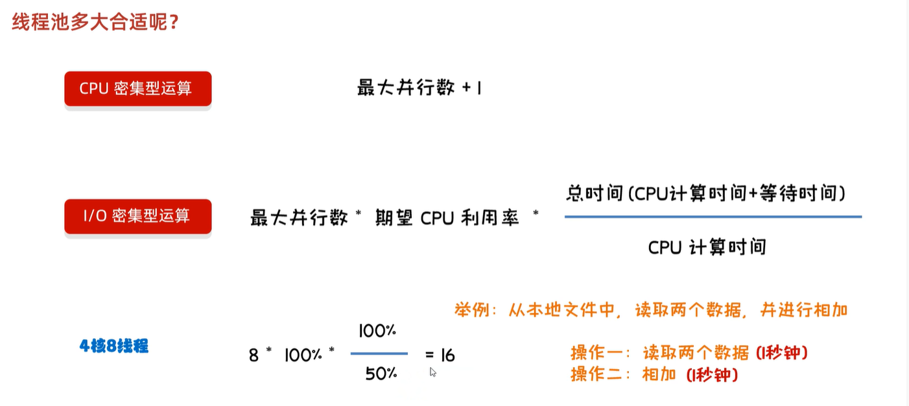

​		

## 7. 网络编程

### 7.1 概述

- 计算机网络

  是指将地理位置不同的具有独立功能的多台计算机及其外部设备，通过通信线路连接起来，在网络操作系统，网络管理软件及网络通信协议的管理和协调下，实现资源共享和信息传递的计算机系统

- 网络编程

  在网络通信协议下，不同计算机上运行的程序，可以进行数据传输

#### 7.1.1 三要素

- IP地址

  要想让网络中的计算机能够互相通信，必须为每台计算机指定一个标识号，通过这个标识号来指定要接收数据的计算机和识别发送的计算机，而IP地址就是这个标识号。也就是设备的标识

- 端口

  网络的通信，本质上是两个应用程序的通信。每台计算机都有很多的应用程序，那么在网络通信时，如何区分这些应用程序呢？如果说IP地址可以唯一标识网络中的设备，那么端口号就可以唯一标识设备中的应用程序了。也就是应用程序的标识

- 协议

  通过计算机网络可以使多台计算机实现连接，位于同一个网络中的计算机在进行连接和通信时需要遵守一定的规则，这就好比在道路中行驶的汽车一定要遵守交通规则一样。在计算机网络中，这些连接和通信的规则被称为网络通信协议，它对数据的传输格式、传输速率、传输步骤等做了统一规定，通信双方必须同时遵守才能完成数据交换。常见的协议有UDP协议和TCP协议

  ​		

#### 7.1.2 IP地址

IP地址：是网络中设备的唯一标识

- IP地址分为两大类

  - IPv4：是给每个连接在网络上的主机分配一个32bit地址。按照TCP/IP规定，IP地址用二进制来表示，每个IP地址长32bit，也就是4个字节。例如一个采用二进制形式的IP地址是“11000000 10101000 00000001 01000010”，这么长的地址，处理起来也太费劲了。为了方便使用，IP地址经常被写成十进制的形式，中间使用符号“.”分隔不同的字节。于是，上面的IP地址可以表示为“192.168.1.66”。IP地址的这种表示法叫做“点分十进制表示法”，这显然比1和0容易记忆得多
  - IPv6：由于互联网的蓬勃发展，IP地址的需求量愈来愈大，但是网络地址资源有限，使得IP的分配越发紧张。为了扩大地址空间，通过IPv6重新定义地址空间，采用128位地址长度，每16个字节一组，分成8组十六进制数，这样就解决了网络地址资源数量不够的问题

- DOS常用命令：

  - ipconfig：查看本机IP地址
  - ping IP地址：检查网络是否连通

- 特殊IP地址：

  - 127.0.0.1：是回送地址，可以代表本机地址，一般用来测试使用

    ​			

#### 7.1.3 InetAddress

InetAddress：此类表示Internet协议（IP）地址

- 相关方法

  | 方法名                                    | 说明                                                         |
  | ----------------------------------------- | ------------------------------------------------------------ |
  | static InetAddress getByName(String host) | 确定主机名称的IP地址。主机名称可以是机器名称，也可以是IP地址 |
  | String getHostName()                      | 获取此IP地址的主机名                                         |
  | String getHostAddress()                   | 返回文本显示中的IP地址字符串                                 |

  ​				

#### 7.1.4 端口和协议

- 端口

  - 设备上应用程序的唯一标识

- 端口号

  - 用两个字节表示的整数，它的取值范围是0~65535。其中，0~1023之间的端口号用于一些知名的网络服务和应用，普通的应用程序需要使用1024以上的端口号。如果端口号被另外一个服务或应用所占用，会导致当前程序启动失败

- 协议

  - 计算机网络中，连接和通信的规则被称为网络通信协议

- UDP协议

  - 用户数据报协议(User Datagram Protocol)
  - UDP是无连接通信协议，即在数据传输时，数据的发送端和接收端不建立逻辑连接。简单来说，当一台计算机向另外一台计算机发送数据时，发送端不会确认接收端是否存在，就会发出数据，同样接收端在收到数据时，也不会向发送端反馈是否收到数据。
  - 由于使用UDP协议消耗系统资源小，通信效率高，所以通常都会用于音频、视频和普通数据的传输
  - 例如视频会议通常采用UDP协议，因为这种情况即使偶尔丢失一两个数据包，也不会对接收结果产生太大影响。但是在使用UDP协议传送数据时，由于UDP的面向无连接性，不能保证数据的完整性，因此在传输重要数据时不建议使用UDP协议

- TCP协议

  - 传输控制协议 (Transmission Control Protocol)

  - TCP协议是面向连接的通信协议，即传输数据之前，在发送端和接收端建立逻辑连接，然后再传输数据，它提供了两台计算机之间可靠无差错的数据传输。在TCP连接中必须要明确客户端与服务器端，由客户端向服务端发出连接请求，每次连接的创建都需要经过“三次握手”

  - 三次握手：TCP协议中，在发送数据的准备阶段，客户端与服务器之间的三次交互，以保证连接的可靠

    第一次握手，客户端向服务器端发出连接请求，等待服务器确认

    第二次握手，服务器端向客户端回送一个响应，通知客户端收到了连接请求

    第三次握手，客户端再次向服务器端发送确认信息，确认连接

  - 完成三次握手，连接建立后，客户端和服务器就可以开始进行数据传输了。由于这种面向连接的特性，TCP协议可以保证传输数据的安全，所以应用十分广泛。例如上传文件、下载文件、浏览网页等

    ​			

### 7.2 UDP通信程序

#### 7.2.1 发送数据

- Java中的UDP通信

  - UDP协议是一种不可靠的网络协议，它在通信的两端各建立一个Socket对象，但是这两个Socket只是发送，接收数据的对象，因此对于基于UDP协议的通信双方而言，没有所谓的客户端和服务器的概念
  - Java提供了DatagramSocket类作为基于UDP协议的Socket

- 构造方法

  | 方法名                                                      | 说明                                                 |
  | ----------------------------------------------------------- | ---------------------------------------------------- |
  | DatagramSocket()                                            | 创建数据报套接字并将其绑定到本机地址上的任何可用端口 |
  | DatagramPacket(byte[] buf,int len,InetAddress add,int port) | 创建数据包,发送长度为len的数据包到指定主机的指定端口 |

- 相关方法

  | 方法名                         | 说明                   |
  | ------------------------------ | ---------------------- |
  | void send(DatagramPacket p)    | 发送数据报包           |
  | void close()                   | 关闭数据报套接字       |
  | void receive(DatagramPacket p) | 从此套接字接受数据报包 |

- 发送数据的步骤

  - 创建发送端的Socket对象(DatagramSocket)
  - 创建数据，并把数据打包
  - 调用DatagramSocket对象的方法发送数据
  - 关闭发送端


- 代码演示

  ```java
  public class SendDemo {
      public static void main(String[] args) throws IOException {
          //创建发送端的Socket对象(DatagramSocket)
          // DatagramSocket() 构造数据报套接字并将其绑定到本地主机上的任何可用端口
          DatagramSocket ds = new DatagramSocket();
  
          //创建数据，并把数据打包
          //DatagramPacket(byte[] buf, int length, InetAddress address, int port)
          //构造一个数据包，发送长度为 length的数据包到指定主机上的指定端口号。
          byte[] bys = "hello,udp,我来了".getBytes();
  
          DatagramPacket dp = new DatagramPacket(bys,bys.length,InetAddress.getByName("127.0.0.1"),10086);
  
          //调用DatagramSocket对象的方法发送数据
          //void send(DatagramPacket p) 从此套接字发送数据报包
          ds.send(dp);
  
          //关闭发送端
          //void close() 关闭此数据报套接字
          ds.close();
      }
  }
  ```

  ​			

#### 7.2.2 接收数据

- 接收数据的步骤

  - 创建接收端的Socket对象(DatagramSocket)
  - 创建一个数据包，用于接收数据
  - 调用DatagramSocket对象的方法接收数据
  - 解析数据包，并把数据在控制台显示
  - 关闭接收端

- 构造方法

  | 方法名                              | 说明                                            |
  | ----------------------------------- | ----------------------------------------------- |
  | DatagramPacket(byte[] buf, int len) | 创建一个DatagramPacket用于接收长度为len的数据包 |

- 相关方法

  | 方法名            | 说明                                     |
  | ----------------- | ---------------------------------------- |
  | byte[]  getData() | 返回数据缓冲区                           |
  | int  getLength()  | 返回要发送的数据的长度或接收的数据的长度 |

- 示例代码

  ```java
  public class ReceiveDemo {
      public static void main(String[] args) throws IOException {
        	//创建接收端的Socket对象(DatagramSocket)
        	DatagramSocket ds = new DatagramSocket(12345);
  
        	//创建一个数据包，用于接收数据
        	byte[] bys = new byte[1024];
        	DatagramPacket dp = new DatagramPacket(bys, bys.length);
  
        	//调用DatagramSocket对象的方法接收数据
        	ds.receive(dp);
  
        	//解析数据包，并把数据在控制台显示
        	System.out.println("数据是：" + new String(dp.getData(), 0,                                             dp.getLength()));
          }
      }
  }
  ```

  ​			

#### 7.2.3 UDP三种通讯方式

- 单播

  单播用于两个主机之间的端对端通信

- 组播

  组播用于对一组特定的主机进行通信

- 广播

  广播用于一个主机对整个局域网上所有主机上的数据通信

****

**组播：**

- 实现步骤

  - 发送端
    1. 创建发送端的Socket对象(DatagramSocket)
    2. 创建数据，并把数据打包(DatagramPacket)
    3. 调用DatagramSocket对象的方法发送数据(在单播中,这里是发给指定IP的电脑但是在组播当中,这里是发给组播地址)
    4. 释放资源
  - 接收端
    1. 创建接收端Socket对象(MulticastSocket)
    2. 创建一个箱子,用于接收数据
    3. 把当前计算机绑定一个组播地址
    4. 将数据接收到箱子中
    5. 解析数据包,并打印数据
    6. 释放资源

- 代码实现

  ```java
  // 发送端
  public class ClinetDemo {
      public static void main(String[] args) throws IOException {
          // 1. 创建发送端的Socket对象(DatagramSocket)
          DatagramSocket ds = new DatagramSocket();
          String s = "hello 组播";
          byte[] bytes = s.getBytes();
          InetAddress address = InetAddress.getByName("224.0.1.0");
          int port = 10000;
          // 2. 创建数据，并把数据打包(DatagramPacket)
          DatagramPacket dp = new DatagramPacket(bytes,bytes.length,address,port);
          // 3. 调用DatagramSocket对象的方法发送数据(在单播中,这里是发给指定IP的电脑但是在组播当中,这里是发给组播地址)
          ds.send(dp);
          // 4. 释放资源
          ds.close();
      }
  }
  // 接收端
  public class ServerDemo {
      public static void main(String[] args) throws IOException {
          // 1. 创建接收端Socket对象(MulticastSocket)
          MulticastSocket ms = new MulticastSocket(10000);
          // 2. 创建一个箱子,用于接收数据
          DatagramPacket dp = new DatagramPacket(new byte[1024],1024);
          // 3. 把当前计算机绑定一个组播地址,表示添加到这一组中.
          ms.joinGroup(InetAddress.getByName("224.0.1.0"));
          // 4. 将数据接收到箱子中
          ms.receive(dp);
          // 5. 解析数据包,并打印数据
          byte[] data = dp.getData();
          int length = dp.getLength();
          System.out.println(new String(data,0,length));
          // 6. 释放资源
          ms.close();
      }
  }
  ```

  ​	

****

**广播：**

- 实现步骤

  - 发送端
    1. 创建发送端Socket对象(DatagramSocket)
    2. 创建存储数据的箱子,将广播地址封装进去
    3. 发送数据
    4. 释放资源
  - 接收端
    1. 创建接收端的Socket对象(DatagramSocket)
    2. 创建一个数据包，用于接收数据
    3. 调用DatagramSocket对象的方法接收数据
    4. 解析数据包，并把数据在控制台显示
    5. 关闭接收端

- 代码实现

  ```java
  // 发送端
  public class ClientDemo {
      public static void main(String[] args) throws IOException {
        	// 1. 创建发送端Socket对象(DatagramSocket)
          DatagramSocket ds = new DatagramSocket();
  		// 2. 创建存储数据的箱子,将广播地址封装进去
          String s = "广播 hello";
          byte[] bytes = s.getBytes();
          InetAddress address = InetAddress.getByName("255.255.255.255");
          int port = 10000;
          DatagramPacket dp = new DatagramPacket(bytes,bytes.length,address,port);
  		// 3. 发送数据
          ds.send(dp);
  		// 4. 释放资源
          ds.close();
      }
  }
  
  // 接收端
  public class ServerDemo {
      public static void main(String[] args) throws IOException {
          // 1. 创建接收端的Socket对象(DatagramSocket)
          DatagramSocket ds = new DatagramSocket(10000);
          // 2. 创建一个数据包，用于接收数据
          DatagramPacket dp = new DatagramPacket(new byte[1024],1024);
          // 3. 调用DatagramSocket对象的方法接收数据
          ds.receive(dp);
          // 4. 解析数据包，并把数据在控制台显示
          byte[] data = dp.getData();
          int length = dp.getLength();
          System.out.println(new String(data,0,length));
          // 5. 关闭接收端
          ds.close();
      }
  }
  ```

  ​			

### 7.3 TCP通信程序

#### 7.3.1 发送数据

- Java中的TCP通信

  - Java对基于TCP协议的的网络提供了良好的封装，使用Socket对象来代表两端的通信端口，并通过Socket产生IO流来进行网络通信。
  - Java为客户端提供了Socket类，为服务器端提供了ServerSocket类

- 构造方法

  | 方法名                               | 说明                                           |
  | ------------------------------------ | ---------------------------------------------- |
  | Socket(InetAddress address,int port) | 创建流套接字并将其连接到指定IP指定端口号       |
  | Socket(String host, int port)        | 创建流套接字并将其连接到指定主机上的指定端口号 |

- 相关方法

  | 方法名                         | 说明                 |
  | ------------------------------ | -------------------- |
  | InputStream  getInputStream()  | 返回此套接字的输入流 |
  | OutputStream getOutputStream() | 返回此套接字的输出流 |

- 示例代码

  ```java
  public class Client {
      public static void main(String[] args) throws IOException {
          //TCP协议，发送数据
  
          //1.创建Socket对象
          //细节：在创建对象的同时会连接服务端
          //      如果连接不上，代码会报错
          Socket socket = new Socket("127.0.0.1",10000);
  
          //2.可以从连接通道中获取输出流
          OutputStream os = socket.getOutputStream();
          //写出数据
          os.write("aaa".getBytes());
  
          //3.释放资源
          os.close();
          socket.close();
      }
  }
  ```

  ​			

#### 7.3.2 接收数据

- 构造方法

  | 方法名                  | 说明                             |
  | ----------------------- | -------------------------------- |
  | ServletSocket(int port) | 创建绑定到指定端口的服务器套接字 |

- 相关方法

  | 方法名          | 说明                           |
  | --------------- | ------------------------------ |
  | Socket accept() | 监听要连接到此的套接字并接受它 |

- 注意事项

  1. accept方法是阻塞的,作用就是等待客户端连接
  2. 客户端创建对象并连接服务器,此时是通过三次握手协议,保证跟服务器之间的连接
  3. 针对客户端来讲,是往外写的,所以是输出流
     针对服务器来讲,是往里读的,所以是输入流
  4. read方法也是阻塞的
  5. 客户端在关流的时候,还多了一个往服务器写结束标记的动作
  6. 最后一步断开连接,通过四次挥手协议保证连接终止

- 三次握手和四次挥手

  - 三次握手

    

  - 四次挥手

    

- 示例代码

  ```java
  public class Server {
      public static void main(String[] args) throws IOException {
          //TCP协议，接收数据
  
          //1.创建对象ServerSocker
          ServerSocket ss = new ServerSocket(10000);
  
          //2.监听客户端的链接
          Socket socket = ss.accept();
  
          //3.从连接通道中获取输入流读取数据
          InputStream is = socket.getInputStream();
          int b;
          while ((b = is.read()) != -1){
              System.out.println((char) b);
          }
  
          //4.释放资源
          socket.close();
          ss.close();
      }
  }
  ```
  
  ​				

## 8. 反射

### 8.1 概述

​	**专业的解释（了解一下）：**

​       是在运行状态中，对于任意一个类，都能够知道这个类的所有属性和方法；

​       对于任意一个对象，都能够调用它的任意属性和方法；

​       这种动态获取信息以及动态调用对象方法的功能称为Java语言的反射机制。

​	**通俗的理解：（掌握）**

* 利用**反射**创建的对象**可以无视修饰符**调用类里面的内容

* 可以跟**配置文件结合起来使用**，把要创建的对象信息和方法写在配置文件中。

  读取到什么类，就创建什么类的对象

  读取到什么方法，就调用什么方法

  此时当需求变更的时候不需要修改代码，只要修改配置文件即可。

反射都是从class字节码文件中获取的内容。

* 如何获取class字节码文件的对象

* 利用反射如何获取构造方法（创建对象）

* 利用反射如何获取成员变量（赋值，获取值）

* 利用反射如何获取成员方法（运行）

  ​			

### 8.2 获取字节码文件对象的三种方式

* Class这个类里面的静态方法forName（“全类名”）**（最常用）**
* 通过class属性获取  
* 通过对象获取字节码文件对象

代码示例：

```java
//1.Class这个类里面的静态方法forName
//Class.forName("类的全类名")： 全类名 = 包名 + 类名
Class clazz1 = Class.forName("com.itheima.reflectdemo.Student");
//源代码阶段获取 --- 先把Student加载到内存中，再获取字节码文件的对象
//clazz 就表示Student这个类的字节码文件对象。
//就是当Student.class这个文件加载到内存之后，产生的字节码文件对象


//2.通过class属性获取
//类名.class
Class clazz2 = Student.class;

//因为class文件在硬盘中是唯一的，所以，当这个文件加载到内存之后产生的对象也是唯一的
System.out.println(clazz1 == clazz2);//true


//3.通过Student对象获取字节码文件对象
Student s = new Student();
Class clazz3 = s.getClass();
System.out.println(clazz1 == clazz2);//true
System.out.println(clazz2 == clazz3);//true
```

​			

### 8.3 获取构造方法

规则：

​	get表示获取

​	Declared表示私有

​	最后的s表示所有，复数形式

​	如果当前获取到的是私有的，必须要临时修改访问权限，否则无法使用

| 方法名                                                       | 说明                              |
| ------------------------------------------------------------ | --------------------------------- |
| Constructor<?>[] getConstructors()                           | 获得所有的构造（只能public修饰）  |
| Constructor<?>[] getDeclaredConstructors()                   | 获得所有的构造（包含private修饰） |
| Constructor<T> getConstructor(Class<?>... parameterTypes)    | 获取指定构造（只能public修饰）    |
| Constructor<T> getDeclaredConstructor(Class<?>... parameterTypes) | 获取指定构造（包含private修饰）   |

代码示例：

```java
public class ReflectDemo2 {
    public static void main(String[] args) throws ClassNotFoundException, NoSuchMethodException {
        //1.获得整体（class字节码文件对象）
        Class clazz = Class.forName("com.itheima.reflectdemo.Student");


        //2.获取构造方法对象
        //获取所有构造方法（public）
        Constructor[] constructors1 = clazz.getConstructors();
        for (Constructor constructor : constructors1) {
            System.out.println(constructor);
        }

        System.out.println("=======================");

        //获取所有构造（带私有的）
        Constructor[] constructors2 = clazz.getDeclaredConstructors();

        for (Constructor constructor : constructors2) {
            System.out.println(constructor);
        }
        System.out.println("=======================");

        //获取指定的空参构造
        Constructor con1 = clazz.getConstructor();
        System.out.println(con1);

        Constructor con2 = clazz.getConstructor(String.class,int.class);
        System.out.println(con2);

        System.out.println("=======================");
        //获取指定的构造(所有构造都可以获取到，包括public包括private)
        Constructor con3 = clazz.getDeclaredConstructor();
        System.out.println(con3);
        //了解 System.out.println(con3 == con1);
        //每一次获取构造方法对象的时候，都会新new一个。

        Constructor con4 = clazz.getDeclaredConstructor(String.class);
        System.out.println(con4);
    }
}
```

​	

### 8.4 获取构造方法并创建对象

涉及到的方法：newInstance

代码示例：

```java
//首先要有一个javabean类
public class Student {
    private String name;

    private int age;


    public Student() {

    }

    public Student(String name) {
        this.name = name;
    }

    private Student(String name, int age) {
        this.name = name;
        this.age = age;
    }


    /**
     * 获取
     * @return name
     */
    public String getName() {
        return name;
    }

    /**
     * 设置
     * @param name
     */
    public void setName(String name) {
        this.name = name;
    }

    /**
     * 获取
     * @return age
     */
    public int getAge() {
        return age;
    }

    /**
     * 设置
     * @param age
     */
    public void setAge(int age) {
        this.age = age;
    }

    public String toString() {
        return "Student{name = " + name + ", age = " + age + "}";
    }
}


//测试类中的代码：
//需求1：
//获取空参，并创建对象

//1.获取整体的字节码文件对象
Class clazz = Class.forName("com.itheima.a02reflectdemo1.Student");
//2.获取空参的构造方法
Constructor con = clazz.getConstructor();
//3.利用空参构造方法创建对象
Student stu = (Student) con.newInstance();
System.out.println(stu);


System.out.println("=============================================");


//测试类中的代码：
//需求2：
//获取带参构造，并创建对象
//1.获取整体的字节码文件对象
Class clazz = Class.forName("com.itheima.a02reflectdemo1.Student");
//2.获取有参构造方法
Constructor con = clazz.getDeclaredConstructor(String.class, int.class);
//3.临时修改构造方法的访问权限（暴力反射）
con.setAccessible(true);
//4.直接创建对象
Student stu = (Student) con.newInstance("zhangsan", 23);
System.out.println(stu);
```

​	

### 8.5 获取成员变量

规则：

​	get表示获取

​	Declared表示私有

​	最后的s表示所有，复数形式

​	如果当前获取到的是私有的，必须要临时修改访问权限，否则无法使用

方法名：

| 方法名                              | 说明                                         |
| ----------------------------------- | -------------------------------------------- |
| Field[] getFields()                 | 返回所有成员变量对象的数组（只能拿public的） |
| Field[] getDeclaredFields()         | 返回所有成员变量对象的数组，存在就能拿到     |
| Field getField(String name)         | 返回单个成员变量对象（只能拿public的）       |
| Field getDeclaredField(String name) | 返回单个成员变量对象，存在就能拿到           |

代码示例：

```java
public class ReflectDemo4 {
    public static void main(String[] args) throws ClassNotFoundException, NoSuchFieldException {
        //获取成员变量对象

        //1.获取class对象
        Class clazz = Class.forName("com.itheima.reflectdemo.Student");

        //2.获取成员变量的对象（Field对象)只能获取public修饰的
        Field[] fields1 = clazz.getFields();
        for (Field field : fields1) {
            System.out.println(field);
        }

        System.out.println("===============================");

        //获取成员变量的对象（public + private）
        Field[] fields2 = clazz.getDeclaredFields();
        for (Field field : fields2) {
            System.out.println(field);
        }

        System.out.println("===============================");
        //获得单个成员变量对象
        //如果获取的属性是不存在的，那么会报异常
        //Field field3 = clazz.getField("aaa");
        //System.out.println(field3);//NoSuchFieldException

        Field field4 = clazz.getField("gender");
        System.out.println(field4);

        System.out.println("===============================");
        //获取单个成员变量（私有）
        Field field5 = clazz.getDeclaredField("name");
        System.out.println(field5);

    }
}


public class Student {
    private String name;

    private int age;

    public String gender;

    public String address;


    public Student() {
    }

    public Student(String name, int age, String address) {
        this.name = name;
        this.age = age;
        this.address = address;
    }


    public Student(String name, int age, String gender, String address) {
        this.name = name;
        this.age = age;
        this.gender = gender;
        this.address = address;
    }

    /**
     * 获取
     * @return name
     */
    public String getName() {
        return name;
    }

    /**
     * 设置
     * @param name
     */
    public void setName(String name) {
        this.name = name;
    }

    /**
     * 获取
     * @return age
     */
    public int getAge() {
        return age;
    }

    /**
     * 设置
     * @param age
     */
    public void setAge(int age) {
        this.age = age;
    }

    /**
     * 获取
     * @return gender
     */
    public String getGender() {
        return gender;
    }

    /**
     * 设置
     * @param gender
     */
    public void setGender(String gender) {
        this.gender = gender;
    }

    /**
     * 获取
     * @return address
     */
    public String getAddress() {
        return address;
    }

    /**
     * 设置
     * @param address
     */
    public void setAddress(String address) {
        this.address = address;
    }

    public String toString() {
        return "Student{name = " + name + ", age = " + age + ", gender = " + gender + ", address = " + address + "}";
    }
}

```

​	

### 8.6 获取成员变量并获取值和修改值

| 方法                                | 说明   |
| ----------------------------------- | ------ |
| void set(Object obj, Object value） | 赋值   |
| Object get(Object obj)              | 获取值 |

代码示例：

```java
public class ReflectDemo5 {
    public static void main(String[] args) throws ClassNotFoundException, NoSuchFieldException, IllegalAccessException {
        Student s = new Student("zhangsan",23,"广州");
        Student ss = new Student("lisi",24,"北京");

        //需求：
        //利用反射获取成员变量并获取值和修改值

        //1.获取class对象
        Class clazz = Class.forName("com.itheima.reflectdemo.Student");

        //2.获取name成员变量
        //field就表示name这个属性的对象
        Field field = clazz.getDeclaredField("name");
        //临时修饰他的访问权限
        field.setAccessible(true);

        //3.设置(修改)name的值
        //参数一：表示要修改哪个对象的name？
        //参数二：表示要修改为多少？
        field.set(s,"wangwu");

        //3.获取name的值
        //表示我要获取这个对象的name的值
        String result = (String)field.get(s);

        //4.打印结果
        System.out.println(result);

        System.out.println(s);
        System.out.println(ss);

    }
}


public class Student {
    private String name;
    private int age;
    public String gender;
    public String address;


    public Student() {
    }

    public Student(String name, int age, String address) {
        this.name = name;
        this.age = age;
        this.address = address;
    }


    public Student(String name, int age, String gender, String address) {
        this.name = name;
        this.age = age;
        this.gender = gender;
        this.address = address;
    }

    /**
     * 获取
     * @return name
     */
    public String getName() {
        return name;
    }

    /**
     * 设置
     * @param name
     */
    public void setName(String name) {
        this.name = name;
    }

    /**
     * 获取
     * @return age
     */
    public int getAge() {
        return age;
    }

    /**
     * 设置
     * @param age
     */
    public void setAge(int age) {
        this.age = age;
    }

    /**
     * 获取
     * @return gender
     */
    public String getGender() {
        return gender;
    }

    /**
     * 设置
     * @param gender
     */
    public void setGender(String gender) {
        this.gender = gender;
    }

    /**
     * 获取
     * @return address
     */
    public String getAddress() {
        return address;
    }

    /**
     * 设置
     * @param address
     */
    public void setAddress(String address) {
        this.address = address;
    }

    public String toString() {
        return "Student{name = " + name + ", age = " + age + ", gender = " + gender + ", address = " + address + "}";
    }
}

```

​		

### 8.7 获取成员方法

规则：

​	get表示获取

​	Declared表示私有

​	最后的s表示所有，复数形式

​	如果当前获取到的是私有的，必须要临时修改访问权限，否则无法使用

| 方法名                                                       | 说明                                         |
| ------------------------------------------------------------ | -------------------------------------------- |
| Method[] getMethods()                                        | 返回所有成员方法对象的数组（只能拿public的） |
| Method[] getDeclaredMethods()                                | 返回所有成员方法对象的数组，存在就能拿到     |
| Method getMethod(String name, Class<?>... parameterTypes)    | 返回单个成员方法对象（只能拿public的）       |
| Method getDeclaredMethod(String name, Class<?>... parameterTypes) | 返回单个成员方法对象，存在就能拿到           |

代码示例：

```java
public class ReflectDemo6 {
    public static void main(String[] args) throws ClassNotFoundException, NoSuchMethodException {
        //1.获取class对象
        Class<?> clazz = Class.forName("com.itheima.reflectdemo.Student");


        //2.获取方法
        //getMethods可以获取父类中public修饰的方法
        Method[] methods1 = clazz.getMethods();
        for (Method method : methods1) {
            System.out.println(method);
        }

        System.out.println("===========================");
        //获取所有的方法（包含私有）
        //但是只能获取自己类中的方法
        Method[] methods2 = clazz.getDeclaredMethods();
        for (Method method : methods2) {
            System.out.println(method);
        }

        System.out.println("===========================");
        //获取指定的方法（空参）
        Method method3 = clazz.getMethod("sleep");
        System.out.println(method3);

        Method method4 = clazz.getMethod("eat",String.class);
        System.out.println(method4);

        //获取指定的私有方法
        Method method5 = clazz.getDeclaredMethod("playGame");
        System.out.println(method5);
    }
}

```

​	

### 8.8 获取成员方法并运行

方法

 Object invoke(Object obj, Object... args) ：运行方法

参数一：用obj对象调用该方法

参数二：调用方法的传递的参数（如果没有就不写）

返回值：方法的返回值（如果没有就不写）

代码示例：

```java
package com.itheima.a02reflectdemo1;

import java.lang.reflect.InvocationTargetException;
import java.lang.reflect.Method;

public class ReflectDemo6 {
    public static void main(String[] args) throws ClassNotFoundException, NoSuchMethodException, InvocationTargetException, IllegalAccessException {
        //1.获取字节码文件对象
        Class clazz = Class.forName("com.itheima.a02reflectdemo1.Student");
		
        //2.获取一个对象
        //需要用这个对象去调用方法
        Student s = new Student();
        
        //3.获取一个指定的方法
        //参数一：方法名
        //参数二：参数列表，如果没有可以不写
        Method eatMethod = clazz.getMethod("eat",String.class);
        
        //运行
        //参数一：表示方法的调用对象
        //参数二：方法在运行时需要的实际参数
        //注意点：如果方法有返回值，那么需要接收invoke的结果
        //如果方法没有返回值，则不需要接收
        String result = (String) eatMethod.invoke(s, "重庆小面");
        System.out.println(result);

    }
}


public class Student {
    private String name;
    private int age;
    public String gender;
    public String address;


    public Student() {

    }

    public Student(String name) {
        this.name = name;
    }

    private Student(String name, int age) {
        this.name = name;
        this.age = age;
    }

    /**
     * 获取
     * @return name
     */
    public String getName() {
        return name;
    }

    /**
     * 设置
     * @param name
     */
    public void setName(String name) {
        this.name = name;
    }

    /**
     * 获取
     * @return age
     */
    public int getAge() {
        return age;
    }

    /**
     * 设置
     * @param age
     */
    public void setAge(int age) {
        this.age = age;
    }

    public String toString() {
        return "Student{name = " + name + ", age = " + age + "}";
    }

    private void study(){
        System.out.println("学生在学习");
    }

    private void sleep(){
        System.out.println("学生在睡觉");
    }

    public String eat(String something){
        System.out.println("学生在吃" + something);
        return "学生已经吃完了，非常happy";
    }
}
```
